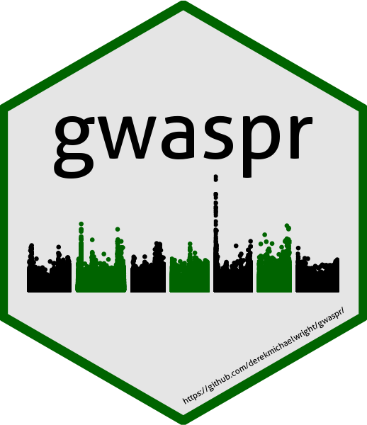
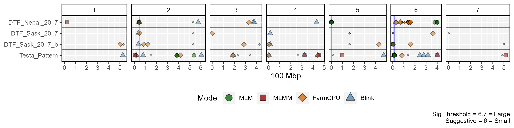
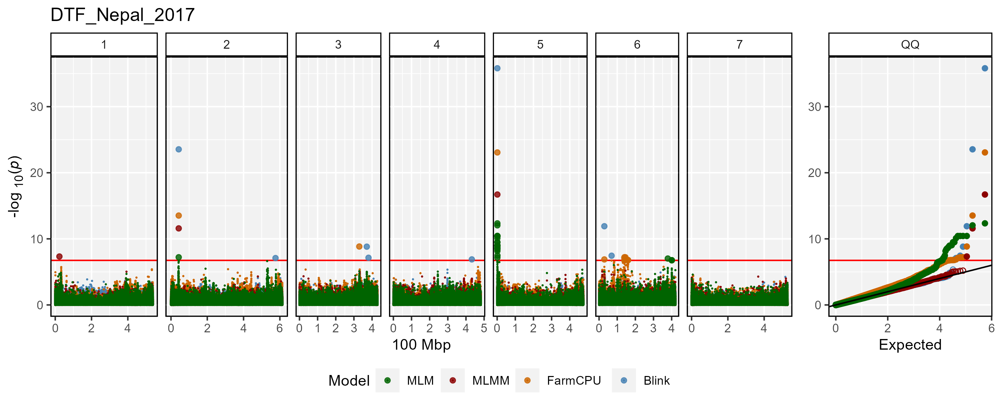
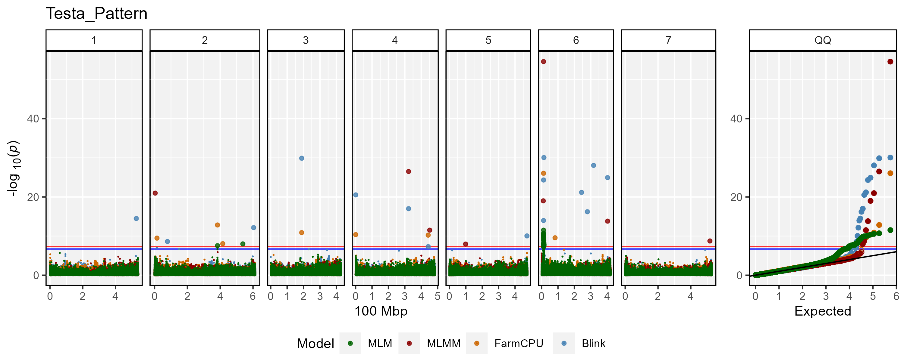
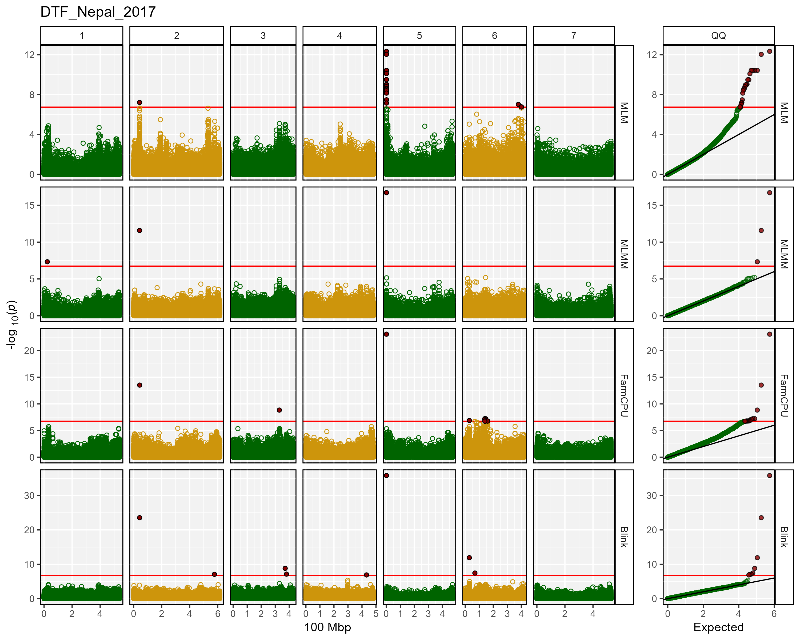
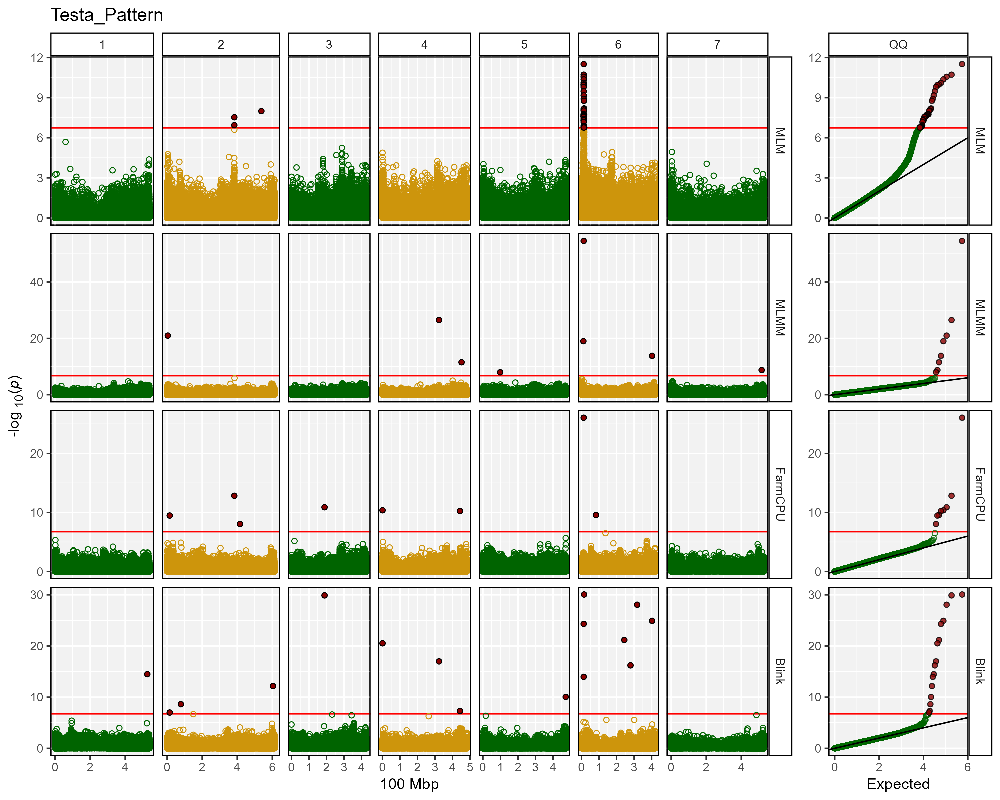

```{r setup, include = FALSE}
knitr::opts_chunk$set(echo = T, message = F, warning = F)
```

`gwaspr`: an `R` package for plotting GWAS results from the `GAPIT` package

# Installation

```{r eval = F}
devtools::install_github("derekmichaelwright/gwaspr")
```

```{r eval = T}
library(gwaspr)
```



# GWAS Tutorial

```{r echo = F}
downloadthis::download_link(
  link = "https://dblogr.com/academic/gwas_tutorial/gwas_tutorial.html",
  button_label = "https://dblogr.com/academic/gwas_tutorial/gwas_tutorial.html",
  button_type = "success",
  has_icon = TRUE,
  icon = "far fa-file-code",
  self_contained = FALSE
)
```

# Usage

For best practice, output from GAPIT should be in its own folder. In this case, they are located in a folder called `GWAS_Results/`.

```{r eval = T}
myTraits <- list_Traits(folder = "GWAS_Results/")
myTraits
```

```{r eval = T}
myResults <- list_Result_Files(folder = "GWAS_Results/")
myResults
```

## Summary Plot

```{r eval = T}
mp <- gg_GWAS_Summary(folder = "GWAS_Results/", traits = myTraits,
                      threshold = 7.3, threshold2 = 6.7)
ggsave("man/figures/GWAS_Summary.png", mp, width = 10, height = 2)
```



## Manhattan Plots

```{r eval = F}
for(i in myTraits) {
  mp <- gg_Manhattan(folder = "GWAS_Results/", trait = i, facet = F)
  ggsave(paste0("man/figures/Multi_",i,".png"), mp, width = 10, height = 4)
}
```





```{r eval = F}
for(i in myTraits) {
  mp <- gg_Manhattan(folder = "GWAS_Results/", trait = i, facet = T)
  ggsave(paste0("man/figures/Facet_",i,".png"), mp, width = 10, height = 8)
}
```





# GAPIT

`GAPIT`: and `R` package for performing Genome Wide Association Studies (GWAS)

https://github.com/jiabowang/GAPIT3

# Dependancies

`tidyverse`, `ggpubr`, `ggbeeswarm`, `ggrepel`, `ggtext`, `plotly`, `htmlwidgets`

---

&copy; Derek Michael Wright [www.dblogr.com/](https://dblogr.com/)
