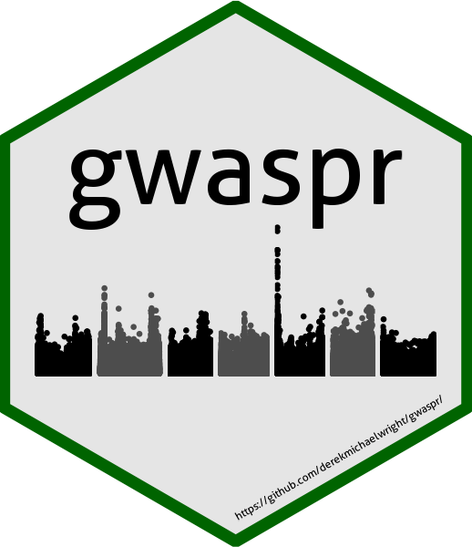

```{r setup, include = FALSE}
knitr::opts_chunk$set(echo = T, fig.width = 10, fig.height = 4)
```



`gwaspr`: an `R` package for plotting GWAS results from `GAPIT` package

`GAPIT`: and `R` package for performing Genome Wide Association Studies (GWAS)

https://github.com/jiabowang/GAPIT3

# Installation

```{r eval = F}
devtools::install_github("derekmichaelwright/gwaspr")
```

# Dependancies

`tidyverse`, `ggpubr`, `ggbeeswarm`, `ggrepel`, `ggtext`, `plotly`, `htmlwidgets`

# GWAS Tutorial

https://dblogr.com/academic/gwas_tutorial/gwas_tutorial.html

---

&copy; Derek Michael Wright [www.dblogr.com/](https://dblogr.com/)
