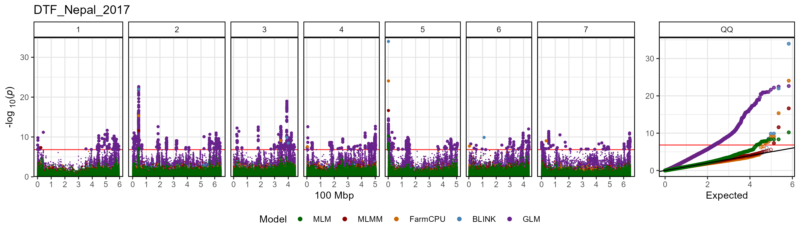
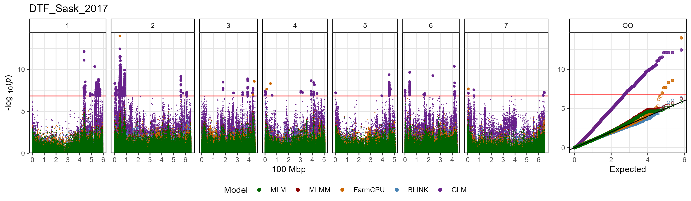
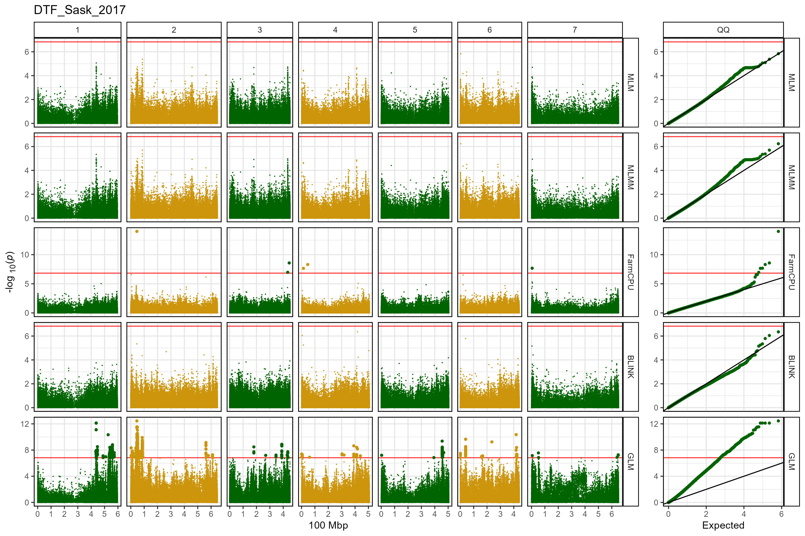
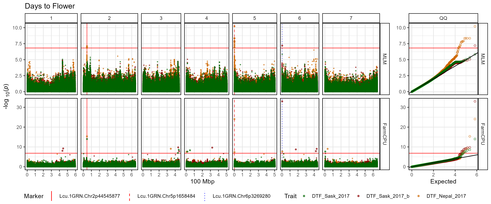
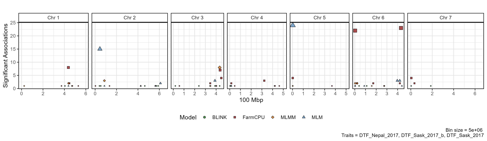
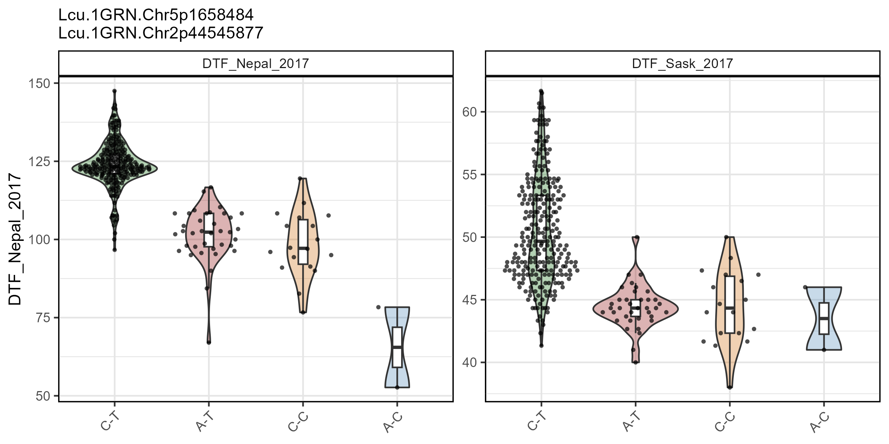
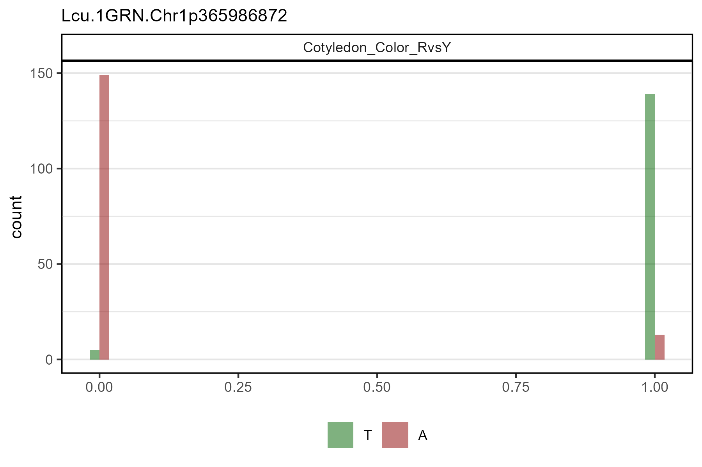
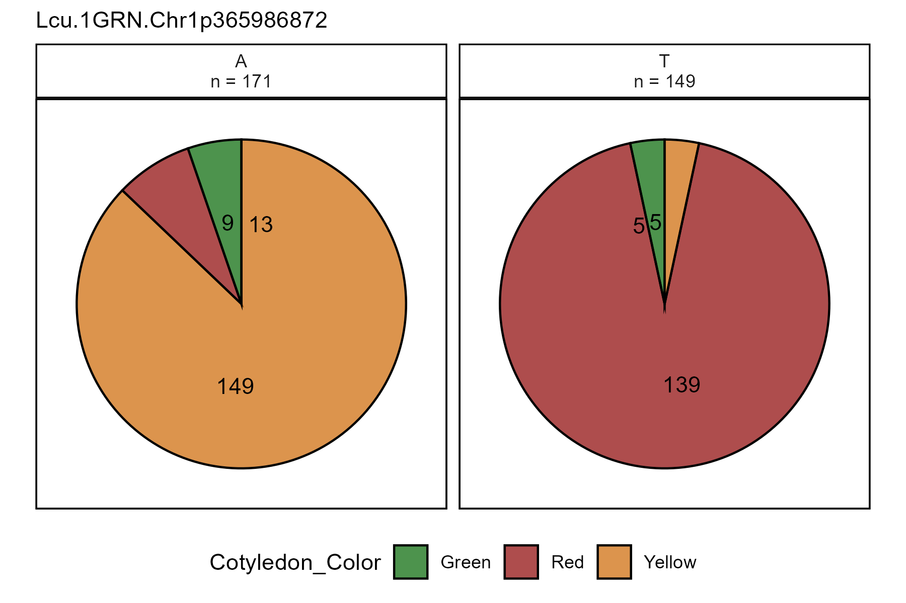

```{r setup, include = FALSE}
knitr::opts_chunk$set(echo = T, message = F, warning = F)
```


```{r eval = F, echo = F}
library(GAPIT)
myY <- read.csv("myY.csv")
myG <- read.csv("myG_hmp.csv", header = F)
myCV <- read.csv("myCV.csv")
myGAPIT <- GAPIT( Y = myY[,-2],
                  G = myG, 
                  PCA.total = 4,
                  model = c("GLM","MLM","MLMM","FarmCPU","BLINK"),
                  Random.model = F, Phenotype.View = F
                )
myY2 <- myY[,c("Name","DTF_Sask_2017")]
colnames(myY2)[2] <- "DTF_Sask_2017_b"
myGAPIT <- GAPIT( Y = myY2,
                  G = myG, 
                  CV = myCV,
                  PCA.total = 0,
                  model = c("GLM","MLM","MLMM","FarmCPU","BLINK"),
                  Random.model = F, Phenotype.View = F
                )
#
myGAPIT <- GAPIT( Y = myY[,c(1,4)],
                  G = myG, 
                  PCA.total = 4,
                  model = c("BLINK"),
                  Random.model = F, Phenotype.View = F
                )
```

`gwaspr`: an `R` package for plotting GWAS results from the `GAPIT` package

> - **GAPIT Website**: [https://www.maizegenetics.net/gapit](https://www.maizegenetics.net/gapit){target="_blank"}
> - **GAPIT github**: [https://github.com/jiabowang/GAPIT](https://github.com/jiabowang/GAPIT){target="_blank"}

# Installation

```{r eval = F}
devtools::install_github("derekmichaelwright/gwaspr")
```

```{r eval = T}
library(gwaspr)
```


# GWAS Tutorial

> [https://derekmichaelwright.github.io/dblogr/academic/gwas_tutorial](https://derekmichaelwright.github.io/dblogr/academic/gwas_tutorial){target="_blank"}

# Usage

For best practice, output from GAPIT should be in its own folder. In this case, they are located in a folder called `GWAS_Results/`. For this example we will plot GWAS results from 3 traits in a lentil diversity panel:

- ****Cotyledon_Color**: a *qualitative* trait describing cotyledon color (Red = 0, Yellow = 1).
- **DTF_Nepal_2017**: a *quantitative* trait describing days from sowing to flowering in a 2017 Nepal field trial. 
- **DTF_Sask_2017**: a *quantitative* trait describing days from sowing to flowering in a 2017 Saskatchewan field trial. 
- **DTF_Sask_2017_b**: same as above but run with the *b* coefficient from a photothermal model (see [Wright *et al*. 2020](https://doi.org/10.1002/ppp3.10158)) used as a covariate. 

Note: for more info check out this [GWAS tutorial](https://derekmichaelwright.github.io/dblogr/academic/gwaspr_tutorial){target="_blank"}.

# Data

```{r}
myG <- read.csv("myG_hmp.csv")
myY <- read.csv("myY.csv")
```

# gwaspr Functions

---

## list_Traits()

List off the traits which have GWAS results files in the designated folder.

```{r eval = T}
list_Traits(folder = "GWAS_Results/")
```

---

## is_ran()

Check to see which of your `myY` traits have GWAS results files int he designated folder.

```{r}
is_Ran(myY = myY, folder = "GWAS_Results/")
```

---

## run_simmary()

Checks which GWAS models have been run for each trait within the designated folder.

```{r}
run_Summary(folder = "GWAS_Results/")
```

---

## Order_GWAS_Results()

Reorders the result files if they are not already arranged by P.value.

```{r eval = F}
order_GWAS_Results(folder = "GWAS_Results/")
```

---

## is_Ordered()

```{r}
is_Ordered(folder = "GWAS_Results/")
```

---

## table_GWAS_Results()

```{r eval = T}
myResults <- table_GWAS_Results(folder = "GWAS_Results/",
                                threshold = 6.8, sug.threshold = 5)
myResults[1:5,]
```

---

## table_GWAS_Results_Summary()

```{r}
mySummary <- table_GWAS_Results_Summary(myResults, binMarkers = T, binSize = 5e+06)
mySummary[1:5,]
```

---

## list_Top_Markers()

```{r eval = T}
list_Top_Markers(folder = "GWAS_Results/", trait = "DTF_Nepal_2017", chroms = c(2,5))
```

```{r eval = T}
list_Top_Markers(folder = "GWAS_Results/", trait = "DTF_Sask_2017", chroms = 6)
```

```{r eval = T}
list_Top_Markers(folder = "GWAS_Results/", trait = "DTF_Sask_2017_b", chroms = 6)
```

```{r eval = T}
list_Top_Markers(folder = "GWAS_Results/", trait = "Cotyledon_Color_RvsY", chroms = 1)
```

---

## gg_Manhattan()

### Multi-Model Manhattan Plots

This is the default setting for this function: `facet = F`

```{r eval = F}
for(i in list_Traits(folder = "GWAS_Results/")) {
  # Plot
  mp <- gg_Manhattan(
    # Specify a folder with GWAS results
    folder = "GWAS_Results/", 
    # Select a trait to plot
    trait = i)
  # Save
  ggsave(paste0("man/figures/fig_01_", i, ".png"), 
         mp, width = 12, height = 3.5, bg = "white")
}
```






---

### Facetted Manhattan Plots

facet the plots by setting `facet = T`

```{r eval = F}
for(i in list_Traits(folder = "GWAS_Results/")) {
  # Plot
  mp <- gg_Manhattan(
    # Specify a folder with GWAS results
    folder = "GWAS_Results/",
    # Select a trait to plot
    trait = i, 
    # Facet out the different GWAS models
    facet = T)
  # Save
  ggsave(paste0("man/figures/fig_02_", i, ".png"), 
         mp, width = 12, height = 8, bg = "white")
}
```





---

### Custom Manhattan Plot

```{r}
mp <- gg_Manhattan(
  # Specify a folder with GWAS results
  folder = "GWAS_Results/",
  # Select a trait to plot
  trait = "DTF_Nepal_2017",
  # Create a title for the plot
  title = "GWAS Results for DTF_Nepal_2017",
  # Highlight specific markers
  vlines = c("Lcu.1GRN.Chr2p44545877",
             "Lcu.1GRN.Chr5p1658484",
             "Lcu.1GRN.Chr6p3269280"),
  vline.colors = c("red","red","blue"),
  # Plot only certain GWAS models
  models = c("MLM", "MLMM", "FarmCPU", "BLINK"),
  # Set horizontal thresholds bars
  threshold = 6.7,
  sug.threshold = 5
  )
ggsave(paste0("man/figures/fig_03.png"), 
         mp, width = 12, height = 3.5, bg = "white")
```


---

## gg_Mahattan_Zoom()

`facet = T`

```{r eval = F}
# Plot
mp <- gg_Manhattan_Zoom(
  # Specify a folder with GWAS results
  folder = "GWAS_Results/", 
  # Select a trait to plot
  trait = "Cotyledon_Color_RvsY", 
  # Plot just Chromosome 1
  chr = 1,
  pos1 = 360000000,
  pos2 = 370000000,
  # Highlight specific markers
  markers = c("Lcu.1GRN.Chr1p365986872",
              "Lcu.1GRN.Chr1p361840399"),
  # Create alt labels for the markers
  labels = c("365Mbp","361Mbp"),
  # Specify Color for each marker vline
  vline.colors = c("red", "blue"),
  # Should models be facetted
  facet = T
  )
# Save
ggsave("man/figures/fig_04_1.png", mp, width = 8, height = 8)
```


---

`facet = F`

```{r eval = F}
# Plot
mp <- gg_Manhattan_Zoom(
  # Specify a folder with GWAS results
  folder = "GWAS_Results/", 
  # Select a trait to plot
  trait = "Cotyledon_Color_RvsY", 
  # Plot just Chromosome 1
  chr = 1,
  pos1 = 360000000,
  pos2 = 370000000,
  # Plot only certain GWAS models
  models = c("MLMM","FarmCPU","BLINK"),
  # Highlight specific markers
  markers = c("Lcu.1GRN.Chr1p365986872",
              "Lcu.1GRN.Chr1p361840399"),
  # Create alt labels for the markers
  labels = c("365Mbp","361Mbp"),
  # Specify Color for each marker vline
  vline.colors = c("red", "blue"),
  # Should models be facetted
  facet = F,
  # set a max P value
  pmax = 40
  )
# Save
ggsave("man/figures/fig_04_2.png", mp, width = 10, height = 4)
```


---

## gg_Manhattan_Zoom_Traits()

```{r}
# Plot
mp <- gg_Manhattan_Zoom_Traits(
  # Specify a folder with GWAS results
  folder = "GWAS_Results/",
  # Select traits to plot
  traits = c("DTF_Sask_2017","DTF_Sask_2017_b","DTF_Nepal_2017"),
  # Create a title for the plot
  title = "Days To Flower",
  # Plot just Chromosome 1
  chrom = 5, 
  pos1 = 1000000,
  pos2 = 2500000,
  # Set horizontal thresholds bars
  threshold = 6.7,
  sug.threshold = 5,
  # Highlight specific markers
  markers = "Lcu.1GRN.Chr5p1658484",
  # Plot only certain GWAS models
  models =  c("MLM","FarmCPU","BLINK"),
  model.colors = gwaspr_Colors
  ) 
ggsave("man/figures/fig_05.png", mp, width = 8, height = 6)
```


---

## gg_Manhattan_xModels()

Uses a Single GWAS model and plots multiple traits

```{r}
mp <- gg_Manhattan_xModels(
  # Specify a folder with GWAS results
  folder = "GWAS_Results/",
  # Select traits to plot
  traits = c("DTF_Sask_2017", "DTF_Sask_2017_b", "DTF_Nepal_2017"),
  # Specify a title
  title = "Days to Flower",
  vlines = c("Lcu.1GRN.Chr2p44545877",
              "Lcu.1GRN.Chr5p1658484",
              "Lcu.1GRN.Chr6p3269280"),
  vline.colors = c("red", "red", "blue"),
  # Choose a GWAS model
  models =  c("MLM","FarmCPU")
  )
ggsave("man/figures/fig_06.png", mp, width = 12, height = 5, bg = "white")
```



---

## gg_Manhattan_xTraits()

Uses multiple GWAS models and facets each trait.

```{r eval = F}
# Plot
mp <- gg_Manhattan_xTraits(
  # Specify a folder with GWAS results
  folder = "GWAS_Results/",
  # Select traits to plot
  traits = c("DTF_Sask_2017", "DTF_Sask_2017_b", "DTF_Nepal_2017"),
  # Specify a title
  title = "Days to Flower",
  # Highlight specific markers
  markers = c("Lcu.1GRN.Chr2p44545877",
              "Lcu.1GRN.Chr5p1658484",
              "Lcu.1GRN.Chr6p3269280"),
  # Create alt labels for the markers
  labels = c("44Mbp","16Mbp","32Mbp"),
  # Specify Color for each marker vline
  vline.colors = c("red","red","blue"),
  # Specify GWAS models to plot
  models =  c("MLM","MLMM","FarmCPU","BLINK")
  )
# Save
ggsave("man/figures/fig_07.png", mp, width = 12, height = 8, bg = "white")
```


---

## gg_GWAS_Summary()

```{r eval = F}
# Plot
mp <- gg_GWAS_Summary(
  # Specify a folder with GWAS results
  folder = "GWAS_Results/",
  # Specify a title
  title = "Summary of Significant GWAS Results",
  # Specify GWAS models to plot
  models = c("MLMM","FarmCPU","BLINK")
  )
# Save
ggsave("man/figures/fig_08.png", mp, width = 12, height = 4)
```


Make it an interactive plot with the following code


```{r, eval = F}
gg_plotly(mp, filename = "man/figures/fig_08.html")
```

https://derekmichaelwright.github.io/gwaspr/man/figures/fig_08.html

---

## gg_GWAS_Hits()

```{r}
xx <- table_GWAS_Results(folder = "GWAS_Results/", threshold = 6.8, sug.threshold = 5)
mp <- gg_GWAS_Hits(
  xx = xx,
  xG = myG,
  xCV = NULL,
  range = 5000000,
  traits = c("DTF_Sask_2017", "DTF_Sask_2017_b", "DTF_Nepal_2017"),
  models =  c("BLINK", "FarmCPU", "MLMM", "MLM")
  )
ggsave("man/figures/fig_09.png", mp, width = 12, height = 3.5)
```



---

## gg_Marker_*

### gg_Marker_Box()

single marker, single trait

```{r eval = F}
mp <- gg_Marker_Box(xG = myG, xY = myY,
                    traits = "DTF_Sask_2017",
                    markers = "Lcu.1GRN.Chr6p3269280",
                    plot.points = F
                    )
ggsave("man/figures/fig_10_1.png", mp, width = 6, height = 4)
```


---

multiple markers, multiple traits

```{r eval = F}
mp <- gg_Marker_Box(xG = myG, xY = myY,
                    traits = c("DTF_Nepal_2017", "DTF_Sask_2017"),
                    markers = c("Lcu.1GRN.Chr5p1658484", "Lcu.1GRN.Chr2p44545877")
                    )
ggsave("man/figures/fig_10_2.png", mp, width = 8, height = 4)
```



```{r eval = F, echo = F}
gg_Marker_Box(xG = myG, xY = myY,
                    traits = c("DTF_Nepal_2017", "DTF_Sask_2017"),
                    markers = c("Lcu.1GRN.Chr5p1658484")
                    )
gg_Marker_Box(xG = myG, xY = myY,
                    traits = c("DTF_Nepal_2017", "DTF_Sask_2017"),
                    markers = c("Lcu.1GRN.Chr2p44545877")
                    )
```

---

## gg_Marker_Bar()

```{r eval = F}
mp <- gg_Marker_Bar(xG = myG, xY = myY,
                    traits = c("DTF_Nepal_2017", "DTF_Sask_2017"),
                    markers = c("Lcu.1GRN.Chr2p44545877", "Lcu.1GRN.Chr5p1658484")
                    )
ggsave("man/figures/fig_10_3.png", mp, width = 8, height = 4)
```


---

```{r eval = F}
# Plot 
mp <- gg_Marker_Bar(xG = myG, xY = myY,
                    traits = "Cotyledon_Color_RvsY",
                    markers = "Lcu.1GRN.Chr1p365986872",
                    plot.density = F
                    )
# Save
ggsave("man/figures/fig_10_4.png", mp, width = 6, height = 4)
```



---

```{r eval = F}
xx <- myY %>% 
  mutate(Cotyledon_Color = plyr::mapvalues(Cotyledon_Color_RvsY, 
                              c(0,1,NA), c("Yellow","Red","Green")))
# Plot 
mp <- gg_Marker_Bar(xG = myG, xY = xx,
                    traits = "Cotyledon_Color",
                    markers = "Lcu.1GRN.Chr1p365986872",
                    plot.density = F,
                    )
# Save
ggsave("man/figures/fig_10_5.png", mp, width = 6, height = 4)
```


---

```{r eval = F}
xx <- myY %>% 
  mutate(Cotyledon_Color = plyr::mapvalues(Cotyledon_Color_RvsY, 
                              c(0,1,NA), c("Yellow","Red","Green")))
# Plot 
mp <- gg_Marker_Pie(xG = myG, xY = xx,
                    trait = "Cotyledon_Color",
                    markers = "Lcu.1GRN.Chr1p365986872"
                    )
# Save
ggsave("man/figures/fig_10_6.png", mp, width = 6, height = 4)
```



---

# GAPIT

`GAPIT`: and `R` package for performing Genome Wide Association Studies (GWAS)

https://github.com/jiabowang/GAPIT

# Dependancies

`tidyverse`, `ggpubr`, `ggbeeswarm`, `ggrepel`, `ggtext`, `plotly`, `htmlwidgets`

---

&copy; Derek Michael Wright
