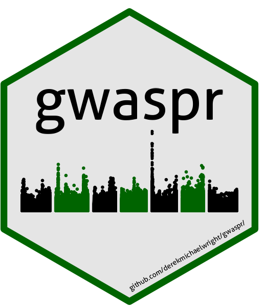

```{r setup, include = FALSE}
knitr::opts_chunk$set(message = F, warning = F)
```

# gwaspr 

`gwaspr`: an `R` package for plotting GWAS results from the `GAPIT` package

---

# Instal gwaspr

```{r eval = F}
devtools::install_github("derekmichaelwright/gwaspr")
```

```{r}
library(gwaspr)
```

---

# github

> - **github link**: [https://github.com/derekmichaelwright/gwaspr/](https://github.com/derekmichaelwright/gwaspr/){target="_blank"}

---

# GWAS Tutorial

> - **dblogr GWAS Tutorial**: [https://derekmichaelwright.github.io/dblogr/academic/gwas_tutorial/](https://derekmichaelwright.github.io/dblogr/academic/gwas_tutorial/){target="_blank"}

---

# GAPIT

`GAPIT`: and `R` package for performing Genome Wide Association Studies (GWAS)

> - **GAPIT Website**: [https://www.maizegenetics.net/gapit](https://www.maizegenetics.net/gapit){target="_blank"}
> - **GAPIT github**: [https://github.com/jiabowang/GAPIT](https://github.com/jiabowang/GAPIT){target="_blank"}

---

# Dependancies

`tidyverse`, `ggpubr`, `ggbeeswarm`, `ggrepel`, `ggtext`, `plotly`, `htmlwidgets`

---

# Example Plots

```{r eval = F, echo = F}
library(magick)
im1 <- image_append(c(
  image_read("vignettes/figures/gg_Manhattan_xTraits_02.png.png"),
  image_read("vignettes/figures/gg_Manhattan_Zoom_05.png.png"),
  image_read("vignettes/gg_QTL_Summary_05.png")), 
  stack = T )
im2 <- magick::image_append(c(
  image_read("vignettes/figures/gg_Manhattan_xModels_03.png"),
  image_read("vignettes/figures/gg_Marker_Box_01.png"),
  image_read("vignettes/figures/gg_LDheatmap_01.png"),
  image_read("vignettes/gg_Mangattan_DTF_Nepal_2017.png"),
  stack = T )
  im <- image_append(im1,im2)
image_write(im, "man/figures/featured.png")
```


---


---
