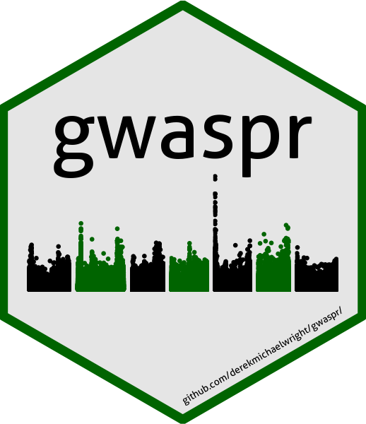

```{r setup, include = FALSE}
knitr::opts_chunk$set(echo = T, message = F, warning = F)
```

`gwaspr`: an `R` package for plotting GWAS results from the `GAPIT` package

# Installation

```{r eval = F}
devtools::install_github("derekmichaelwright/gwaspr")
```

```{r eval = T}
library(gwaspr)
```



# GWAS Tutorial

https://derekmichaelwright.github.io/dblogr/academic/gwas_tutorial

# Usage

For best practice, output from GAPIT should be in its own folder. In this case, they are located in a folder called `GWAS_Results/`. For this example we will plot GWAS results from 3 traits in a lentil diversity panel:

- **Testa_Pattern**: a *qualitative* trait describing the presence or absence of seed coat pigmentation.
- **DTF_Nepal_2017**: a *quantitative* trait describing days from sowing to flowering in a 2017 Nepal field trial. 
- **DTF_Sask_2017**: a *quantitative* trait describing days from sowing to flowering in a 2017 Saskatchewan field trial. 
- **DTF_Sask_2017_b**: same as above but run with the *b* coefficient from a photothermal model (see [Wright *et al*. 2020](https://doi.org/10.1002/ppp3.10158)) used as a covariate. 

Note: for more info check out this [GWAS tutorial](https://derekmichaelwright.github.io/dblogr/academic/gwaspr_tutorial).

## List Traits

```{r eval = T}
myTraits <- list_Traits(folder = "GWAS_Results/")
myTraits
```

## List Results Files

```{r eval = T}
myFiles <- list_Result_Files(folder = "GWAS_Results/")
myFiles
```

## List Significant Markers

```{r eval = F}
# first reorder the result files if they are not already arranged by P.value
order_GWAS_Results(folder = "GWAS_Results/", files = myFiles)
```

```{r eval = T}
myResults <- table_GWAS_Results(folder = "GWAS_Results/", files = myFiles,
                                threshold = 6.7, sug.threshold = 6)
myResults[1:10,]
```

```{r eval = T}
list_Top_Markers(trait = "DTF_Nepal_2017", model = "MLMM", 
                 folder = "GWAS_Results/", 
                 threshold = 6.7, chroms = c(2,5), n = 1)
```

```{r}
myMarkers <- c("Lcu.2RBY.Chr2p42543877","Lcu.2RBY.Chr5p1069654",
               "Lcu.2RBY.Chr6p2528817", "Lcu.2RBY.Chr6p12212845")
```

```{r eval = T}
list_Top_Markers(trait = "Testa_Pattern", model = "MLM", 
                 folder = "GWAS_Results/", 
                 threshold = 6.7, chroms = 6, n = 1)
```

```{r eval = T}
table_Results_Summary("GWAS_Results/", isOrdered = F)
table_Results_Summary("GWAS_Results/", isOrdered = T)
```

## Summary Plot

```{r eval = F}
mp <- gg_GWAS_Summary(folder = "GWAS_Results/", 
                      traits = myTraits,
                      models = c("MLM", "MLMM", "FarmCPU", "BLINK"),
                      colors = c("darkgreen", "darkred", "darkorange3", "steelblue"),
                      threshold = 6.7, sug.threshold = 6, 
                      hlines = c(1.5,3.5), legend.rows = 2,
                      vlines = myMarkers,
                      vline.colors = c("red", "red", "green", "blue"),
                      title = "Summary of Significant GWAS Results")
ggsave("man/figures/GWAS_Summary.png", mp, width = 12, height = 4)
```


```{r eval = F, echo = F}
gg_GWAS_plotly(mp, filename = "GWAS_Summary.html")
```

---

## Manhattan Plots

### Multi Manhattan Plots

```{r eval = F}
for(i in myTraits) {
  mp <- gg_Manhattan(folder = "GWAS_Results/", 
                     trait = i, 
                     title = paste("LDP -", i), 
                     threshold = 7.3, 
                     sug.threshold = 6.7, 
                     vlines = myMarkers,
                     vline.colors = c("red","red","darkgreen","blue"),
                     vline.legend = T,
                     facet = F,
                     addQQ = T,
                     pmax = 12, 
                     models = c("MLM", "MLMM", "FarmCPU", "BLINK"),
                     model.colors = c("darkgreen", "darkred", "darkorange3", "steelblue"),
                     legend.rows = 2)
  ggsave(paste0("man/figures/Multi_", i, ".png"), 
         mp, width = 12, height = 4, bg = "white")
}
```


---

### Facetted Manhattan Plots

```{r eval = F}
for(i in myTraits) {
  mp <- gg_Manhattan(folder = "GWAS_Results/", 
                     trait = i, 
                     title = paste("LDP -", i), 
                     threshold = 7.3, 
                     sug.threshold = 6.7, 
                     vlines = myMarkers,
                     vline.colors = c("red","red","darkgreen","blue"),
                     vline.legend = T,
                     facet = T,
                     addQQ = T,
                     pmax = 12, 
                     models = c("MLM", "MLMM", "FarmCPU", "BLINK"),
                     chrom.colors = rep(c("darkgreen", "darkgoldenrod2"), 4),
                     legend.rows = 2)
  ggsave(paste0("man/figures/Facet_", i, ".png"), 
         mp, width = 12, height = 8)
}
```


---

# GAPIT

`GAPIT`: and `R` package for performing Genome Wide Association Studies (GWAS)

https://github.com/jiabowang/GAPIT3

# Dependancies

`tidyverse`, `ggpubr`, `ggbeeswarm`, `ggrepel`, `ggtext`, `plotly`, `htmlwidgets`

---

&copy; Derek Michael Wright
