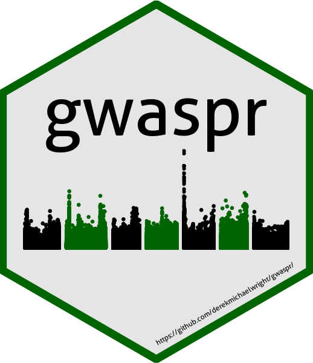
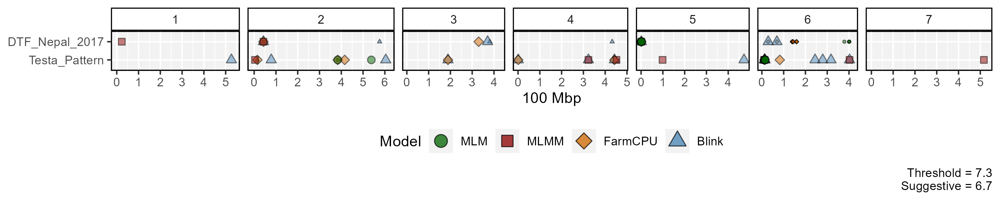
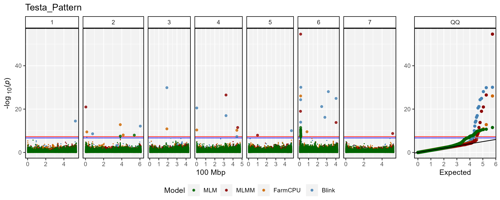
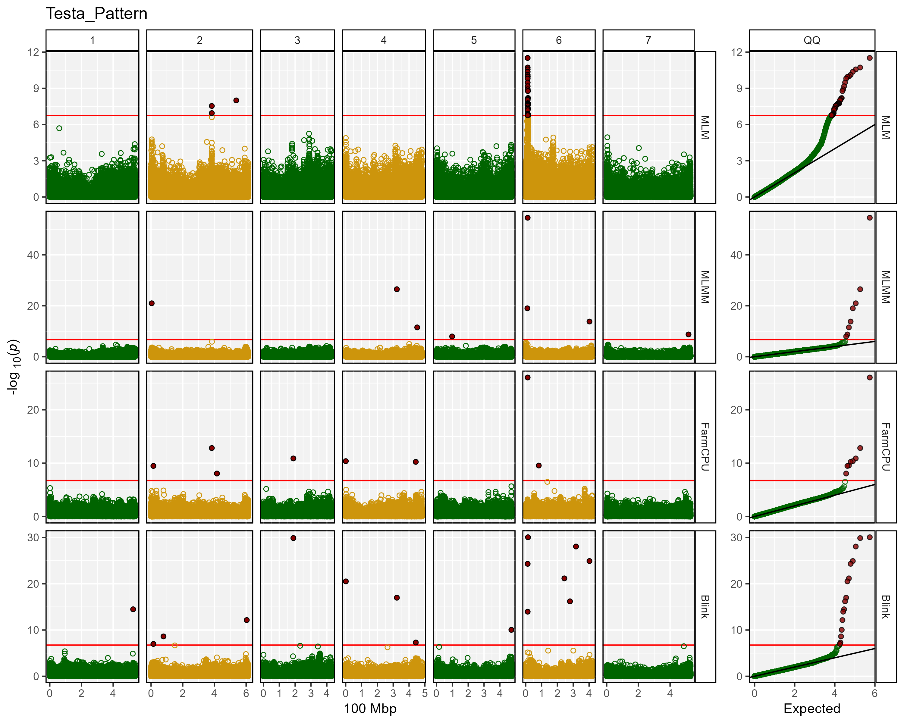

gwaspr R Package
================

`gwaspr`: an `R` package for plotting GWAS results from the `GAPIT`
package

# Installation

``` r
devtools::install_github("derekmichaelwright/gwaspr")
```

``` r
library(gwaspr)
```



# GWAS Tutorial

<https://dblogr.com/academic/gwas_tutorial/>

# Usage

For best practice, output from GAPIT should be in its own folder. In
this case, they are located in a folder called `GWAS_Results/`. For this
example we will plot GWAS results from 3 traits in a lentil diversity
panel:

- **Testa_Pattern**: a *qualitative* trait describing the presence or
  absence of seed coat pigmentation.
- **DTF_Nepal_2017**: a *quantitative* trait describing days from sowing
  to flowering in a 2017 Nepal field trial.
- **DTF_Sask_2017**: a *quantitative* trait describing days from sowing
  to flowering in a 2017 Saskatchewan field trial.
- **DTF_Sask_2017_b**: same as above but run with the *b* coefficient
  from a photothermal model (see [Wright *et al*.
  2020](https://nph.onlinelibrary.wiley.com/doi/10.1002/ppp3.10158))
  used as a covariate.

Note: for more info check out this [GWAS
tutorial](https://dblogr.com/academic/gwas_tutorial/gwas_tutorial.html%22).

## List Traits

``` r
myTraits <- list_Traits(folder = "GWAS_Results/")
myTraits
```

    ## [1] "DTF_Nepal_2017"     "DTF_Sask_2017"      "DTF_Sask_2017_CV_b"
    ## [4] "Testa_Pattern"

## List Results Files

``` r
myFiles <- list_Result_Files(folder = "GWAS_Results/")
myFiles
```

    ##  [1] "GAPIT.Association.GWAS_Results.BLINK.DTF_Nepal_2017.csv"      
    ##  [2] "GAPIT.Association.GWAS_Results.BLINK.DTF_Sask_2017.csv"       
    ##  [3] "GAPIT.Association.GWAS_Results.BLINK.DTF_Sask_2017_CV_b.csv"  
    ##  [4] "GAPIT.Association.GWAS_Results.BLINK.Testa_Pattern.csv"       
    ##  [5] "GAPIT.Association.GWAS_Results.FarmCPU.DTF_Nepal_2017.csv"    
    ##  [6] "GAPIT.Association.GWAS_Results.FarmCPU.DTF_Sask_2017.csv"     
    ##  [7] "GAPIT.Association.GWAS_Results.FarmCPU.DTF_Sask_2017_CV_b.csv"
    ##  [8] "GAPIT.Association.GWAS_Results.FarmCPU.Testa_Pattern.csv"     
    ##  [9] "GAPIT.Association.GWAS_Results.GLM.DTF_Nepal_2017.csv"        
    ## [10] "GAPIT.Association.GWAS_Results.GLM.DTF_Sask_2017.csv"         
    ## [11] "GAPIT.Association.GWAS_Results.GLM.DTF_Sask_2017_CV_b.csv"    
    ## [12] "GAPIT.Association.GWAS_Results.GLM.Testa_Pattern.csv"         
    ## [13] "GAPIT.Association.GWAS_Results.MLM.DTF_Nepal_2017.csv"        
    ## [14] "GAPIT.Association.GWAS_Results.MLM.DTF_Sask_2017.csv"         
    ## [15] "GAPIT.Association.GWAS_Results.MLM.DTF_Sask_2017_CV_b.csv"    
    ## [16] "GAPIT.Association.GWAS_Results.MLM.Testa_Pattern.csv"         
    ## [17] "GAPIT.Association.GWAS_Results.MLMM.DTF_Nepal_2017.csv"       
    ## [18] "GAPIT.Association.GWAS_Results.MLMM.DTF_Sask_2017.csv"        
    ## [19] "GAPIT.Association.GWAS_Results.MLMM.DTF_Sask_2017_CV_b.csv"   
    ## [20] "GAPIT.Association.GWAS_Results.MLMM.Testa_Pattern.csv"

## List Significant Markers

``` r
# first reorder the result files if they are not already arranged by P.value
order_GWAS_Results(folder = "GWAS_Results/", files = myFiles)
```

``` r
myResults <- table_GWAS_Results(folder = "GWAS_Results/", files = myFiles,
                   threshold = 6.7, sug.threshold = 6)
myResults[1:10,]
```

    ##                        SNP Chr       Pos      P.value        MAF  H.B.P.Value
    ## 1   Lcu.2RBY.Chr6p12212845   6  12212845 2.553940e-55 0.42056075 6.840600e-50
    ## 2    Lcu.2RBY.Chr5p1061938   5   1061938 4.300613e-33 0.12345679 1.151898e-27
    ## 3   Lcu.2RBY.Chr6p14410759   6  14410759 9.468879e-31 0.38317757 2.536192e-25
    ## 4    Lcu.2RBY.Chr6p2528817   6   2528817 2.687467e-30 0.27932099 7.198246e-25
    ## 5  Lcu.2RBY.Chr3p188873032   3 188873032 2.260523e-29 0.01168224 3.027349e-24
    ## 6  Lcu.2RBY.Chr4p323097758   4 323097758 3.245062e-27 0.07943925 4.345868e-22
    ## 7  Lcu.2RBY.Chr6p317400151   6 317400151 4.516331e-27 0.09112150 4.032255e-22
    ## 8   Lcu.2RBY.Chr6p12192948   6  12192948 8.560650e-27 0.43925234 2.292927e-21
    ## 9   Lcu.2RBY.Chr2p42543877   2  42543877 3.264679e-25 0.06790123 4.372140e-20
    ## 10   Lcu.2RBY.Chr5p1061938   5   1061938 8.804190e-24 0.12345679 2.358158e-18
    ##         Effect -log10(p)   Model              Trait   Threshold
    ## 1    0.4002402  54.59279    MLMM      Testa_Pattern Significant
    ## 2  -12.1833602  32.36647   BLINK     DTF_Nepal_2017 Significant
    ## 3    0.2234545  30.02370   BLINK      Testa_Pattern Significant
    ## 4   -2.1310601  29.57066 FarmCPU DTF_Sask_2017_CV_b Significant
    ## 5    0.3969966  28.64579   BLINK      Testa_Pattern Significant
    ## 6    0.3775797  26.48878    MLMM      Testa_Pattern Significant
    ## 7    0.3144896  26.34521   BLINK      Testa_Pattern Significant
    ## 8    0.2223050  26.06749 FarmCPU      Testa_Pattern Significant
    ## 9   10.7592301  24.48616   BLINK     DTF_Nepal_2017 Significant
    ## 10 -10.8302898  23.05531 FarmCPU     DTF_Nepal_2017 Significant

``` r
list_Top_Markers(trait = "DTF_Nepal_2017", model = "MLMM", 
                 folder = "GWAS_Results/", 
                 threshold = 6.7, chroms = c(2,5), n = 1)
```

    ##                      SNP Chr      Pos -log10(p)
    ## 1 Lcu.2RBY.Chr2p42543877   2 42543877     11.53
    ## 2  Lcu.2RBY.Chr5p1069654   5  1069654     16.66

``` r
list_Top_Markers(trait = "Testa_Pattern", model = "MLM", 
                 folder = "GWAS_Results/", 
                 threshold = 6.7, chroms = 6, n = 1)
```

    ##                      SNP Chr      Pos -log10(p)
    ## 1 Lcu.2RBY.Chr6p12212845   6 12212845     11.55

## Summary Plot

``` r
mp <- gg_GWAS_Summary(folder = "GWAS_Results/", 
                      traits = myTraits,
                      models = c("MLM", "MLMM", "FarmCPU", "BLINK"),
                      colors = c("darkgreen", "darkred", "darkorange3", "steelblue"),
                      threshold = 6.7, sug.threshold = 6, 
                      hlines = c(1.5,3.5), lrows = 2,
                      vlines = c("Lcu.2RBY.Chr2p42543877","Lcu.2RBY.Chr5p1069654",
                                 "Lcu.2RBY.Chr6p2528817", "Lcu.2RBY.Chr6p12212845"),
                      vline.colors = c("red", "red", "green", "blue"),
                      title = "Summary of Significant GWAS Results")
ggsave("man/figures/GWAS_Summary.png", mp, width = 12, height = 4)
```



------------------------------------------------------------------------

## Manhattan Plots

### Multi Manhattan Plots

``` r
for(i in myTraits) {
  mp <- gg_Manhattan(folder = "GWAS_Results/", trait = i, facet = F,
                     models = c("MLM", "MLMM", "FarmCPU", "BLINK"),
                     threshold = 7.3, sug.threshold = 6.7, pmax = 12,
                     vlines = c("Lcu.2RBY.Chr2p42543877", 
                                "Lcu.2RBY.Chr5p1069654",
                                "Lcu.2RBY.Chr6p12212845",
                                "Lcu.2RBY.Chr6p2528817") )
  ggsave(paste0("man/figures/Multi_",i,".png"), 
         mp, width = 12, height = 4, bg = "white")
}
```




------------------------------------------------------------------------

### Facetted Manhattan Plots

``` r
for(i in myTraits) {
  mp <- gg_Manhattan(folder = "GWAS_Results/", trait = i, facet = T,
                     threshold = 7.3, sug.threshold = 6.7,
                     vlines = c("Lcu.2RBY.Chr2p42543877", 
                                "Lcu.2RBY.Chr5p1069654",
                                "Lcu.2RBY.Chr6p12212845",
                                "Lcu.2RBY.Chr6p2528817"))
  ggsave(paste0("man/figures/Facet_",i,".png"), mp, width = 12, height = 8)
}
```




------------------------------------------------------------------------

# GAPIT

`GAPIT`: and `R` package for performing Genome Wide Association Studies
(GWAS)

<https://github.com/jiabowang/GAPIT3>

# Dependancies

`tidyverse`, `ggpubr`, `ggbeeswarm`, `ggrepel`, `ggtext`, `plotly`,
`htmlwidgets`

------------------------------------------------------------------------

© Derek Michael Wright [www.dblogr.com/](https://dblogr.com/)
