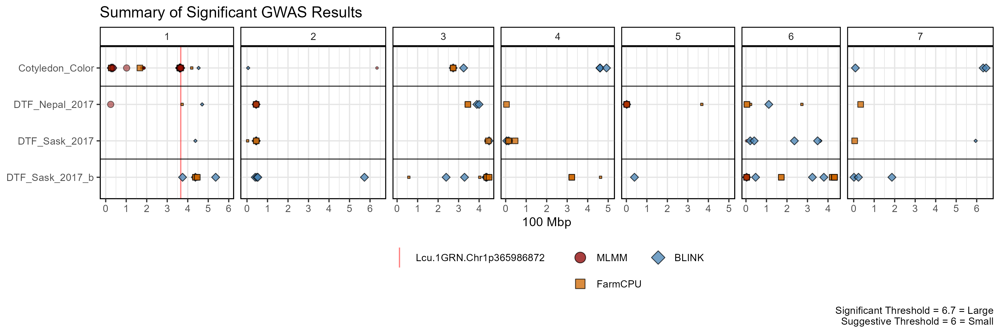

gwaspr R Package
================

`gwaspr`: an `R` package for plotting GWAS results from the `GAPIT`
package

# Installation

``` r
devtools::install_github("derekmichaelwright/gwaspr")
```

``` r
library(gwaspr)
```


# GWAS Tutorial

<https://derekmichaelwright.github.io/dblogr/academic/gwas_tutorial>

# Usage

For best practice, output from GAPIT should be in its own folder. In
this case, they are located in a folder called `GWAS_Results/`. For this
example we will plot GWAS results from 3 traits in a lentil diversity
panel:

- \*\*\*\*Cotyledon_Color\*\*: a *qualitative* trait describing
  cotyledon color (Red = 0, Yellow = 1).
- **DTF_Nepal_2017**: a *quantitative* trait describing days from sowing
  to flowering in a 2017 Nepal field trial.
- **DTF_Sask_2017**: a *quantitative* trait describing days from sowing
  to flowering in a 2017 Saskatchewan field trial.
- **DTF_Sask_2017_b**: same as above but run with the *b* coefficient
  from a photothermal model (see [Wright *et al*.
  2020](https://doi.org/10.1002/ppp3.10158)) used as a covariate.

Note: for more info check out this [GWAS
tutorial](https://derekmichaelwright.github.io/dblogr/academic/gwaspr_tutorial).

## List Traits

``` r
myTraits <- list_Traits(folder = "GWAS_Results/")
myTraits
```

    ## [1] "Cotyledon_Color" "DTF_Nepal_2017"  "DTF_Sask_2017"   "DTF_Sask_2017_b"

## List Results Files

``` r
myFiles <- list_Result_Files(folder = "GWAS_Results/")
myFiles
```

    ##  [1] "GAPIT.Association.GWAS_Results.BLINK.Cotyledon_Color(Kansas).csv"  
    ##  [2] "GAPIT.Association.GWAS_Results.BLINK.Cotyledon_Color(NYC).csv"     
    ##  [3] "GAPIT.Association.GWAS_Results.BLINK.DTF_Nepal_2017(Kansas).csv"   
    ##  [4] "GAPIT.Association.GWAS_Results.BLINK.DTF_Nepal_2017(NYC).csv"      
    ##  [5] "GAPIT.Association.GWAS_Results.BLINK.DTF_Sask_2017(Kansas).csv"    
    ##  [6] "GAPIT.Association.GWAS_Results.BLINK.DTF_Sask_2017(NYC).csv"       
    ##  [7] "GAPIT.Association.GWAS_Results.BLINK.DTF_Sask_2017_b(Kansas).csv"  
    ##  [8] "GAPIT.Association.GWAS_Results.BLINK.DTF_Sask_2017_b(NYC).csv"     
    ##  [9] "GAPIT.Association.GWAS_Results.FarmCPU.Cotyledon_Color(Kansas).csv"
    ## [10] "GAPIT.Association.GWAS_Results.FarmCPU.Cotyledon_Color(NYC).csv"   
    ## [11] "GAPIT.Association.GWAS_Results.FarmCPU.DTF_Nepal_2017(Kansas).csv" 
    ## [12] "GAPIT.Association.GWAS_Results.FarmCPU.DTF_Nepal_2017(NYC).csv"    
    ## [13] "GAPIT.Association.GWAS_Results.FarmCPU.DTF_Sask_2017(Kansas).csv"  
    ## [14] "GAPIT.Association.GWAS_Results.FarmCPU.DTF_Sask_2017(NYC).csv"     
    ## [15] "GAPIT.Association.GWAS_Results.FarmCPU.DTF_Sask_2017_b(Kansas).csv"
    ## [16] "GAPIT.Association.GWAS_Results.FarmCPU.DTF_Sask_2017_b(NYC).csv"   
    ## [17] "GAPIT.Association.GWAS_Results.GLM.Cotyledon_Color(NYC).csv"       
    ## [18] "GAPIT.Association.GWAS_Results.GLM.DTF_Nepal_2017(NYC).csv"        
    ## [19] "GAPIT.Association.GWAS_Results.GLM.DTF_Sask_2017(NYC).csv"         
    ## [20] "GAPIT.Association.GWAS_Results.GLM.DTF_Sask_2017_b(NYC).csv"       
    ## [21] "GAPIT.Association.GWAS_Results.MLM.Cotyledon_Color(NYC).csv"       
    ## [22] "GAPIT.Association.GWAS_Results.MLM.DTF_Nepal_2017(NYC).csv"        
    ## [23] "GAPIT.Association.GWAS_Results.MLM.DTF_Sask_2017(NYC).csv"         
    ## [24] "GAPIT.Association.GWAS_Results.MLM.DTF_Sask_2017_b(NYC).csv"       
    ## [25] "GAPIT.Association.GWAS_Results.MLMM.Cotyledon_Color(NYC).csv"      
    ## [26] "GAPIT.Association.GWAS_Results.MLMM.DTF_Nepal_2017(NYC).csv"       
    ## [27] "GAPIT.Association.GWAS_Results.MLMM.DTF_Sask_2017(NYC).csv"        
    ## [28] "GAPIT.Association.GWAS_Results.MLMM.DTF_Sask_2017_b(NYC).csv"

## Check Results

``` r
is_ran(folder = "GWAS_Results/")
```

    ##             Trait GLM MLM MLMM FarmCPU BLINK CMLM SUPER
    ## 1 Cotyledon_Color   X   X    X       X     X   NA    NA
    ## 2  DTF_Nepal_2017   X   X    X       X     X   NA    NA
    ## 3   DTF_Sask_2017   X   X    X       X     X   NA    NA
    ## 4 DTF_Sask_2017_b   X   X    X       X     X   NA    NA

## List Significant Markers

``` r
# first reorder the result files if they are not already arranged by P.value
order_GWAS_Results(folder = "GWAS_Results/", files = myFiles)
```

``` r
is_ordered(folder = "GWAS_Results/")
```

    ##             Trait GLM MLM MLMM FarmCPU BLINK CMLM SUPER FarmCPU_Kansas
    ## 1 Cotyledon_Color   X   X    X       X     X   NA    NA              X
    ## 2  DTF_Nepal_2017   X   X    X       X     X   NA    NA              X
    ## 3   DTF_Sask_2017   X   X    X       X     X   NA    NA              X
    ## 4 DTF_Sask_2017_b   X   X    X       X     X   NA    NA              X
    ##   BLINK_Kansas
    ## 1            X
    ## 2            X
    ## 3            X
    ## 4            X

``` r
myResults <- table_GWAS_Results(folder = "GWAS_Results/", fnames = myFiles,
                                threshold = 6.8, sug.threshold = 5)
myResults[1:10,]
```

    ##                        SNP Chr       Pos       P.value        MAF     effect
    ## 1  Lcu.1GRN.Chr1p365986872   1 365986872 1.754402e-175 0.47096774  0.4683785
    ## 2  Lcu.1GRN.Chr1p365986872   1 365986872 1.164052e-154 0.47096774         NA
    ## 3  Lcu.1GRN.Chr1p365986872   1 365986872 3.281941e-128 0.47096774  0.4954384
    ## 4  Lcu.1GRN.Chr1p361840399   1 361840399  2.178943e-84 0.04193548  0.4603589
    ## 5  Lcu.1GRN.Chr1p361840399   1 361840399  6.963600e-47 0.04193548  0.4715544
    ## 6  Lcu.1GRN.Chr1p361856257   1 361856257  3.377658e-40 0.04516129         NA
    ## 7  Lcu.1GRN.Chr1p365986872   1 365986872  2.845683e-37 0.47096774         NA
    ## 8  Lcu.1GRN.Chr1p365318023   1 365318023  1.769760e-35 0.47096774         NA
    ## 9  Lcu.1GRN.Chr1p365318027   1 365318027  2.803987e-35 0.47258065         NA
    ## 10   Lcu.1GRN.Chr5p1658484   5   1658484  1.050791e-34 0.12345679 12.5619150
    ##      H.B.P.Value   Model   Type           Trait negLog10_P negLog10_HBP
    ## 1  5.901229e-170   BLINK Kansas Cotyledon_Color  174.75587    169.22906
    ## 2  3.915488e-149    MLMM    NYC Cotyledon_Color  153.93403    148.40721
    ## 3  1.103937e-122 FarmCPU Kansas Cotyledon_Color  127.48387    121.95706
    ## 4   3.664623e-79   BLINK Kansas Cotyledon_Color   83.66175     78.43597
    ## 5   1.171163e-41 FarmCPU Kansas Cotyledon_Color   46.15717     40.93138
    ## 6   5.680663e-35    MLMM    NYC Cotyledon_Color   39.47138     34.24560
    ## 7   9.571939e-32     GLM    NYC Cotyledon_Color   36.54581     31.01900
    ## 8   2.976445e-30     GLM    NYC Cotyledon_Color   34.75209     29.52630
    ## 9   3.143895e-30     GLM    NYC Cotyledon_Color   34.55222     29.50253
    ## 10  3.534516e-29   BLINK Kansas  DTF_Nepal_2017   33.97848     28.45167
    ##      Threshold    Effect
    ## 1  Significant        NA
    ## 2  Significant 0.4905608
    ## 3  Significant        NA
    ## 4  Significant        NA
    ## 5  Significant        NA
    ## 6  Significant 1.4947330
    ## 7  Significant 0.4558343
    ## 8  Significant 0.4470957
    ## 9  Significant 0.4451259
    ## 10 Significant        NA

``` r
list_Top_Markers(folder = "GWAS_Results/", trait = "DTF_Nepal_2017", 
                 threshold = 6.7, chroms = c(2,5))
```

    ## # A tibble: 8 × 6
    ##   SNP                      Chr      Pos Traits         Models           Max_LogP
    ##   <chr>                  <int>    <int> <chr>          <chr>               <dbl>
    ## 1 Lcu.1GRN.Chr5p1658484      5  1658484 DTF_Nepal_2017 BLINK; FarmCPU;…    34.0 
    ## 2 Lcu.1GRN.Chr2p44546658     2 44546658 DTF_Nepal_2017 FarmCPU; GLM; M…    33.0 
    ## 3 Lcu.1GRN.Chr2p44545877     2 44545877 DTF_Nepal_2017 BLINK; FarmCPU;…    22.7 
    ## 4 Lcu.1GRN.Chr2p44558948     2 44558948 DTF_Nepal_2017 GLM; MLM            22.2 
    ## 5 Lcu.1GRN.Chr5p1650591      5  1650591 DTF_Nepal_2017 FarmCPU; GLM; M…    18.7 
    ## 6 Lcu.1GRN.Chr5p2101990      5  2101990 DTF_Nepal_2017 FarmCPU             14.8 
    ## 7 Lcu.1GRN.Chr5p1651791      5  1651791 DTF_Nepal_2017 GLM; MLM            14.1 
    ## 8 Lcu.1GRN.Chr5p2102310      5  2102310 DTF_Nepal_2017 FarmCPU              7.40

``` r
list_Top_Markers(folder = "GWAS_Results/", trait = "DTF_Sask_2017_b", 
                 threshold = 6.7, chroms = 6)
```

    ## # A tibble: 9 × 6
    ##   SNP                       Chr       Pos Traits          Models        Max_LogP
    ##   <chr>                   <int>     <int> <chr>           <chr>            <dbl>
    ## 1 Lcu.1GRN.Chr6p3269280       6   3269280 DTF_Sask_2017_b BLINK; FarmC…    32.9 
    ## 2 Lcu.1GRN.Chr6p1734191       6   1734191 DTF_Sask_2017_b GLM              23.6 
    ## 3 Lcu.1GRN.Chr6p1445607       6   1445607 DTF_Sask_2017_b GLM              23.5 
    ## 4 Lcu.1GRN.Chr6p3270522       6   3270522 DTF_Sask_2017_b FarmCPU          21.8 
    ## 5 Lcu.1GRN.Chr6p431657465     6 431657465 DTF_Sask_2017_b FarmCPU          17.8 
    ## 6 Lcu.1GRN.Chr6p324049462     6 324049462 DTF_Sask_2017_b BLINK            13.1 
    ## 7 Lcu.1GRN.Chr6p46982948      6  46982948 DTF_Sask_2017_b BLINK             9.10
    ## 8 Lcu.1GRN.Chr6p431595092     6 431595092 DTF_Sask_2017_b FarmCPU           9.04
    ## 9 Lcu.1GRN.Chr6p172232372     6 172232372 DTF_Sask_2017_b FarmCPU           8.71

``` r
list_Top_Markers(folder = "GWAS_Results/", trait = "Cotyledon_Color", 
                 threshold = 6.7, chroms = 6, n = 2)
```

    ## # A tibble: 2 × 6
    ##   SNP                       Chr       Pos Traits          Models Max_LogP
    ##   <chr>                   <int>     <int> <chr>           <chr>     <dbl>
    ## 1 Lcu.1GRN.Chr6p297914010     6 297914010 Cotyledon_Color GLM        13.4
    ## 2 Lcu.1GRN.Chr6p303174618     6 303174618 Cotyledon_Color GLM        12.8

``` r
myMarkers <- c("Lcu.1GRN.Chr2p44545877", "Lcu.1GRN.Chr5p1658484",
               "Lcu.1GRN.Chr6p3269280", "Lcu.1GRN.Chr1p365986872")
```

------------------------------------------------------------------------

## Manhattan Plots

### Multi Manhattan Plots

``` r
for(i in myTraits) {
  mp <- gg_Manhattan(folder = "GWAS_Results/", 
                     trait = i, 
                     title = paste("LDP -", i), 
                     threshold = 6.7, 
                     sug.threshold = 5, 
                     vlines = myMarkers,
                     vline.colors = c("red","red","darkgreen","blue"),
                     vline.types = c(1,1,1,1),
                     vline.legend = T,
                     facet = F,
                     addQQ = T,
                     pmax = 12, 
                     models = c("MLM", "MLMM", "FarmCPU", "BLINK"),
                     model.colors = c("darkgreen", "darkred", "darkorange3", "steelblue"),
                     legend.rows = 2)
  ggsave(paste0("man/figures/Multi_", i, ".png"), 
         mp, width = 12, height = 4, bg = "white")
}
```


------------------------------------------------------------------------

### Facetted Manhattan Plots

``` r
for(i in myTraits) {
  mp <- gg_Manhattan(folder = "GWAS_Results/", 
                     trait = i, 
                     title = paste("LDP -", i), 
                     threshold = 7.3, 
                     sug.threshold = 6.7, 
                     vlines = myMarkers,
                     vline.colors = c("red","red","darkgreen","blue"),
                     vline.types = c(1,1,1,1),
                     vline.legend = T,
                     facet = T,
                     addQQ = T,
                     pmax = 12, 
                     models = c("MLM", "MLMM", "FarmCPU", "BLINK"),
                     chrom.colors = rep(c("darkgreen", "darkgoldenrod2"), 4),
                     legend.rows = 1)
  ggsave(paste0("man/figures/Facet_", i, ".png"), 
         mp, width = 12, height = 8, bg = "white")
}
```


------------------------------------------------------------------------

## Summary Plot

``` r
mp <- gg_GWAS_Summary(folder = "GWAS_Results/", 
                      traits = myTraits,
                      models = c("MLM", "MLMM", "FarmCPU", "BLINK"),
                      colors = c("darkgreen", "darkred", "darkorange3", "steelblue"),
                      threshold = 6.7, sug.threshold = 6, 
                      hlines = c(1.5,3.5), legend.rows = 2,
                      vlines = myMarkers,
                      vline.colors = c("red", "red", "green", "blue"),
                      vline.types = c(1,1,1,1),
                      title = "Summary of Significant GWAS Results")
ggsave("man/figures/GWAS_Summary_01.png", mp, width = 12, height = 4)
```


------------------------------------------------------------------------

``` r
mp <- gg_GWAS_Summary(folder = "GWAS_Results/", 
                      traits = myTraits,
                      models = c("MLMM", "FarmCPU", "BLINK"),
                      colors = c("darkred", "darkorange3", "steelblue"),
                      threshold = 6.7, sug.threshold = 6, 
                      hlines = c(1.5,3.5), legend.rows = 2,
                      vlines = myMarkers,
                      vline.colors = c("red", "red", "green", "blue"),
                      vline.types = c(1,1,1,1),
                      title = "Summary of Significant GWAS Results")
ggsave("man/figures/GWAS_Summary_02.png", mp, width = 12, height = 4)
```



------------------------------------------------------------------------

# GAPIT

`GAPIT`: and `R` package for performing Genome Wide Association Studies
(GWAS)

<https://github.com/jiabowang/GAPIT>

# Dependancies

`tidyverse`, `ggpubr`, `ggbeeswarm`, `ggrepel`, `ggtext`, `plotly`,
`htmlwidgets`

------------------------------------------------------------------------

© Derek Michael Wright
