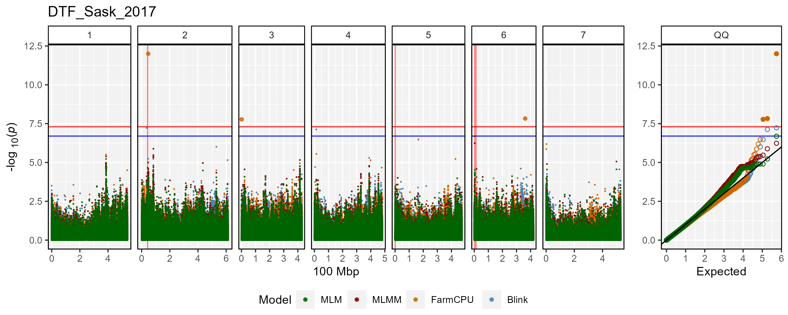
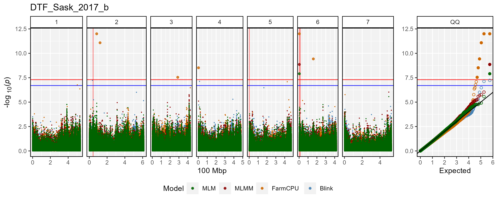
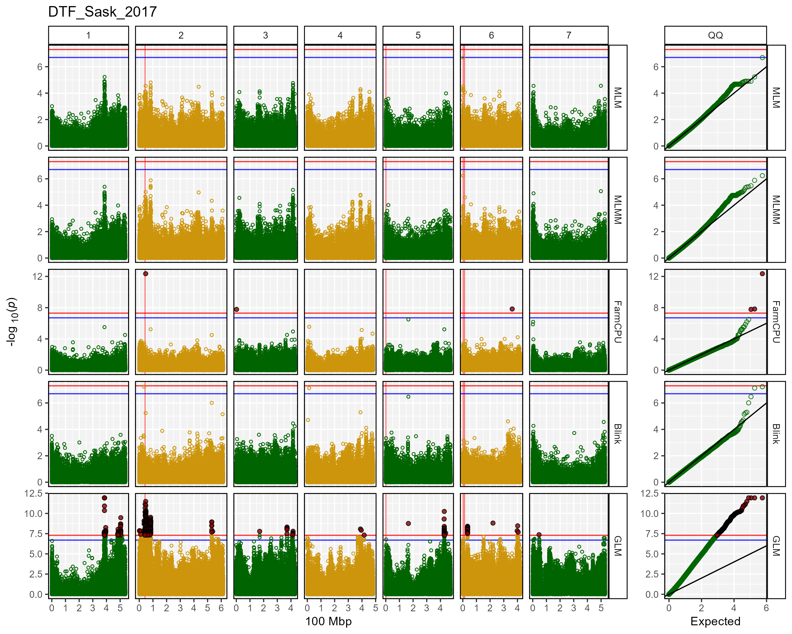
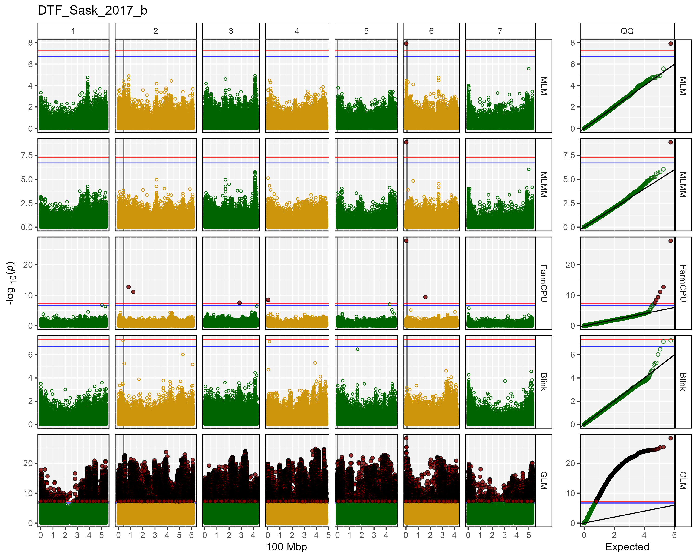

gwaspr R Package
================

`gwaspr`: an `R` package for plotting GWAS results from the `GAPIT`
package

# Installation

``` r
devtools::install_github("derekmichaelwright/gwaspr")
```

``` r
library(gwaspr)
```


# GWAS Tutorial

<a href="https://dblogr.com/academic/gwas_tutorial/gwas_tutorial.html">
<button class="btn btn-success"><i class="far fa-file-code"></i> https://dblogr.com/academic/gwas_tutorial/gwas_tutorial.html</button>
</a>

# Usage

For best practice, output from GAPIT should be in its own folder. In
this case, they are located in a folder called `GWAS_Results/`. For this
example we will plot GWAS results from 3 traits in a lentil diversity
panel:

-   **Testa\_Pattern**: a *qualitative* trait describing the presence or
    absence of seed coat pigmentation.
-   **DTF\_Nepal\_2017**: a *quantitative* trait describing days from
    sowing to flowering in a 2017 Nepal field trial.
-   **DTF\_Sask\_2017**: a *quantitative* trait describing days from
    sowing to flowering in a 2017 Saskatchewan field trial.
-   **DTF\_Sask\_2017\_b**: same as above but run with the *b*
    coefficient from a photothermal model (see [Wright *et al*.
    2020](https://nph.onlinelibrary.wiley.com/doi/10.1002/ppp3.10158))
    used as a covariate.

Note: for more info check out this [GWAS
tutorial](https://dblogr.com/academic/gwas_tutorial/gwas_tutorial.html%22).

``` r
myTraits <- list_Traits(folder = "GWAS_Results/")
myTraits
```

    ## [1] "DTF_Nepal_2017"  "DTF_Sask_2017"   "DTF_Sask_2017_b" "Testa_Pattern"

``` r
myResults <- list_Result_Files(folder = "GWAS_Results/")
myResults
```

    ##  [1] "GAPIT.Blink.DTF_Nepal_2017.GWAS.Results.csv"   
    ##  [2] "GAPIT.Blink.DTF_Sask_2017.GWAS.Results.csv"    
    ##  [3] "GAPIT.Blink.DTF_Sask_2017_b.GWAS.Results.csv"  
    ##  [4] "GAPIT.Blink.Testa_Pattern.GWAS.Results.csv"    
    ##  [5] "GAPIT.FarmCPU.DTF_Nepal_2017.GWAS.Results.csv" 
    ##  [6] "GAPIT.FarmCPU.DTF_Sask_2017.GWAS.Results.csv"  
    ##  [7] "GAPIT.FarmCPU.DTF_Sask_2017_b.GWAS.Results.csv"
    ##  [8] "GAPIT.FarmCPU.Testa_Pattern.GWAS.Results.csv"  
    ##  [9] "GAPIT.GLM.DTF_Nepal_2017.GWAS.Results.csv"     
    ## [10] "GAPIT.GLM.DTF_Sask_2017.GWAS.Results.csv"      
    ## [11] "GAPIT.GLM.DTF_Sask_2017_b.GWAS.Results.csv"    
    ## [12] "GAPIT.GLM.Testa_Pattern.GWAS.Results.csv"      
    ## [13] "GAPIT.MLM.DTF_Nepal_2017.GWAS.Results.csv"     
    ## [14] "GAPIT.MLM.DTF_Sask_2017.GWAS.Results.csv"      
    ## [15] "GAPIT.MLM.DTF_Sask_2017_b.GWAS.Results.csv"    
    ## [16] "GAPIT.MLM.Testa_Pattern.GWAS.Results.csv"      
    ## [17] "GAPIT.MLMM.DTF_Nepal_2017.GWAS.Results.csv"    
    ## [18] "GAPIT.MLMM.DTF_Sask_2017.GWAS.Results.csv"     
    ## [19] "GAPIT.MLMM.DTF_Sask_2017_b.GWAS.Results.csv"   
    ## [20] "GAPIT.MLMM.Testa_Pattern.GWAS.Results.csv"

``` r
list_Top_Markers(trait = "DTF_Nepal_2017", model = "MLMM", 
                 folder = "GWAS_Results/", 
                 threshold = 6.7, chroms = c(2,5), n = 1)
```

    ##                      SNP CHR      POS -log10(p)
    ## 1 Lcu.2RBY.Chr2p42543877   2 42543877     11.58
    ## 2  Lcu.2RBY.Chr5p1069654   5  1069654     16.71

## Summary Plot

``` r
mp <- gg_GWAS_Summary(folder = "GWAS_Results/", 
                      traits = myTraits,
                      models = c("MLM", "MLMM", "FarmCPU", "Blink"),
                      colors = c("darkgreen", "darkred", "darkorange3", "steelblue"),
                      threshold = 6.7, threshold2 = 6, 
                      hlines = c(1.5,3.5),
                      markers = c("Lcu.2RBY.Chr2p42543877","Lcu.2RBY.Chr5p1069654"), 
                      markers2 = "Lcu.2RBY.Chr6p12212845",
                      markers3 = "Lcu.2RBY.Chr6p2528817" )
ggsave("man/figures/GWAS_Summary.png", mp, width = 10, height = 2.5)
```


``` r
gg_GWAS_Summary_plotly(mp, 
                       filename = "man/figures/GWAS_Summary.html", 
                       width = 10, height = 8)
```

<https://derekmichaelwright.github.io/gwaspr/man/figures/GWAS_Summary.html>

------------------------------------------------------------------------

## Manhattan Plots

### Multi Manhattan Plots

``` r
for(i in myTraits) {
  mp <- gg_Manhattan(folder = "GWAS_Results/", trait = i, facet = F,
                     models = c("MLM", "MLMM", "FarmCPU", "Blink"),
                     threshold = 7.3, threshold2 = 6.7, pmax = 12,
                     vlines = c("Lcu.2RBY.Chr2p42543877", 
                                "Lcu.2RBY.Chr5p1069654",
                                "Lcu.2RBY.Chr6p12212845",
                                "Lcu.2RBY.Chr6p2528817") )
  ggsave(paste0("man/figures/Multi_",i,".png"), mp, width = 10, height = 4)
}
```







------------------------------------------------------------------------

### Facetted Manhattan Plots

``` r
for(i in myTraits) {
  mp <- gg_Manhattan(folder = "GWAS_Results/", trait = i, facet = T,
                     threshold = 7.3, threshold2 = 6.7,
                     vlines = c("Lcu.2RBY.Chr2p42543877", 
                                "Lcu.2RBY.Chr5p1069654",
                                "Lcu.2RBY.Chr6p12212845",
                                "Lcu.2RBY.Chr6p2528817"))
  ggsave(paste0("man/figures/Facet_",i,".png"), mp, width = 10, height = 8)
}
```







------------------------------------------------------------------------

# GAPIT

`GAPIT`: and `R` package for performing Genome Wide Association Studies
(GWAS)

<https://github.com/jiabowang/GAPIT3>

# Dependancies

`tidyverse`, `ggpubr`, `ggbeeswarm`, `ggrepel`, `ggtext`, `plotly`,
`htmlwidgets`

------------------------------------------------------------------------

© Derek Michael Wright [www.dblogr.com/](https://dblogr.com/)
