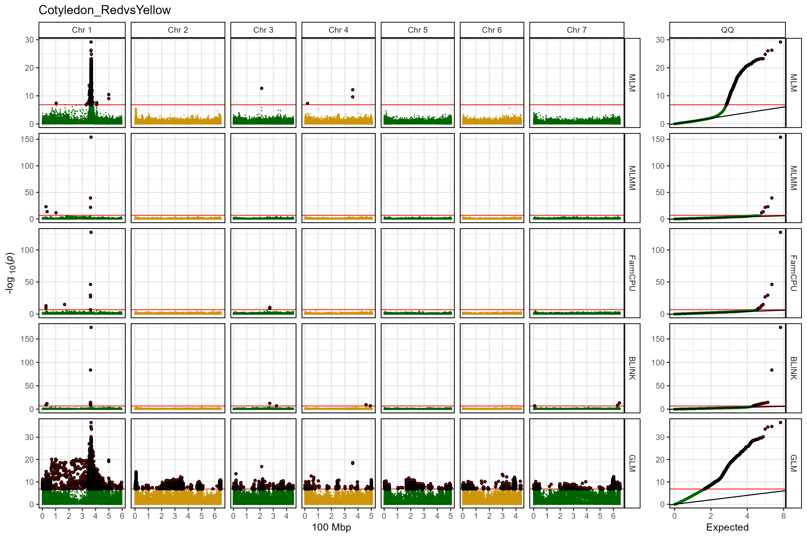
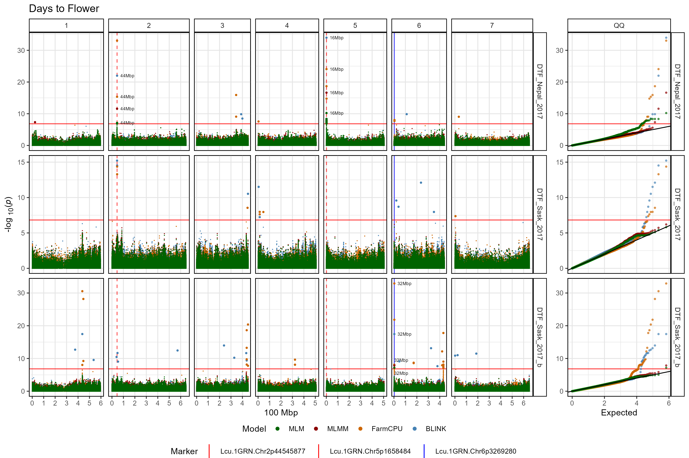
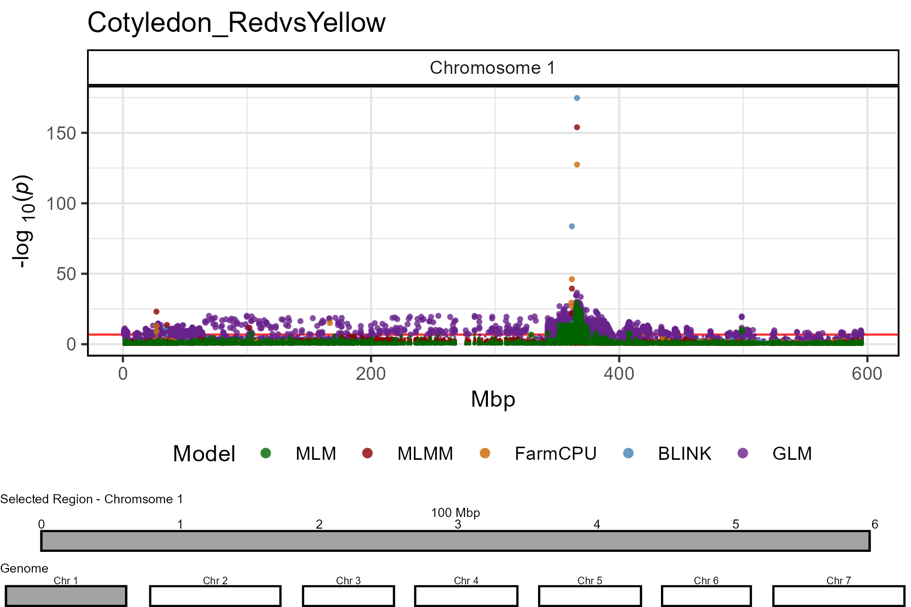

# gwaspr 

`gwaspr`: an `R` package for plotting GWAS results from the `GAPIT`
package

------------------------------------------------------------------------

# Instal gwaspr

``` r
devtools::install_github("derekmichaelwright/gwaspr")
```

``` r
library(gwaspr)
```

------------------------------------------------------------------------

# github

> - **github link**:
>   <a href="https://github.com/derekmichaelwright/gwaspr/"
>   target="_blank">https://github.com/derekmichaelwright/gwaspr/</a>

------------------------------------------------------------------------

# GWAS Tutorial

> - **dblogr GWAS Tutorial**: <a
>   href="https://derekmichaelwright.github.io/dblogr/academic/gwas_tutorial/"
>   target="_blank">https://derekmichaelwright.github.io/dblogr/academic/gwas_tutorial/</a>

------------------------------------------------------------------------

# GAPIT

`GAPIT`: and `R` package for performing Genome Wide Association Studies
(GWAS)

> - **GAPIT Website**: <a href="https://www.maizegenetics.net/gapit"
>   target="_blank">https://www.maizegenetics.net/gapit</a>
> - **GAPIT github**: <a href="https://github.com/jiabowang/GAPIT"
>   target="_blank">https://github.com/jiabowang/GAPIT</a>

``` r
devtools::install_github("jiabowang/GAPIT")
```

------------------------------------------------------------------------

# Dependancies

`tidyverse`, `ggpubr`, `ggbeeswarm`, `ggrepel`, `ggtext`, `plotly`,
`htmlwidgets`

------------------------------------------------------------------------

# Example Plots










------------------------------------------------------------------------


