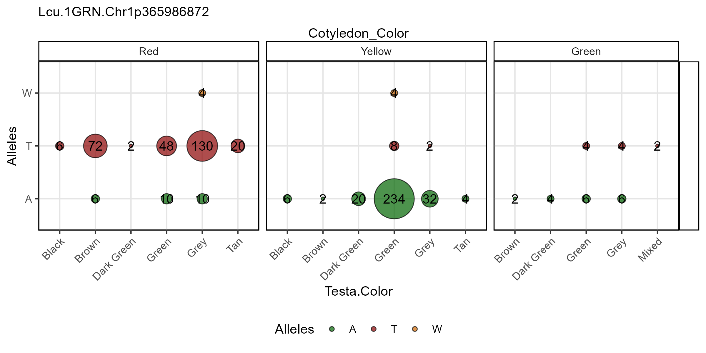
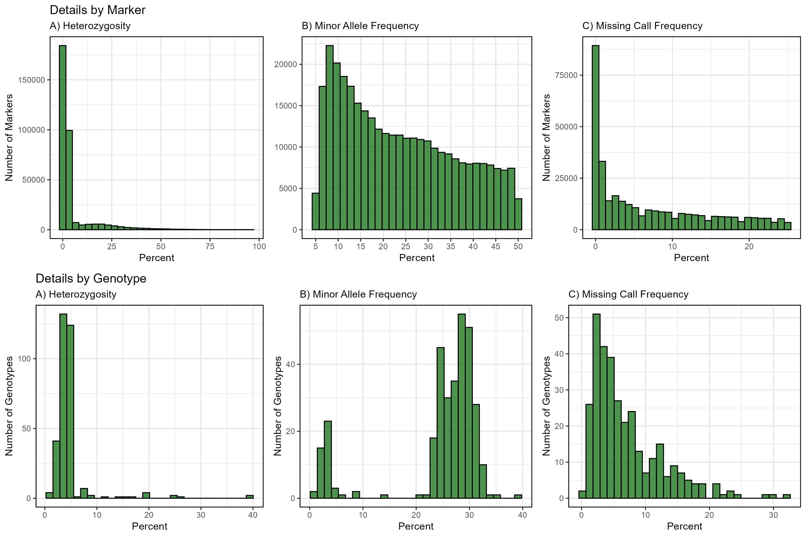
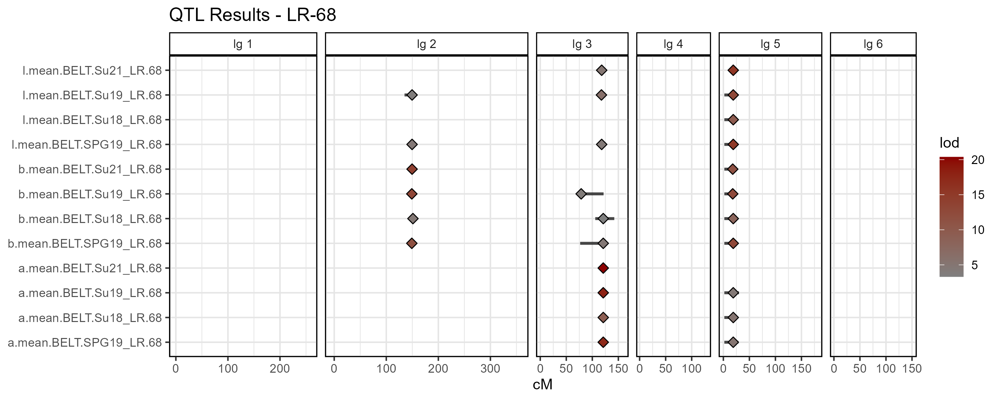

# gwaspr 

`gwaspr`: an `R` package for plotting GWAS results from the `GAPIT`
package

------------------------------------------------------------------------

# Instal gwaspr

``` r
devtools::install_github("derekmichaelwright/gwaspr")
```

``` r
library(gwaspr)
```

------------------------------------------------------------------------

# github

- **github link**:
  <a href="https://github.com/derekmichaelwright/gwaspr/"
  target="_blank">https://github.com/derekmichaelwright/gwaspr/</a>

------------------------------------------------------------------------

# Tutorial

- **dblogr GWAS Tutorial**: <a
  href="https://derekmichaelwright.github.io/dblogr/academic/gwas_tutorial/"
  target="_blank">https://derekmichaelwright.github.io/dblogr/academic/gwas_tutorial/</a>
- [Phenotype data (gwaspr_myY.csv)](vignettes/gwaspr_myY.csv)
- [Covariate data (gwaspr_myCV.csv)](vignettes/gwaspr_myCV.csv)
- [Genotype data (gwaspr_myG_hmp.zip)](vignettes/gwaspr_myG_hmp.zip)

------------------------------------------------------------------------

# GAPIT

`GAPIT`: and `R` package for performing Genome Wide Association Studies
(GWAS)

> - **GAPIT Website**: <a href="https://www.maizegenetics.net/gapit"
>   target="_blank">https://www.maizegenetics.net/gapit</a>
> - **GAPIT github**: <a href="https://github.com/jiabowang/GAPIT"
>   target="_blank">https://github.com/jiabowang/GAPIT</a>

``` r
devtools::install_github("jiabowang/GAPIT")
library(GAPIT)
```

------------------------------------------------------------------------

# Dependancies

`tidyverse`, `ggpubr`, `ggbeeswarm`, `ggrepel`, `ggtext`, `plotly`,
`htmlwidgets`

------------------------------------------------------------------------

# Example plots









------------------------------------------------------------------------


