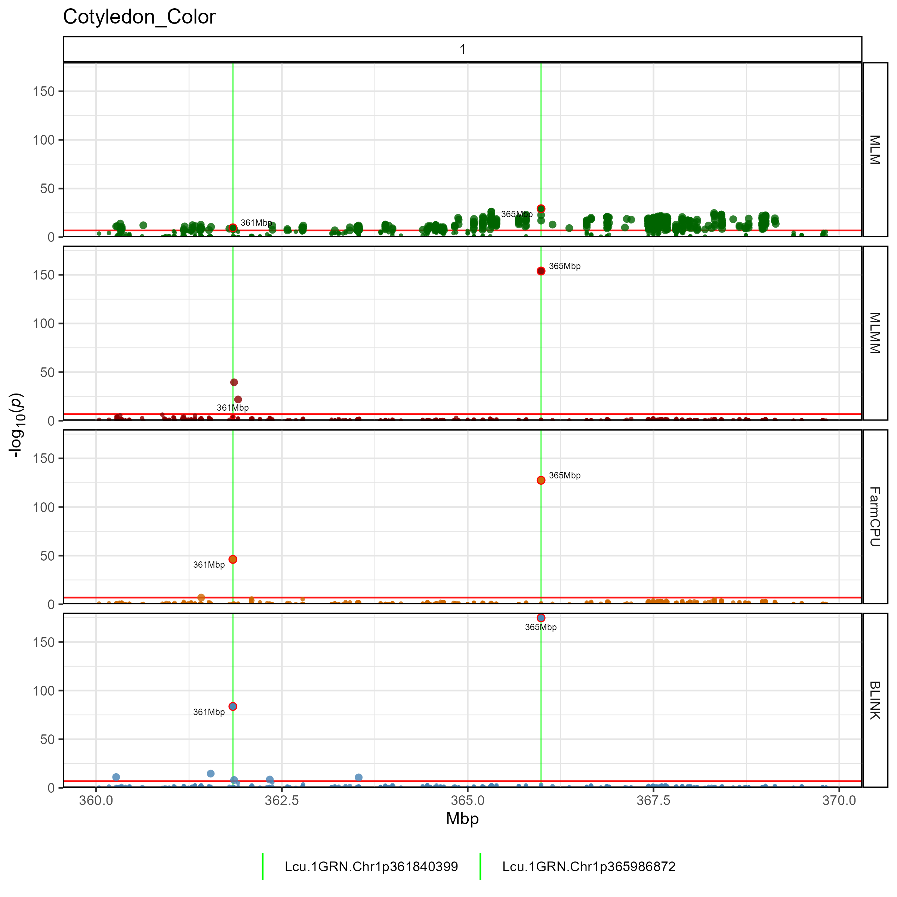
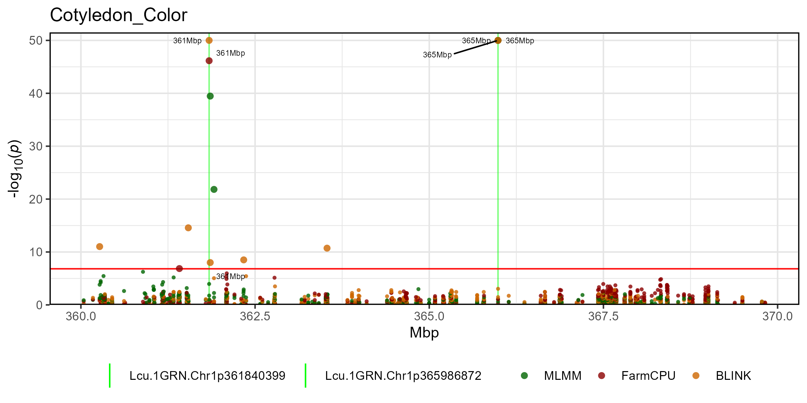

gwaspr R Package
================

`gwaspr`: an `R` package for plotting GWAS results from the `GAPIT`
package

# Installation

``` r
devtools::install_github("derekmichaelwright/gwaspr")
```

``` r
library(gwaspr)
```


# GWAS Tutorial

<https://derekmichaelwright.github.io/dblogr/academic/gwas_tutorial>

# Usage

For best practice, output from GAPIT should be in its own folder. In
this case, they are located in a folder called `GWAS_Results/`. For this
example we will plot GWAS results from 3 traits in a lentil diversity
panel:

- \*\*\*\*Cotyledon_Color\*\*: a *qualitative* trait describing
  cotyledon color (Red = 0, Yellow = 1).
- **DTF_Nepal_2017**: a *quantitative* trait describing days from sowing
  to flowering in a 2017 Nepal field trial.
- **DTF_Sask_2017**: a *quantitative* trait describing days from sowing
  to flowering in a 2017 Saskatchewan field trial.
- **DTF_Sask_2017_b**: same as above but run with the *b* coefficient
  from a photothermal model (see [Wright *et al*.
  2020](https://doi.org/10.1002/ppp3.10158)) used as a covariate.

Note: for more info check out this [GWAS
tutorial](https://derekmichaelwright.github.io/dblogr/academic/gwaspr_tutorial).

# gwaspr Functions

## list_Traits()

``` r
list_Traits(folder = "GWAS_Results/")
```

    ## [1] "Cotyledon_Color" "DTF_Nepal_2017"  "DTF_Sask_2017"   "DTF_Sask_2017_b"

## list_Results_Files()

``` r
list_Result_Files(folder = "GWAS_Results/")
```

    ##  [1] "GAPIT.Association.GWAS_Results.BLINK.Cotyledon_Color(Kansas).csv"  
    ##  [2] "GAPIT.Association.GWAS_Results.BLINK.Cotyledon_Color(NYC).csv"     
    ##  [3] "GAPIT.Association.GWAS_Results.BLINK.DTF_Nepal_2017(Kansas).csv"   
    ##  [4] "GAPIT.Association.GWAS_Results.BLINK.DTF_Nepal_2017(NYC).csv"      
    ##  [5] "GAPIT.Association.GWAS_Results.BLINK.DTF_Sask_2017(Kansas).csv"    
    ##  [6] "GAPIT.Association.GWAS_Results.BLINK.DTF_Sask_2017(NYC).csv"       
    ##  [7] "GAPIT.Association.GWAS_Results.BLINK.DTF_Sask_2017_b(Kansas).csv"  
    ##  [8] "GAPIT.Association.GWAS_Results.BLINK.DTF_Sask_2017_b(NYC).csv"     
    ##  [9] "GAPIT.Association.GWAS_Results.FarmCPU.Cotyledon_Color(Kansas).csv"
    ## [10] "GAPIT.Association.GWAS_Results.FarmCPU.Cotyledon_Color(NYC).csv"   
    ## [11] "GAPIT.Association.GWAS_Results.FarmCPU.DTF_Nepal_2017(Kansas).csv" 
    ## [12] "GAPIT.Association.GWAS_Results.FarmCPU.DTF_Nepal_2017(NYC).csv"    
    ## [13] "GAPIT.Association.GWAS_Results.FarmCPU.DTF_Sask_2017(Kansas).csv"  
    ## [14] "GAPIT.Association.GWAS_Results.FarmCPU.DTF_Sask_2017(NYC).csv"     
    ## [15] "GAPIT.Association.GWAS_Results.FarmCPU.DTF_Sask_2017_b(Kansas).csv"
    ## [16] "GAPIT.Association.GWAS_Results.FarmCPU.DTF_Sask_2017_b(NYC).csv"   
    ## [17] "GAPIT.Association.GWAS_Results.MLM.Cotyledon_Color(NYC).csv"       
    ## [18] "GAPIT.Association.GWAS_Results.MLM.DTF_Nepal_2017(NYC).csv"        
    ## [19] "GAPIT.Association.GWAS_Results.MLM.DTF_Sask_2017(NYC).csv"         
    ## [20] "GAPIT.Association.GWAS_Results.MLM.DTF_Sask_2017_b(NYC).csv"       
    ## [21] "GAPIT.Association.GWAS_Results.MLMM.Cotyledon_Color(NYC).csv"      
    ## [22] "GAPIT.Association.GWAS_Results.MLMM.DTF_Nepal_2017(NYC).csv"       
    ## [23] "GAPIT.Association.GWAS_Results.MLMM.DTF_Sask_2017(NYC).csv"        
    ## [24] "GAPIT.Association.GWAS_Results.MLMM.DTF_Sask_2017_b(NYC).csv"

## is_ran()

``` r
is_ran(folder = "GWAS_Results/")
```

    ##             Trait GLM MLM MLMM FarmCPU BLINK CMLM SUPER
    ## 1 Cotyledon_Color  NA   X    X       X     X   NA    NA
    ## 2  DTF_Nepal_2017  NA   X    X       X     X   NA    NA
    ## 3   DTF_Sask_2017  NA   X    X       X     X   NA    NA
    ## 4 DTF_Sask_2017_b  NA   X    X       X     X   NA    NA

## Order_GWAS_Results()

``` r
# first reorder the result files if they are not already arranged by P.value
order_GWAS_Results(folder = "GWAS_Results/")
```

## is_ordered()

``` r
is_ordered(folder = "GWAS_Results/")
```

    ##             Trait GLM MLM MLMM FarmCPU BLINK CMLM SUPER FarmCPU_Kansas
    ## 1 Cotyledon_Color  NA   X    X       X     X   NA    NA              X
    ## 2  DTF_Nepal_2017  NA   X    X       X     X   NA    NA              X
    ## 3   DTF_Sask_2017  NA   X    X       X     X   NA    NA              X
    ## 4 DTF_Sask_2017_b  NA   X    X       X     X   NA    NA              X
    ##   BLINK_Kansas
    ## 1            X
    ## 2            X
    ## 3            X
    ## 4            X

## table_GWAS_Results()

``` r
myResults <- table_GWAS_Results(folder = "GWAS_Results/",
                                threshold = 6.8, sug.threshold = 5)
myResults[1:10,]
```

    ##                        SNP Chr       Pos       P.value        MAF     effect
    ## 1  Lcu.1GRN.Chr1p365986872   1 365986872 1.754402e-175 0.47096774  0.4683785
    ## 2  Lcu.1GRN.Chr1p365986872   1 365986872 1.164052e-154 0.47096774         NA
    ## 3  Lcu.1GRN.Chr1p365986872   1 365986872 3.281941e-128 0.47096774  0.4954384
    ## 4  Lcu.1GRN.Chr1p361840399   1 361840399  2.178943e-84 0.04193548  0.4603589
    ## 5  Lcu.1GRN.Chr1p361840399   1 361840399  6.963600e-47 0.04193548  0.4715544
    ## 6  Lcu.1GRN.Chr1p361856257   1 361856257  3.377658e-40 0.04516129         NA
    ## 7    Lcu.1GRN.Chr5p1658484   5   1658484  1.050791e-34 0.12345679 12.5619150
    ## 8   Lcu.1GRN.Chr2p44546658   2  44546658  9.063107e-34 0.06790123         NA
    ## 9    Lcu.1GRN.Chr6p3269280   6   3269280  1.213338e-33 0.28105590 -2.2553180
    ## 10 Lcu.1GRN.Chr1p437374598   1 437374598  2.783736e-31 0.47670807         NA
    ##      H.B.P.Value   Model   Type           Trait negLog10_P negLog10_HBP
    ## 1  5.901229e-170   BLINK Kansas Cotyledon_Color  174.75587    169.22906
    ## 2  3.915488e-149    MLMM    NYC Cotyledon_Color  153.93403    148.40721
    ## 3  1.103937e-122 FarmCPU Kansas Cotyledon_Color  127.48387    121.95706
    ## 4   3.664623e-79   BLINK Kansas Cotyledon_Color   83.66175     78.43597
    ## 5   1.171163e-41 FarmCPU Kansas Cotyledon_Color   46.15717     40.93138
    ## 6   5.680663e-35    MLMM    NYC Cotyledon_Color   39.47138     34.24560
    ## 7   3.534516e-29   BLINK Kansas  DTF_Nepal_2017   33.97848     28.45167
    ## 8   3.048530e-28 FarmCPU    NYC  DTF_Nepal_2017   33.04272     27.51591
    ## 9   4.081267e-28 FarmCPU Kansas DTF_Sask_2017_b   32.91602     27.38920
    ## 10  4.681785e-26 FarmCPU    NYC DTF_Sask_2017_b   30.55537     25.32959
    ##      Threshold     Effect
    ## 1  Significant         NA
    ## 2  Significant  0.4905608
    ## 3  Significant         NA
    ## 4  Significant         NA
    ## 5  Significant         NA
    ## 6  Significant  1.4947330
    ## 7  Significant         NA
    ## 8  Significant -1.3159704
    ## 9  Significant         NA
    ## 10 Significant -0.1943441

## list_Top_Markers()

``` r
list_Top_Markers(folder = "GWAS_Results/", trait = "DTF_Nepal_2017")
```

    ## # A tibble: 34 × 6
    ##    SNP                       Chr       Pos Traits         Models        Max_LogP
    ##    <chr>                   <int>     <int> <chr>          <chr>            <dbl>
    ##  1 Lcu.1GRN.Chr5p1658484       5   1658484 DTF_Nepal_2017 BLINK; FarmC…    34.0 
    ##  2 Lcu.1GRN.Chr2p44546658      2  44546658 DTF_Nepal_2017 FarmCPU; MLM     33.0 
    ##  3 Lcu.1GRN.Chr2p44545877      2  44545877 DTF_Nepal_2017 BLINK; FarmC…    22.0 
    ##  4 Lcu.1GRN.Chr5p1650591       5   1650591 DTF_Nepal_2017 FarmCPU; MLM     18.7 
    ##  5 Lcu.1GRN.Chr3p345157947     3 345157947 DTF_Nepal_2017 FarmCPU          15.9 
    ##  6 Lcu.1GRN.Chr5p2101990       5   2101990 DTF_Nepal_2017 FarmCPU          14.8 
    ##  7 Lcu.1GRN.Chr6p111399799     6 111399799 DTF_Nepal_2017 BLINK             9.87
    ##  8 Lcu.1GRN.Chr3p389104888     3 389104888 DTF_Nepal_2017 BLINK             9.85
    ##  9 Lcu.1GRN.Chr3p345193745     3 345193745 DTF_Nepal_2017 BLINK; FarmC…     9.08
    ## 10 Lcu.1GRN.Chr7p33922006      7  33922006 DTF_Nepal_2017 FarmCPU           9.04
    ## # ℹ 24 more rows

``` r
list_Top_Markers(folder = "GWAS_Results/", trait = "DTF_Sask_2017")
```

    ## # A tibble: 32 × 6
    ##    SNP                       Chr       Pos Traits        Models         Max_LogP
    ##    <chr>                   <int>     <int> <chr>         <chr>             <dbl>
    ##  1 Lcu.1GRN.Chr2p44558948      2  44558948 DTF_Sask_2017 BLINK             15.2 
    ##  2 Lcu.1GRN.Chr2p45088100      2  45088100 DTF_Sask_2017 BLINK; FarmCPU    14.5 
    ##  3 Lcu.1GRN.Chr2p45092147      2  45092147 DTF_Sask_2017 FarmCPU           13.3 
    ##  4 Lcu.1GRN.Chr6p236151499     6 236151499 DTF_Sask_2017 BLINK             12.1 
    ##  5 Lcu.1GRN.Chr4p5017613       4   5017613 DTF_Sask_2017 BLINK             11.5 
    ##  6 Lcu.1GRN.Chr3p448489765     3 448489765 DTF_Sask_2017 BLINK             10.5 
    ##  7 Lcu.1GRN.Chr6p20799044      6  20799044 DTF_Sask_2017 BLINK; FarmCPU     9.58
    ##  8 Lcu.1GRN.Chr6p40079300      6  40079300 DTF_Sask_2017 BLINK              8.70
    ##  9 Lcu.1GRN.Chr3p444676637     3 444676637 DTF_Sask_2017 FarmCPU            8.55
    ## 10 Lcu.1GRN.Chr4p14484871      4  14484871 DTF_Sask_2017 BLINK; FarmCPU     7.98
    ## # ℹ 22 more rows

``` r
list_Top_Markers(folder = "GWAS_Results/", trait = "DTF_Sask_2017_b")
```

    ## # A tibble: 39 × 6
    ##    SNP                       Chr       Pos Traits          Models       Max_LogP
    ##    <chr>                   <int>     <int> <chr>           <chr>           <dbl>
    ##  1 Lcu.1GRN.Chr6p3269280       6   3269280 DTF_Sask_2017_b BLINK; Farm…     32.9
    ##  2 Lcu.1GRN.Chr1p437374598     1 437374598 DTF_Sask_2017_b FarmCPU          30.6
    ##  3 Lcu.1GRN.Chr1p446411579     1 446411579 DTF_Sask_2017_b FarmCPU          28.2
    ##  4 Lcu.1GRN.Chr6p3270522       6   3270522 DTF_Sask_2017_b FarmCPU          21.8
    ##  5 Lcu.1GRN.Chr3p448586972     3 448586972 DTF_Sask_2017_b FarmCPU          20.4
    ##  6 Lcu.1GRN.Chr3p437386398     3 437386398 DTF_Sask_2017_b FarmCPU          18.6
    ##  7 Lcu.1GRN.Chr6p431657465     6 431657465 DTF_Sask_2017_b FarmCPU          17.8
    ##  8 Lcu.1GRN.Chr1p437359352     1 437359352 DTF_Sask_2017_b BLINK; Farm…     17.5
    ##  9 Lcu.1GRN.Chr3p239208186     3 239208186 DTF_Sask_2017_b BLINK            14.0
    ## 10 Lcu.1GRN.Chr3p437318468     3 437318468 DTF_Sask_2017_b FarmCPU          13.3
    ## # ℹ 29 more rows

``` r
list_Top_Markers(folder = "GWAS_Results/", trait = "Cotyledon_Color")
```

    ## # A tibble: 39 × 6
    ##    SNP                       Chr       Pos Traits          Models       Max_LogP
    ##    <chr>                   <int>     <int> <chr>           <chr>           <dbl>
    ##  1 Lcu.1GRN.Chr1p365986872     1 365986872 Cotyledon_Color BLINK; Farm…    175. 
    ##  2 Lcu.1GRN.Chr1p361840399     1 361840399 Cotyledon_Color BLINK; Farm…     83.7
    ##  3 Lcu.1GRN.Chr1p361856257     1 361856257 Cotyledon_Color MLMM             39.5
    ##  4 Lcu.1GRN.Chr1p361407757     1 361407757 Cotyledon_Color FarmCPU          29.5
    ##  5 Lcu.1GRN.Chr1p365318023     1 365318023 Cotyledon_Color MLM              26.3
    ##  6 Lcu.1GRN.Chr1p365318027     1 365318027 Cotyledon_Color MLM              26.1
    ##  7 Lcu.1GRN.Chr1p27007485      1  27007485 Cotyledon_Color MLMM             23.1
    ##  8 Lcu.1GRN.Chr1p166851286     1 166851286 Cotyledon_Color FarmCPU          15.0
    ##  9 Lcu.1GRN.Chr1p361541626     1 361541626 Cotyledon_Color BLINK            14.6
    ## 10 Lcu.1GRN.Chr7p645659887     7 645659887 Cotyledon_Color BLINK            13.5
    ## # ℹ 29 more rows

------------------------------------------------------------------------

## gg_Manhattan()

### Multi Manhattan Plots

``` r
for(i in list_Traits(folder = "GWAS_Results/")) {
  # Plot
  mp <- gg_Manhattan(folder = "GWAS_Results/", trait = i)
  # Save
  ggsave(paste0("man/figures/gg_Man1_", i, ".png"), 
         mp, width = 12, height = 3.5, bg = "white")
}
```


------------------------------------------------------------------------

### Facetted Manhattan Plots

``` r
#i<-"DTF_Sask_2017"
#i<-"DTF_Sask_2017_b"
for(i in list_Traits(folder = "GWAS_Results/")) {
  # Plot
  mp <- gg_Manhattan(folder = "GWAS_Results/", trait = i, facet = T)
  # Save
  ggsave(paste0("man/figures/gg_Man2_", i, ".png"), 
         mp, width = 12, height = 8, bg = "white")
}
```


------------------------------------------------------------------------

## gg_Manhattan_Traits()

``` r
# Plot
mp <- gg_Manhattan_Traits(
  # Specify a folder with GWAS results
  folder = "GWAS_Results/",
  # Select traits to plot
  traits = c("DTF_Sask_2017", "DTF_Sask_2017_b"),
  # Specify a title
  title = "Days to Flower",
  # Highlight specific markers
  markers = c("Lcu.1GRN.Chr2p44545877",
              "Lcu.1GRN.Chr5p1658484",
              "Lcu.1GRN.Chr6p3269280"),
  # Create alt labels for the markers
  labels = c("44Mbp","16Mbp","32Mbp"),
  # Specify Color for each marker vline
  vline.colors = c("red","red","blue")
)
# Save
ggsave("man/figures/gg_Man_Traits.png", mp, width = 12, height = 8, bg = "white")
```


------------------------------------------------------------------------

## gg_Mahattan_Zoom()

``` r
# Plot
mp <- gg_Manhattan_Zoom(
  # Specify a folder with GWAS results
  folder = "GWAS_Results/", 
  # Select a trait to plot
  trait = "Cotyledon_Color", 
  # Plot just Chromosome 1
  chr = 1,
  pos1 = 360000000,
  pos2 = 370000000,
  # Highlight specific markers
  markers = c("Lcu.1GRN.Chr1p365986872",
              "Lcu.1GRN.Chr1p361840399",
              "Lcu.1GRN.Chr1p362336814"),
  # Create alt labels for the markers
  labels = c("365Mbp","361Mbp","362Mbp"),
  # Specify Color for each marker vline
  vline.colors = rep("green",3),
  # Should models be facetted
  facet = T
  )
# Save
ggsave("man/figures/gg_Man_Zoom1.png", mp, width = 8, height = 8)
```



``` r
# Plot
mp <- gg_Manhattan_Zoom(
  # Specify a folder with GWAS results
  folder = "GWAS_Results/", 
  # Select a trait to plot
  trait = "Cotyledon_Color", 
  # Plot just Chromosome 1
  chr = 1,
  pos1 = 360000000,
  pos2 = 370000000,
  # Plot only certain GWAS models
  models = c("MLMM","FarmCPU","BLINK"),
  # Highlight specific markers
  markers = c("Lcu.1GRN.Chr1p365986872",
              "Lcu.1GRN.Chr1p361840399",
              "Lcu.1GRN.Chr1p362336814"),
  # Create alt labels for the markers
  labels = c("365Mbp","361Mbp","362Mbp"),
  # Specify Color for each marker vline
  vline.colors = rep("green",3),
  # Should models be facetted
  facet = F,
  # set a max P value
  pmax = 15
  )
# Save
ggsave("man/figures/gg_Man_Zoom2.png", mp, width = 8, height = 8)
```



------------------------------------------------------------------------

## gg_GWAS_Summary()

``` r
# Plot
mp <- gg_GWAS_Summary(folder = "GWAS_Results/", 
                      title = "Summary of Significant GWAS Results")
# Save
ggsave("man/figures/GWAS_Summary_01.png", mp, width = 12, height = 4)
```


Make it an interactive plot with the following code

------------------------------------------------------------------------

# GAPIT

`GAPIT`: and `R` package for performing Genome Wide Association Studies
(GWAS)

<https://github.com/jiabowang/GAPIT>

# Dependancies

`tidyverse`, `ggpubr`, `ggbeeswarm`, `ggrepel`, `ggtext`, `plotly`,
`htmlwidgets`

------------------------------------------------------------------------

© Derek Michael Wright
