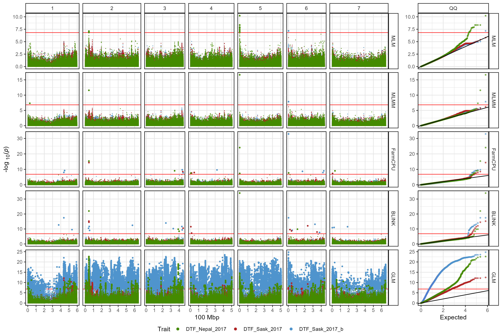
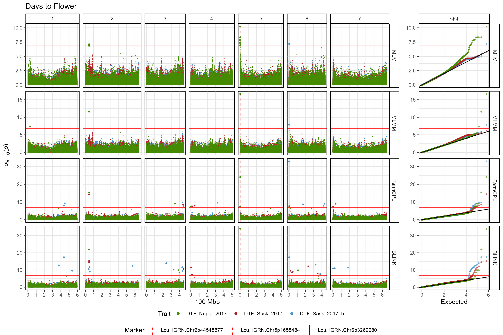
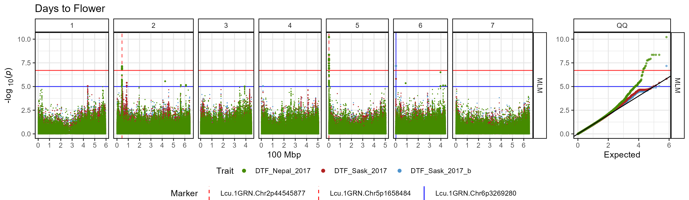

# gg_Manhattan_xModels()

The function
[`gg_Manhattan_xModels()`](https://derekmichaelwright.github.io/gwaspr/reference/gg_Manhattan_xModels.md)
creates manhattan plots from GAPIT GWAS results for multiple traits and
facets them by Model. This allows the user to compare the results from
different traits across each GWAS model.

Specifying a `folder` and `traits` is all that is needed to create
manhattan plots for multiple traits.

``` r

# Plot
mp <- gg_Manhattan_xModels(
  # Specify a folder with GWAS results
  folder = "GWAS_Results/",
  # Select traits to plot
  traits = c("DTF_Nepal_2017", "DTF_Sask_2017", "DTF_Sask_2017_b") )
# Save
ggsave("figures/gg_Manhattan_xModels_01.png", mp, width = 12, height = 8, bg = "white")
```



------------------------------------------------------------------------

## Customized Plot

``` r

# Plot
mp <- gg_Manhattan_xModels(
  # Specify a folder with GWAS results
  folder = "GWAS_Results/",
  # Select traits to plot
  traits = c("DTF_Nepal_2017", "DTF_Sask_2017", "DTF_Sask_2017_b"),
  # Specify a title
  title = "Days to Flower",
  # Add vertical lines
  vlines = c("Lcu.1GRN.Chr2p44545877",
              "Lcu.1GRN.Chr5p1658484",
              "Lcu.1GRN.Chr6p3269280"),
  vline.colors = c("red", "red", "blue"),
  vline.types = c(2,2,1),
  # Change the legend alignment
  legend.box="vertical",
  # Choose a GWAS model
  models =  c("MLM","MLMM","FarmCPU","BLINK") )
# Save
ggsave("figures/gg_Manhattan_xModels_02.png", mp, width = 12, height = 8, bg = "white")
```



------------------------------------------------------------------------

``` r

# Plot
mp <- gg_Manhattan_xModels(
  # Specify a folder with GWAS results
  folder = "GWAS_Results/",
  # Select traits to plot
  traits = c("DTF_Nepal_2017", "DTF_Sask_2017", "DTF_Sask_2017_b"),
  # Specify a title
  title = "Days to Flower",
  # Set horizontal thresholds bars
  threshold = 6.7,
  sug.threshold = 5,
  # Add vertical lines
  vlines = c("Lcu.1GRN.Chr2p44545877",
              "Lcu.1GRN.Chr5p1658484",
              "Lcu.1GRN.Chr6p3269280"),
  vline.colors = c("red", "red", "blue"),
  vline.types = c(2,2,1),
  # Change the legend alignment
  legend.box="vertical",
  # Choose a GWAS model
  models =  "MLM")
# Save
ggsave("figures/gg_Manhattan_xModels_03.png", mp, width = 12, height = 3.5, bg = "white")
```



------------------------------------------------------------------------
