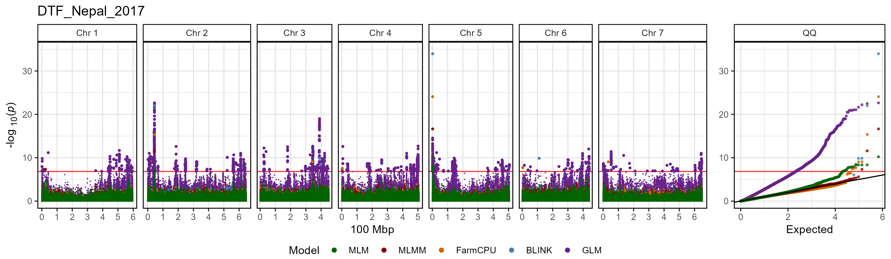
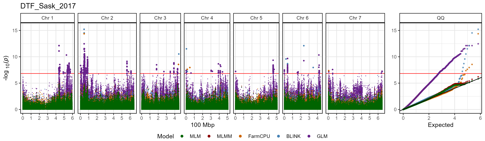
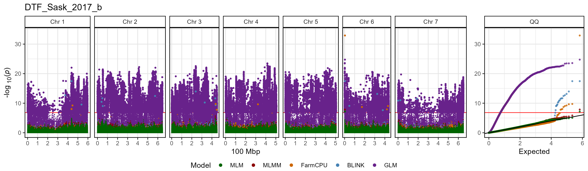
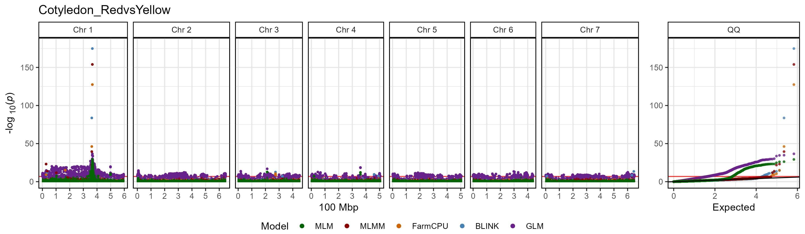
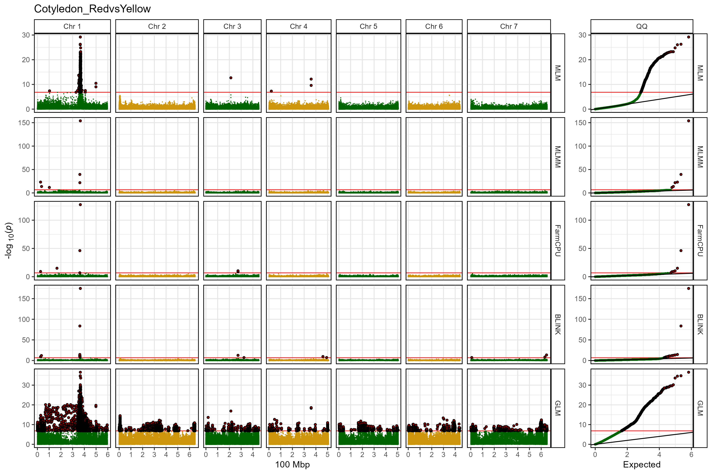
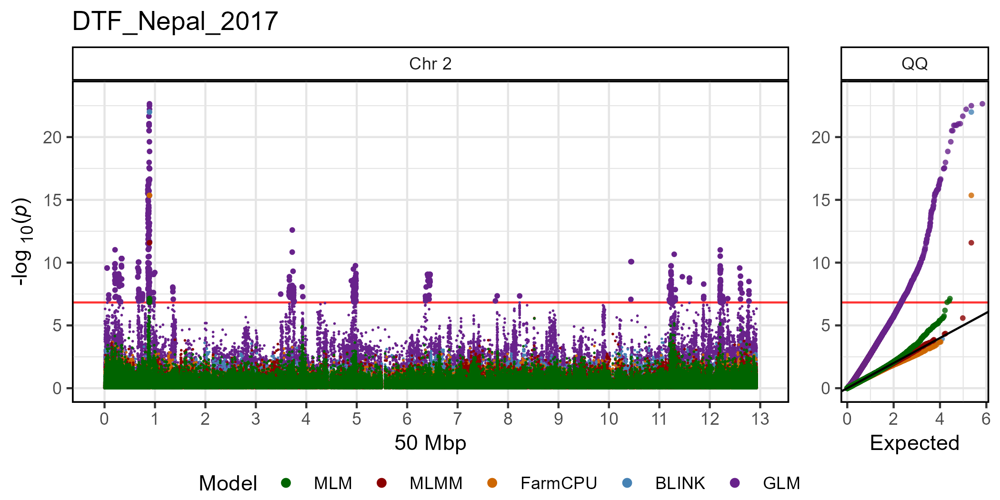
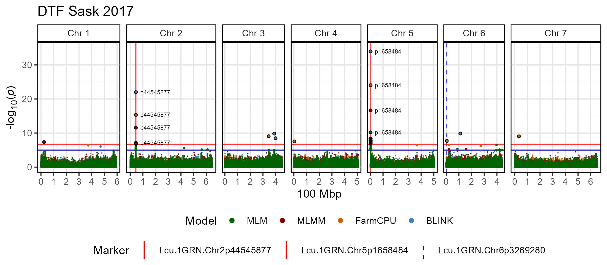
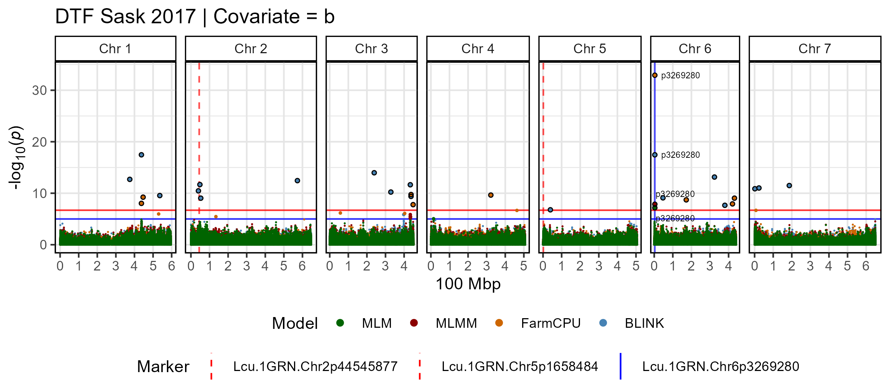

# gg_manhattan()

The function
[`gg_Manhattan()`](https://derekmichaelwright.github.io/gwaspr/reference/gg_Manhattan.md)
creates manhattan plots from GAPIT GWAS results.

Specifying a `folder` and `trait` is all that is needed to create
manhattan plots.

``` r

# Plot
mp <- gg_Manhattan(
  # Specify a folder with GWAS results
  folder = "GWAS_Results/", 
  # Select a trait to plot
  trait = "DTF_Nepal_2017" )
# Save
ggsave("figures/gg_Manhattan_01_DTF_Nepal_2017.png", 
       mp, width = 12, height = 3.5, bg = "white")
```



------------------------------------------------------------------------

## Plot all traits with a loop

A simple loop can be used to plot GWAS results for each trait within the
specified `folder`.

``` r

# Create for loop
for(i in list_Traits(folder = "GWAS_Results/")) {
  # Plot
  mp <- gg_Manhattan(
    # Specify a folder with GWAS results
    folder = "GWAS_Results/", 
    # Select a trait to plot
    trait = i )
  # Save
  ggsave(paste0("figures/gg_Manhattan_01_", i, ".png"), 
         mp, width = 12, height = 3.5, bg = "white")
}
```







------------------------------------------------------------------------

## Facetting

The default setting for
[`gg_Manhattan()`](https://derekmichaelwright.github.io/gwaspr/reference/gg_Manhattan.md)
is to set `facet = F` which will plot all models together. By changing
`facet = T` we can separate each GWAS model. When setting `facet = T`,
points are now colored by chromosome, which can be changed with
`chr.colors`. Significant associations can also be highlighted by
setting `highlight.sig` and `sig.color`.

``` r

# Plot
mp <- gg_Manhattan(
  # Specify a folder with GWAS results
  folder = "GWAS_Results/",
  # Select a trait to plot
  trait = "Cotyledon_RedvsYellow", 
  # Facet out the different GWAS models
  facet = T,
  # Set chromosome colors
  chr.colors = rep(c("darkgreen", "darkgoldenrod3"), 4),
  # Highlight significant associations
  highlight.sig = T,
  # Choose the highlight color
  sig.color = "darkred" )
# Save
ggsave("figures/gg_Manhattan_02_Cotyledon_RedvsYellow.png", 
       mp, width = 12, height = 8, bg = "white")
```



------------------------------------------------------------------------

## Single Chromosome

A single chromosome can be plotted by setting `chr`. The x-axis can also
be adjusted by setting `chr.unit`.

``` r

# Plot
mp <- gg_Manhattan(
  # Specify a folder with GWAS results
  folder = "GWAS_Results/", 
  # Select a trait to plot
  trait = "DTF_Nepal_2017",
  # Select a chromosome to plot
  chr = 2,
  # Change chromosome units
  chr.unit = "50 Mbp" )
# Save
ggsave("figures/gg_Manhattan_03_DTF_Nepal_2017.png", 
       mp, width = 7, height = 3.5, bg = "white")
```



------------------------------------------------------------------------

## Customized Plot

The default for
[`gg_Manhattan()`](https://derekmichaelwright.github.io/gwaspr/reference/gg_Manhattan.md)
is to set the plot `title = trait`, but this can be changed. You can
also adjust the `threshold` and add a`sug.threshold`. If specified,
`markers` can be highlighted and have their `labels` customized. Adding
`vlines` can be used to aid in comparisons with other manhattan plots or
accross GWAS `models`. `vlines` can be customized with `vline.colors`
and `vline.types`. You can Select which GWAS `models` to plot and set
the colors of each with `model.colors`. Significant associations can
also be highlighted by setting `highlight.sig` and `sig.color`. The QQ
plot can also be removed by setting `addQQ = F`.

``` r

# Plot
mp <- gg_Manhattan(
  # Specify a folder with GWAS results
  folder = "GWAS_Results/",
  # Select a trait to plot
  trait = "DTF_Nepal_2017",
  # Create a title for the plot
  title = "DTF Sask 2017",
  # Set horizontal thresholds bars
  threshold = 6.7,
  sug.threshold = 5,
  # Highlight specific markers
  markers = c("Lcu.1GRN.Chr2p44545877",
             "Lcu.1GRN.Chr5p1658484"),
  labels = c("p44545877",
             "p1658484"),
  # Add vertical lines
  vlines = c("Lcu.1GRN.Chr2p44545877",
             "Lcu.1GRN.Chr5p1658484",
             "Lcu.1GRN.Chr6p3269280"),
  vline.colors = c("red","red","blue"),
  vline.types = c(1,1,2),
  # Change the legend alignment
  legend.box="vertical",
  # Select GWAS models
  models = c("MLM", "MLMM", "FarmCPU", "BLINK"),
  # Set colors for each GWAS model
  model.colors = c("darkgreen", "darkred", "darkorange3", "steelblue"),
  # Highlight significant associations
  highlight.sig = T,
  # Highlight color
  sig.color = "black",
  # Remove the QQ plot
  addQQ = F)
# Save
ggsave("figures/gg_Manhattan_04_DTF_Nepal_2017.png", 
       mp, width = 8, height = 3.5, bg = "white")
```



------------------------------------------------------------------------

``` r

# Plot
mp <- gg_Manhattan(
  # Specify a folder with GWAS results
  folder = "GWAS_Results/",
  # Select a trait to plot
  trait = "DTF_Sask_2017_b",
  # Create a title for the plot
  title = "DTF Sask 2017 | Covariate = b",
  # Set horizontal thresholds bars
  threshold = 6.7,
  sug.threshold = 5,
  # Highlight specific markers
  markers = "Lcu.1GRN.Chr6p3269280",
  labels = "p3269280",
  # Add vertical lines
  vlines = c("Lcu.1GRN.Chr2p44545877",
             "Lcu.1GRN.Chr5p1658484",
             "Lcu.1GRN.Chr6p3269280"),
  vline.colors = c("red","red","blue"),
  vline.types = c(2,2,1),
  # Change the legend alignment
  legend.box="vertical",
  # Select GWAS models
  models = c("MLM", "MLMM", "FarmCPU", "BLINK"),
  # Set colors for each GWAS model
  model.colors = c("darkgreen", "darkred", "darkorange3", "steelblue"),
  # Highlight significant associations
  highlight.sig = T,
  # Highlight color
  sig.color = "black",
  # Remove the QQ plot
  addQQ = F)
# Save
ggsave("figures/gg_Manhattan_04_DTF_Sask_2017_b.png", 
       mp, width = 8, height = 3.5, bg = "white")
```



------------------------------------------------------------------------
