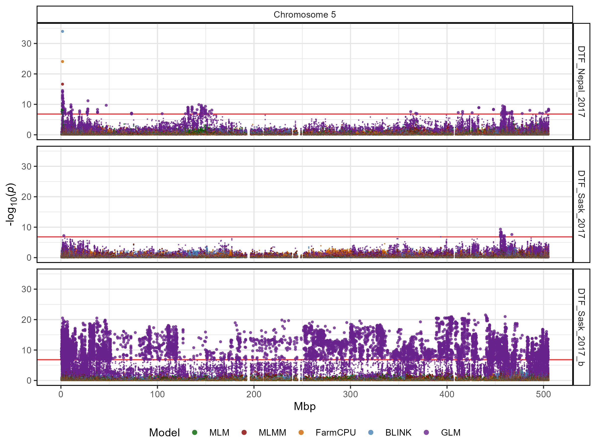
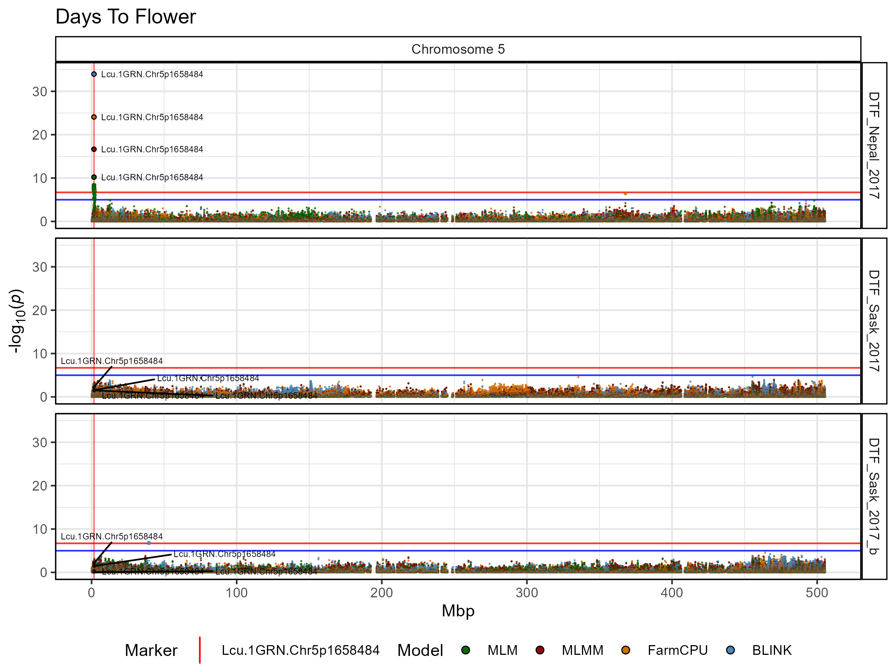
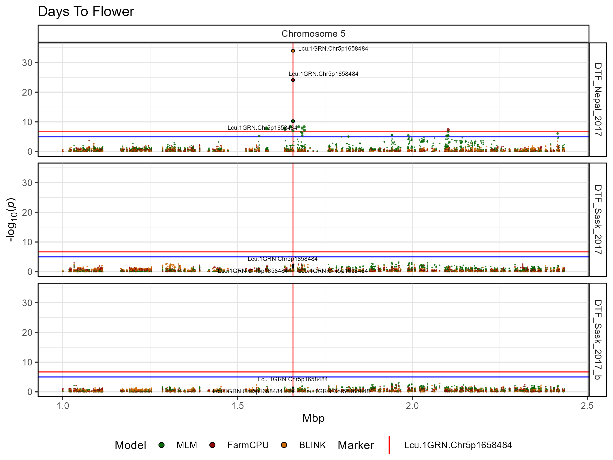

# gg_Manhattan_Zoom_Traits()

The function
[`gg_Manhattan_Zoom_Traits()`](https://derekmichaelwright.github.io/gwaspr/reference/gg_Manhattan_Zoom_Traits.md)
creates manhattan plots from GAPIT GWAS results zoomed into a specific
region on a chromosome for multiple traits. Specifying a `folder`,
`traits` and a `chr` (defaults to 1 if not specified) is all that is
needed to create a zoomed in manhattan plot.

``` r

# Plot
mp <- gg_Manhattan_Zoom_Traits(
  # Specify a folder with GWAS results
  folder = "GWAS_Results/",
  # Select traits to plot
  traits = c("DTF_Sask_2017","DTF_Sask_2017_b","DTF_Nepal_2017"),
  # Plot just Chromosome 1
  chr = 5 ) 
ggsave("figures/gg_Manhattan_Zoom_Traits_01.png", mp, width = 8, height = 6)
```



------------------------------------------------------------------------

``` r

# Plot
mp <- gg_Manhattan_Zoom_Traits(
  # Specify a folder with GWAS results
  folder = "GWAS_Results/",
  # Select traits to plot
  traits = c("DTF_Sask_2017","DTF_Sask_2017_b","DTF_Nepal_2017"),
  # Create a title for the plot
  title = "Days To Flower",
  # Plot just Chromosome 1
  chr = 5,
  # Set horizontal thresholds bars
  threshold = 6.7,
  sug.threshold = 5,
  # Highlight specific markers
  markers = "Lcu.1GRN.Chr5p1658484",
  # Plot only certain GWAS models
  models =  c("MLM","MLMM","FarmCPU","BLINK"),
  model.colors = gwaspr_Colors
  ) 
ggsave("figures/gg_Manhattan_Zoom_Traits_02.png", mp, width = 8, height = 6)
```



------------------------------------------------------------------------

``` r

# Plot
mp <- gg_Manhattan_Zoom_Traits(
  # Specify a folder with GWAS results
  folder = "GWAS_Results/",
  # Select traits to plot
  traits = c("DTF_Sask_2017","DTF_Sask_2017_b","DTF_Nepal_2017"),
  # Create a title for the plot
  title = "Days To Flower",
  # Plot just Chromosome 1
  chr = 5, 
  pos1 = 1000000,
  pos2 = 2500000,
  # Set horizontal thresholds bars
  threshold = 6.7,
  sug.threshold = 5,
  # Highlight specific markers
  markers = "Lcu.1GRN.Chr5p1658484",
  # Plot only certain GWAS models
  models =  c("MLM","FarmCPU","BLINK"),
  model.colors = gwaspr_Colors
  ) 
ggsave("figures/gg_Manhattan_Zoom_Traits_03.png", mp, width = 8, height = 6)
```



------------------------------------------------------------------------
