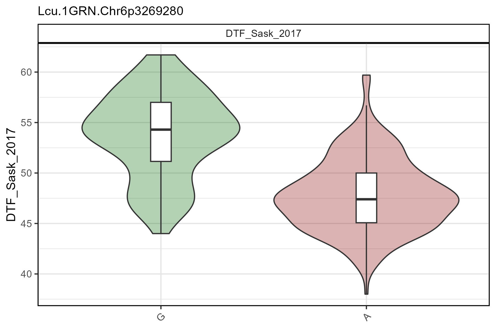
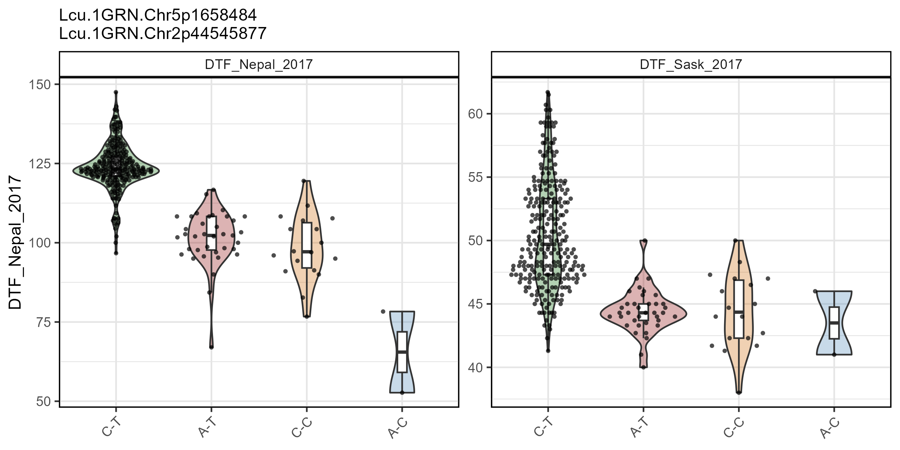
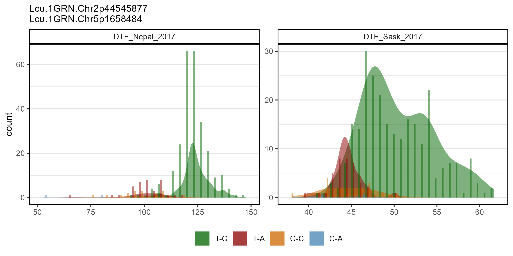
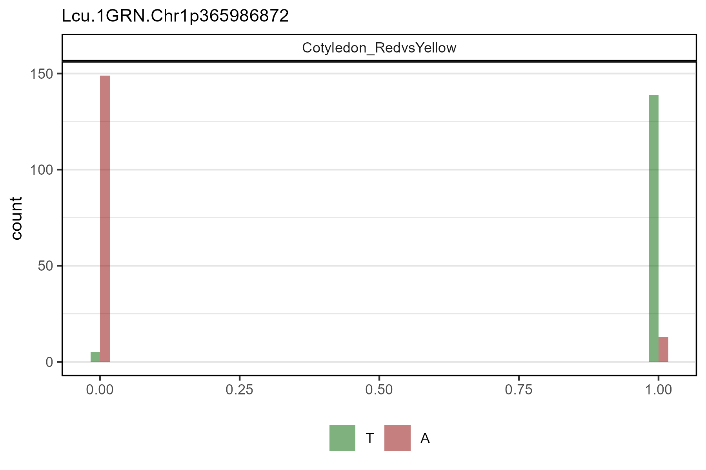

# gg_Marker\_\*()

## Load data

``` r

# Read data
myY <- read.csv("myY.csv")
myG <- read.csv("myG_hmp.csv", header = T)
```

------------------------------------------------------------------------

### gg_Marker_Box()

single marker, single trait

``` r

# Plot
mp <- gg_Marker_Box(xG = myG, xY = myY,
                    traits = "DTF_Sask_2017",
                    markers = "Lcu.1GRN.Chr6p3269280",
                    plot.points = F )
# Save
ggsave("figures/gg_Marker_Box_01.png", mp, width = 6, height = 4)
```



------------------------------------------------------------------------

multiple markers, multiple traits

``` r

# Plot
mp <- gg_Marker_Box(xG = myG, xY = myY,
                    traits = c("DTF_Nepal_2017", "DTF_Sask_2017"),
                    markers = c("Lcu.1GRN.Chr5p1658484", "Lcu.1GRN.Chr2p44545877") )
# Save
ggsave("figures/gg_Marker_Box_02.png", mp, width = 8, height = 4)
```



------------------------------------------------------------------------

## gg_Marker_Bar()

``` r

# Plot
mp <- gg_Marker_Bar(xG = myG, xY = myY,
                    traits = c("DTF_Nepal_2017", "DTF_Sask_2017"),
                    markers = c("Lcu.1GRN.Chr2p44545877", "Lcu.1GRN.Chr5p1658484") )
# Save
ggsave("figures/gg_Marker_Bar_01.png", mp, width = 8, height = 4)
```



------------------------------------------------------------------------

``` r

# Plot 
mp <- gg_Marker_Bar(xG = myG, xY = myY,
                    traits = "Cotyledon_RedvsYellow",
                    markers = "Lcu.1GRN.Chr1p365986872",
                    plot.density = F )
# Save
ggsave("figures/gg_Marker_Bar_02.png", mp, width = 6, height = 4)
```



------------------------------------------------------------------------

``` r

# Prep data
xx <- myY %>% 
  mutate(Cotyledon_Color = plyr::mapvalues(Cotyledon_RedvsYellow, 
                              c(0,1,NA), c("Yellow","Red","Green")) )
# Plot 
mp <- gg_Marker_Bar(xG = myG, xY = xx,
                    traits = "Cotyledon_Color",
                    markers = "Lcu.1GRN.Chr1p365986872",
                    plot.density = F )
# Save
ggsave("figures/gg_Marker_Bar_03.png", mp, width = 6, height = 4)
```


------------------------------------------------------------------------

``` r

# Prep data
xx <- myY %>% 
  mutate(Cotyledon_Color = plyr::mapvalues(Cotyledon_RedvsYellow, 
                              c(0,1,NA), c("Yellow","Red","Green")))
# Plot 
mp <- gg_Marker_Pie(xG = myG, xY = xx,
                    trait = "Cotyledon_Color",
                    markers = "Lcu.1GRN.Chr1p365986872" )
# Save
ggsave("figures/gg_Marker_Pie_01.png", mp, width = 6, height = 4)
```


------------------------------------------------------------------------
