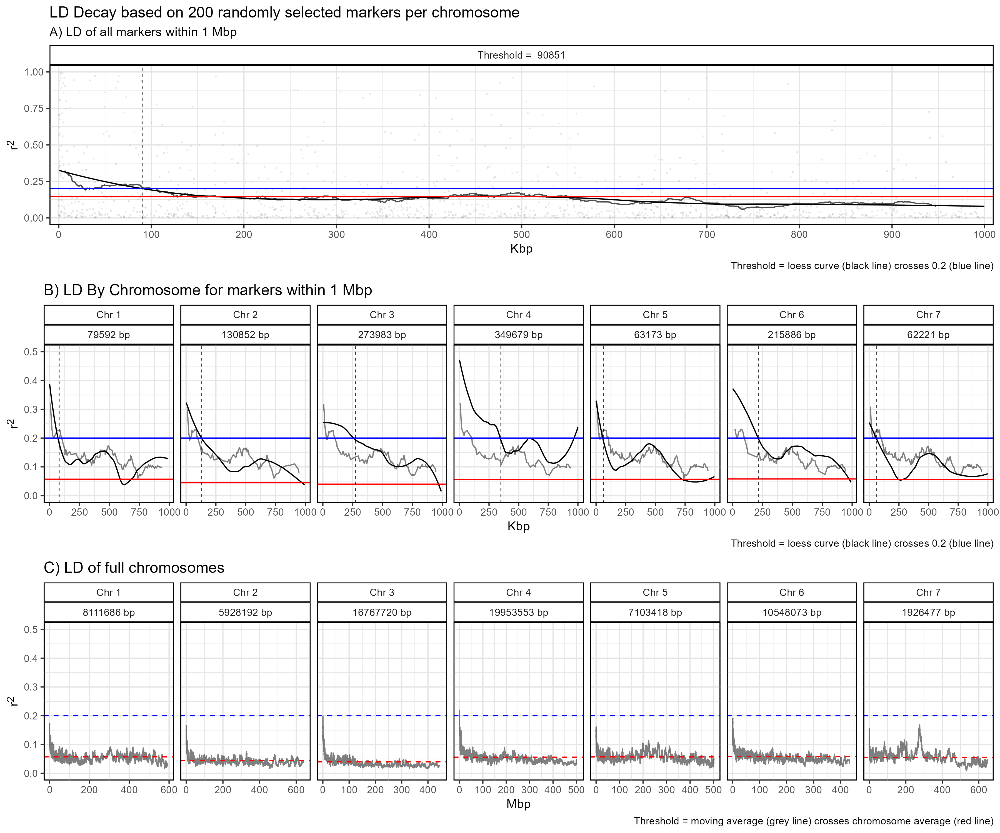
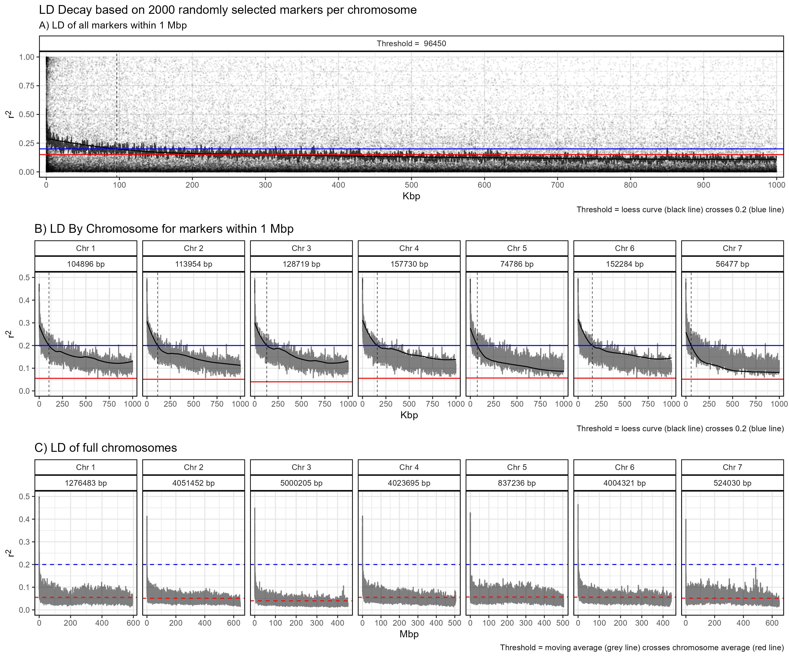

# LD Decay

``` r

library(gwaspr)
```

The function
[`gg_LD_Decay()`](https://derekmichaelwright.github.io/gwaspr/reference/gg_LD_Decay.md)
creates Linkage Disequilibrium (LD) Decay plots from GAPIT GWAS results.

Specifying a `myG` object, an `outputFolder`, and a `markerNum` is all
that is needed to calculate and plot LD decay.

> **Note:** this is a computation heavy function and the larger you set
> `markerNum` the longer the computation will take. Start by setting to
> a lower number such as `200` which is the default.

``` r

# Load genotype file (note: header = T)
myG <- read.csv("gwaspr_myG_hmp.csv", header = T)
```

## `markerNum` = 200

``` r

# Calulate LD decay
calc_LD_Decay(
  # Load genotype data
  xG = myG,
  # Specify a folder with GWAS results
  outputFolder = "LD_Decay/",
  # Select the number of markers per chromosome to analyse
  markerNum = 200 )
```

``` r

# Plot
mp <- gg_LD_Decay(
  # Load genotype data
  xG = myG,
  # Specify a folder with GWAS results
  outputFolder = "LD_Decay/",
  # Select the number of markers per chromosome to analyse
  markerNum = 200 )
# Save
ggsave("figures/gg_LD_Decay_01.png", mp, width = 12, height = 10 )
```



------------------------------------------------------------------------

## `markerNum` = 2000

``` r

# Calulate LD decay
calc_LD_Decay(
  # Load genotype data
  xG = myG,
  # Specify a folder with GWAS results
  outputFolder = "LD_Decay/",
  # Select the number of markers per chromosome to analyse
  markerNum = 2000 )
```

``` r

# Plot
mp <- gg_LD_Decay(
  # Load genotype data
  xG = myG,
  # Specify a folder with GWAS results
  outputFolder = "LD_Decay/",
  # Select the number of markers per chromosome to analyse
  markerNum = 2000 )
# Save
ggsave("figures/gg_LD_Decay_02.png", mp, width = 12, height = 10 )
```



------------------------------------------------------------------------

``` r

xx <- table_LD_Decay(
  xG = myG, 
  outputFolder = "LD_Decay/")
write.csv(xx, "LD_Summary_Table.csv", row.names = F)
```

    ##   Chr   X200  X2000
    ## 1   1  79592 104896
    ## 2   2 130852 113954
    ## 3   3 273983 128719
    ## 4   4 349679 157730
    ## 5   5  63173  74786
    ## 6   6 215886 152284
    ## 7   7  62221  56477

``` r

xx <- xx %>% gather(Num, Value, 2:ncol(.))
# Plot
mp <- ggplot(xx, aes(x = Chr, y = Value, fill = Num)) +
  geom_col(position = "dodge", alpha = 0.8) +
  theme_gwaspr_col(legend.position = "bottom") +
  labs(title = "LD decay", y = "Pos")
ggsave("figures/gg_LD_Decay_03.png", mp, width = 12, height = 10 )
```


------------------------------------------------------------------------
