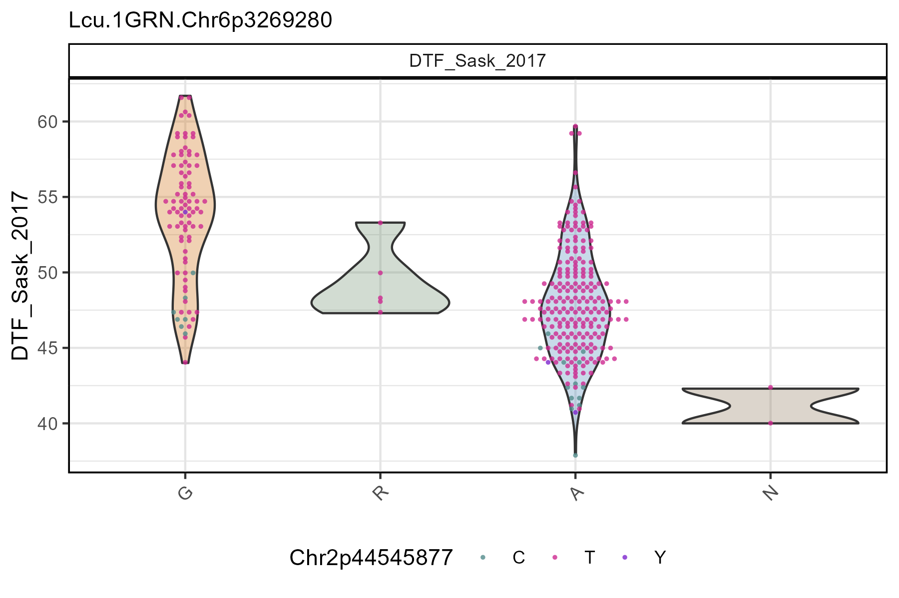
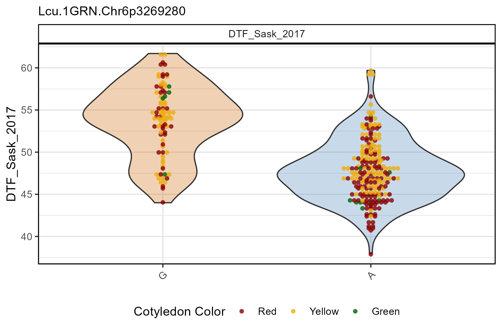
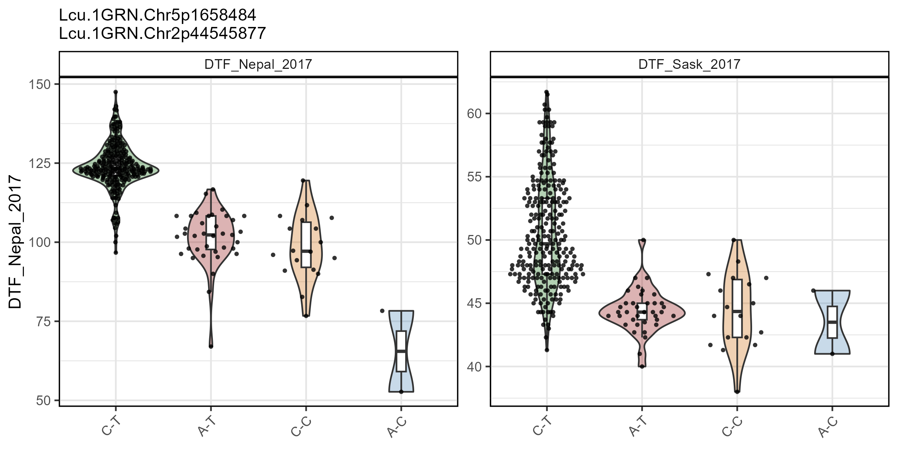
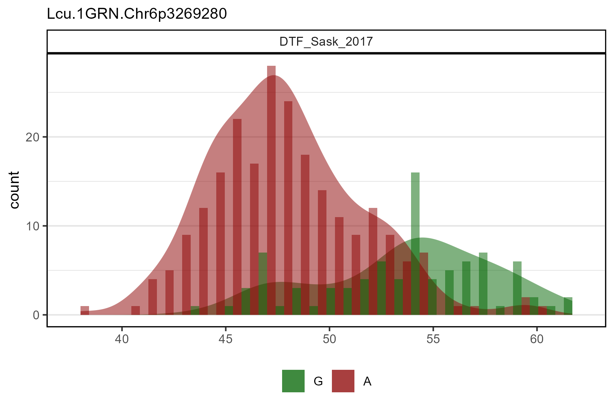
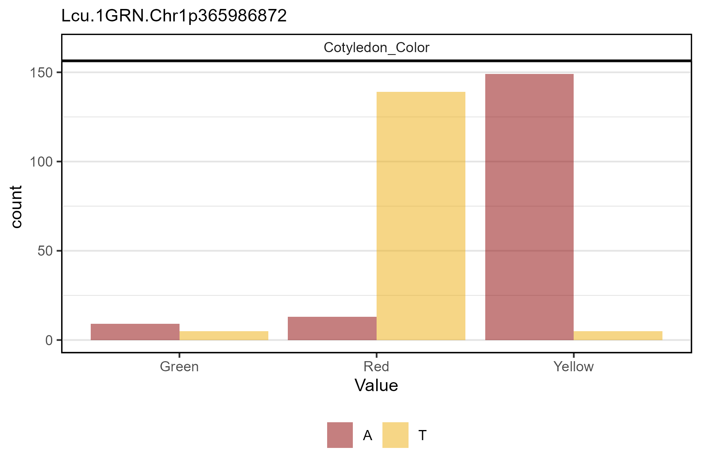
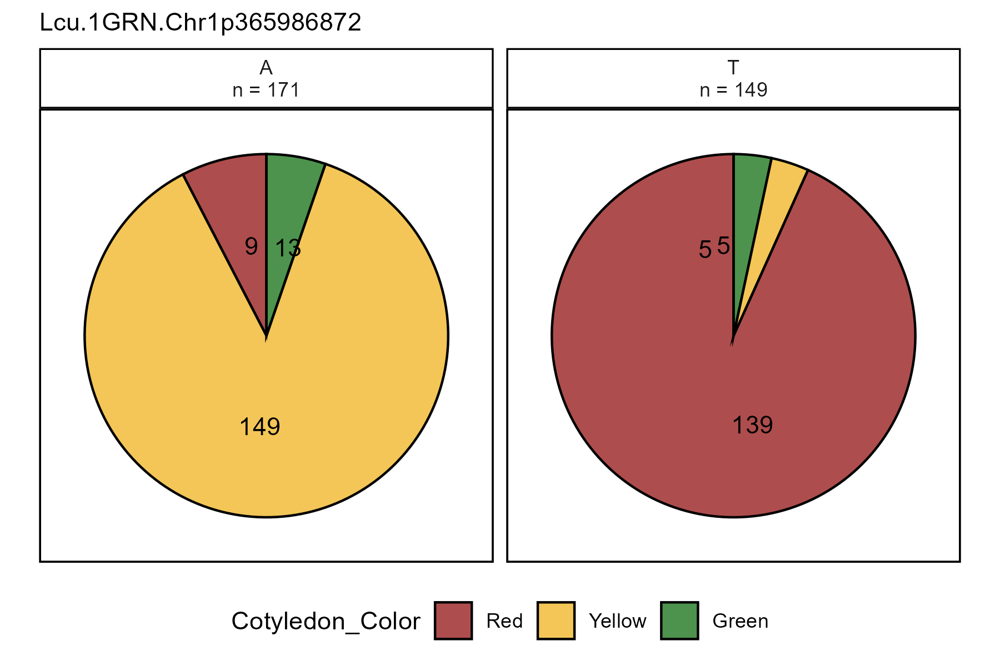

# gg_Marker\_\*()

``` r

library(gwaspr)
```

The functions
[`gg_Marker_Box()`](https://derekmichaelwright.github.io/gwaspr/reference/gg_Marker_Box.md),
[`gg_Marker_Bar()`](https://derekmichaelwright.github.io/gwaspr/reference/gg_Marker_Bar.md),
and
[`gg_Marker_Pie()`](https://derekmichaelwright.github.io/gwaspr/reference/gg_Marker_Pie.md)
create marker plots with your `myY` and `myG` GWAS input files.

## Load data

``` r

# Load genotype file (note: header = T)
myG <- read.csv("gwaspr_myG_hmp.csv", header = T)
```

``` r

# Map + marker Info
myG[1:10,1:11]
```

    ##                      V1      V2    V3     V4     V5       V6     V7       V8
    ## 1                    rs alleles chrom    pos strand assembly center protLSID
    ## 2  Lcu.1GRN.Chr1p853882     A/G     1 853882   <NA>     <NA>   <NA>     <NA>
    ## 3  Lcu.1GRN.Chr1p854117     G/A     1 854117   <NA>     <NA>   <NA>     <NA>
    ## 4  Lcu.1GRN.Chr1p854159     A/C     1 854159   <NA>     <NA>   <NA>     <NA>
    ## 5  Lcu.1GRN.Chr1p854174     C/G     1 854174   <NA>     <NA>   <NA>     <NA>
    ## 6  Lcu.1GRN.Chr1p870836     A/G     1 870836   <NA>     <NA>   <NA>     <NA>
    ## 7  Lcu.1GRN.Chr1p870898     C/T     1 870898   <NA>     <NA>   <NA>     <NA>
    ## 8  Lcu.1GRN.Chr1p870903     G/A     1 870903   <NA>     <NA>   <NA>     <NA>
    ## 9  Lcu.1GRN.Chr1p871108     A/G     1 871108   <NA>     <NA>   <NA>     <NA>
    ## 10 Lcu.1GRN.Chr1p872492     T/C     1 872492   <NA>     <NA>   <NA>     <NA>
    ##           V9   V10    V11
    ## 1  assayLSID panel QCcode
    ## 2       <NA>  <NA>   <NA>
    ## 3       <NA>  <NA>   <NA>
    ## 4       <NA>  <NA>   <NA>
    ## 5       <NA>  <NA>   <NA>
    ## 6       <NA>  <NA>   <NA>
    ## 7       <NA>  <NA>   <NA>
    ## 8       <NA>  <NA>   <NA>
    ## 9       <NA>  <NA>   <NA>
    ## 10      <NA>  <NA>   <NA>

``` r

# genotrype calls
myG[1:10,12:17]
```

    ##             V12             V13            V14            V15          V16
    ## 1  X3156.11_AGL CDC_Asterix_AGL CDC_Cherie_AGL CDC_Glamis_AGL CDC_Gold_AGL
    ## 2             G               A              G              A            G
    ## 3             G               G              G              A            G
    ## 4             C               C              C              C            C
    ## 5             G               G              G              G            G
    ## 6             G               G              N              G            G
    ## 7             T               C              N              C            T
    ## 8             G               G              N              A            G
    ## 9             A               A              A              A            A
    ## 10            T               T              T              T            T
    ##                  V17
    ## 1  CDC_Greenstar_AGL
    ## 2                  A
    ## 3                  G
    ## 4                  A
    ## 5                  C
    ## 6                  A
    ## 7                  C
    ## 8                  G
    ## 9                  A
    ## 10                 N

``` r

# Load phenotype file
myY <- read.csv("gwaspr_myY.csv")
# Convert our nominal trait from numeric to factor.
myY <- myY %>% 
  mutate(Cotyledon_Color = mv(Cotyledon_RedvsYellow, c(1, 0, NA), c("Red", "Yellow", "Green")),
         Cotyledon_Color = factor(Cotyledon_Color, levels = c("Red", "Yellow", "Green")))
```

``` r

myY[1:20,]
```

------------------------------------------------------------------------

## gg_Marker_Box

### Single marker, single trait

Specifying a `trait` and a `marker` along with your genotype and
phenotype data as `xG` and `xY` is needed to create marker plots.

``` r

# Plot
mp <- gg_Marker_Box(
  # Genotype data
  xG = myG, 
  # Phenotype data
  xY = myY,
  # Select traits to plot
  traits = "DTF_Sask_2017",
  # Select markers to plot
  markers = "Lcu.1GRN.Chr6p3269280" )
# Save
ggsave("figures/gg_Marker_Box_01.png", 
       mp, width = 6, height = 4 )
```


------------------------------------------------------------------------

### Customized Plots

#### Boxplots

``` r

# Plot
mp <- gg_Marker_Box(
  # Genotype data
  xG = myG, 
  # Phenotype data
  xY = myY,
  # Select traits to plot
  traits = "DTF_Sask_2017",
  # Select markers to plot
  markers = "Lcu.1GRN.Chr6p3269280",
  # Select marker colors
  marker.colors = c("darkorange3", "steelblue"),
  # Choose what should be plotted
  plot.violin = F,
  plot.box = T,
  plot.points = F,
  # Change the width of the boxplots
  box.width = 0.3,
  # Create a custom label for the y-axis
  yLab = "Days from sowing to flower" )
# Save
ggsave("figures/gg_Marker_Box_02.png", 
       mp, width = 6, height = 4 )
```


------------------------------------------------------------------------

#### Violin + points

``` r

# Plot
mp <- gg_Marker_Box(
  # Genotype data
  xG = myG, 
  # Phenotype data
  xY = myY,
  # Select traits to plot
  traits = "DTF_Sask_2017",
  # Select markers to plot
  markers = "Lcu.1GRN.Chr6p3269280",
  # Select marker colors
  marker.colors = c("darkorange3", "steelblue"),
  # Choose what should be plotted
  plot.violin = T,
  plot.box = F,
  plot.points = T,
  # Set the point size
  point.size = 2,
  # Create a custom label for the y-axis
  yLab = "Days from sowing to flower" )
# Save
ggsave("figures/gg_Marker_Box_03.png", 
       mp, width = 6, height = 4 )
```


------------------------------------------------------------------------

#### Covariable Point Color

##### myG covariable

``` r

# Plot
mp <- gg_Marker_Box(
  # Genotype data
  xG = myG, 
  # Phenotype data
  xY = myY,
  # Select traits to plot
  traits = "DTF_Sask_2017",
  # Select markers to plot
  markers = "Lcu.1GRN.Chr6p3269280",
  # Select marker colors
  marker.colors = c("darkorange3", "darkseagreen4", "steelblue", "burlywood4"),
  # Keep heterozygous markers
  remove.hets = F,
  # Choose what should be plotted
  plot.violin = T,
  plot.box = F,
  plot.points = T,
  # Set the point size
  point.size = 0.75,
  # Plot with geom_beeswarm instead of quasirandom
  point.beeswarm = T,
  # Select Covariable trait for points
  cv.name = "Lcu.1GRN.Chr2p44545877", 
  # Select colors for the covariable
  cv.colors = c("darkslategray4", "maroon3", "purple3"),
  # Set a custom label for the covariable legend
  cv.label = "Chr2p44545877" )
# Save
ggsave("figures/gg_Marker_Box_04.png", 
       mp, width = 6, height = 4 )
```



------------------------------------------------------------------------

##### myY covariable

``` r

# Plot
mp <- gg_Marker_Box(
  # Genotype data
  xG = myG, 
  # Phenotype data
  xY = myY,
  # Select traits to plot
  traits = "DTF_Sask_2017",
  # Select markers to plot
  markers = "Lcu.1GRN.Chr6p3269280",
  # Select marker colors
  marker.colors = c("darkorange3", "steelblue"),
  # Choose what should be plotted
  plot.violin = T,
  plot.box = F,
  plot.points = T,
  # Set the point size
  point.size = 1.5,
  # Plot with geom_beeswarm instead of quasirandom
  point.beeswarm = T,
  # Select covariable source
  cv.source = "xY",
  # Select Covariable trait for points
  cv.name = "Cotyledon_Color", 
  # Select colors for the covariable
  cv.colors = c("darkred", "darkgoldenrod2", "darkgreen"),
  # Set a custom label for the covariable legend
  cv.label = "Cotyledon Color" )
# Save
ggsave("figures/gg_Marker_Box_05.png", 
       mp, width = 6, height = 4 )
```



------------------------------------------------------------------------

### Multiple markers, multiple traits

``` r

# Plot
mp <- gg_Marker_Box(
  # Genotype data
  xG = myG,
  # Phenotype data
  xY = myY,
  # Select traits to plot
  traits = c("DTF_Nepal_2017", "DTF_Sask_2017"),
  # Select markers to plot
  markers = c("Lcu.1GRN.Chr5p1658484", "Lcu.1GRN.Chr2p44545877") )
# Save
ggsave("figures/gg_Marker_Box_06.png",
       mp, width = 8, height = 4 )
```



------------------------------------------------------------------------

## gg_Marker_Bar

### Single marker, single trait

``` r

# Plot
mp <- gg_Marker_Bar(
  # Genotype data
  xG = myG, 
  # Phenotype data
  xY = myY,
  # Select traits to plot
  traits = "DTF_Sask_2017",
  # Select markers to plot
  markers = "Lcu.1GRN.Chr6p3269280" )
# Save
ggsave("figures/gg_Marker_Bar_01.png", 
       mp, width = 6, height = 4 )
```



------------------------------------------------------------------------

### Customized Plots

#### Histogram

``` r

# Plot
mp <- gg_Marker_Bar(
  # Genotype data
  xG = myG, 
  # Phenotype data
  xY = myY,
  # Select traits to plot
  traits = "DTF_Sask_2017",
  # Select markers to plot
  markers = "Lcu.1GRN.Chr6p3269280",
  # Select marker colors
  marker.colors = c("darkorange3", "steelblue"),
  # Choose what should be plotted
  plot.histogram = T,
  plot.density = F )
# Save
ggsave("figures/gg_Marker_Bar_02.png", 
       mp, width = 6, height = 4 )
```


------------------------------------------------------------------------

#### Density

``` r

# Plot
mp <- gg_Marker_Bar(
  # Genotype data
  xG = myG, 
  # Phenotype data
  xY = myY,
  # Select traits to plot
  traits = "DTF_Sask_2017",
  # Select markers to plot
  markers = "Lcu.1GRN.Chr6p3269280",
  # Select marker colors
  marker.colors = c("darkorange3", "steelblue"),
  # Choose what should be plotted
  plot.histogram = F,
  plot.density = T )
# Save
ggsave("figures/gg_Marker_Bar_03.png", 
       mp, width = 6, height = 4)
```


------------------------------------------------------------------------

### Multiple markers, multiple traits

``` r

# Plot
mp <- gg_Marker_Bar(
  # Genotype data
  xG = myG, 
  # Phenotype data
  xY = myY,
  # Select traits to plot
  traits = c("DTF_Nepal_2017", "DTF_Sask_2017"),
  # Select markers to plot
  markers = c("Lcu.1GRN.Chr2p44545877", "Lcu.1GRN.Chr5p1658484") )
# Save
ggsave("figures/gg_Marker_Bar_04.png", 
       mp, width = 8, height = 4 )
```


------------------------------------------------------------------------

### Factor data

#### Numeric format

``` r

# Plot 
mp <- gg_Marker_Bar(
  # Genotype data
  xG = myG, 
  # Phenotype data
  xY = myY,
  # Select traits to plot
  traits = "Cotyledon_RedvsYellow",
  # Select markers to plot
  markers = "Lcu.1GRN.Chr1p365986872",
  # Select marker colors
  marker.colors = c("darkred", "darkgoldenrod2"),
  # Choose what should be plotted
  plot.histogram = T,
  plot.density = F )
# Save
ggsave("figures/gg_Marker_Bar_05.png", 
       mp, width = 6, height = 4 )
```


------------------------------------------------------------------------

#### Factor format

``` r

# Plot 
mp <- gg_Marker_Bar(
  # Genotype data
  xG = myG, 
  # Phenotype data
  xY = myY,
  # Select traits to plot
  traits = "Cotyledon_Color",
  # Select markers to plot
  markers = "Lcu.1GRN.Chr1p365986872",
  # Select marker colors
  marker.colors = c("darkred", "darkgoldenrod2", "darkgreen"),
  # Choose what should be plotted
  plot.histogram = T,
  plot.density = F )
# Save
ggsave("figures/gg_Marker_Bar_06.png", 
       mp, width = 6, height = 4 )
```



------------------------------------------------------------------------

## gg_Marker_Pie

``` r

# Plot 
mp <- gg_Marker_Pie(
  # Genotype data
  xG = myG, 
  # Phenotype data
  xY = myY,
  # Select traits to plot
  trait = "Cotyledon_Color",
  # Select markers to plot
  markers = "Lcu.1GRN.Chr1p365986872",
  # Select marker colors
  marker.colors = c("darkred", "darkgoldenrod2", "darkgreen") )
# Save
ggsave("figures/gg_Marker_Pie_01.png", 
       mp, width = 6, height = 4 )
```


