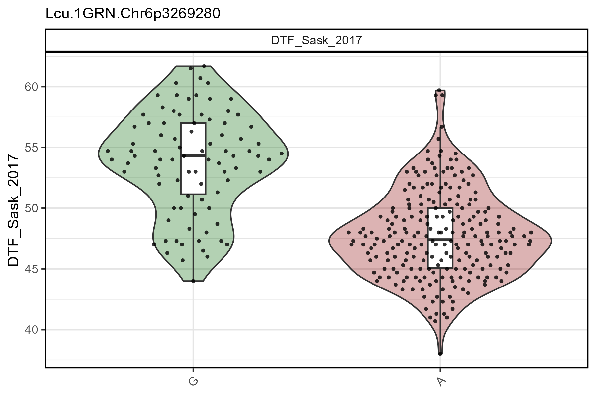

# gg_Marker\_\*()

``` r

library("gwaspr")
```

The functions
[`gg_Marker_Box()`](https://derekmichaelwright.github.io/gwaspr/reference/gg_Marker_Box.md),
[`gg_Marker_Bar()`](https://derekmichaelwright.github.io/gwaspr/reference/gg_Marker_Bar.md),
and
[`gg_Marker_Pie()`](https://derekmichaelwright.github.io/gwaspr/reference/gg_Marker_Pie.md)
create marker plots with your `myY` and `myG` GWAS input files.

## Load data

``` r

# Load genotype file (note: header = T)
myG <- read.csv("gwaspr_myG_hmp.csv", header = T)
```

``` r

# Load phenotype file
myY <- read.csv("gwaspr_myY.csv")
# Convert our nominal trait from numeric to factor.
myY <- myY %>% 
  mutate(Cotyledon_Color = mv(Cotyledon_RedvsYellow, c(1, 0, NA), c("Red", "Yellow", "Green")),
         Cotyledon_Color = factor(Cotyledon_Color, levels = c("Red", "Yellow", "Green")))
myY[1:15,]
```

------------------------------------------------------------------------

## gg_Marker_Box

### Single marker, single trait

Specifying a `trait` and a `marker` along with your genotype and
phenotype data as `xG` and `xY` is needed to create marker plots.

``` r

# Plot
mp <- gg_Marker_Box(
  # Genotype data
  xG = myG, 
  # Phenotype data
  xY = myY,
  # Select traits to plot
  traits = "DTF_Sask_2017",
  # Select markers to plot
  markers = "Lcu.1GRN.Chr6p3269280" )
# Save
ggsave("figures/gg_Marker_Box_01.png", 
       mp, width = 6, height = 4 )
```


