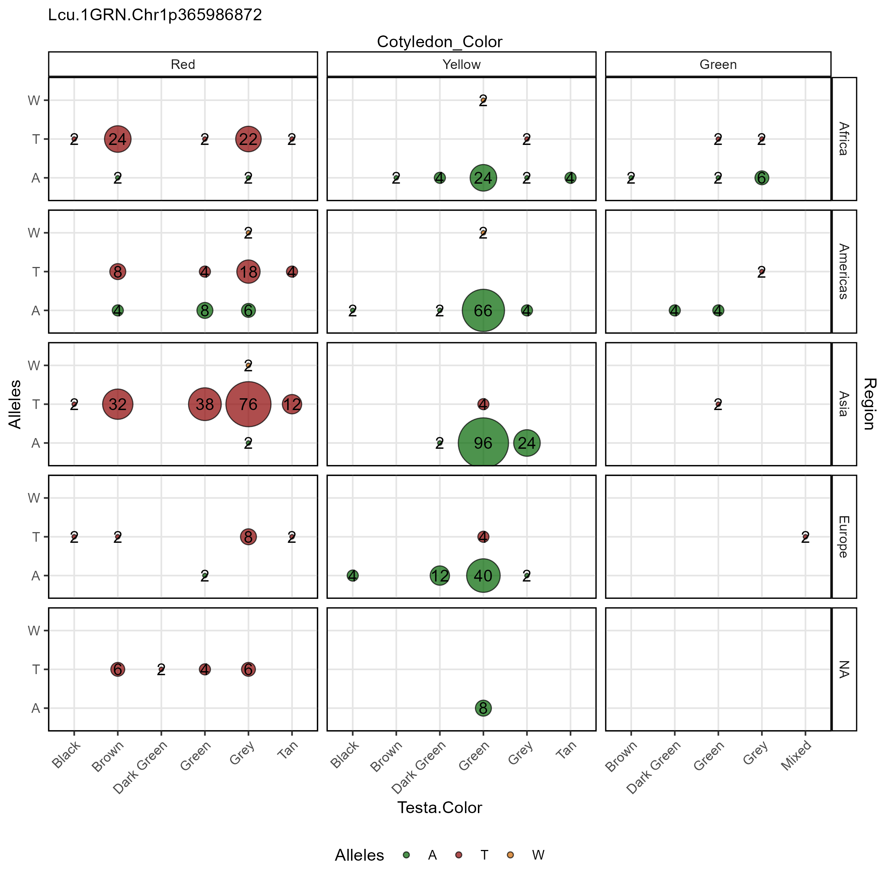

# gg_Marker_Bubble()

``` r

library(gwaspr)
```

The function
[`gg_Marker_Bubble()`](https://derekmichaelwright.github.io/gwaspr/reference/gg_Marker_Bubble.md)
creates marker plots with your `myY` and `myG` GWAS input files.

## Load data

> Note: `header = T`

``` r

# Load genotype file (note: header = T)
myG <- read.csv("gwaspr_myG_hmp.csv", header = T)
```

``` r

# Load phenotype file
myY <- read.csv("gwaspr_myY.csv")
# Convert our nominal trait from numeric to factor.
myY <- myY %>% 
  mutate(Cotyledon_Color = mv(Cotyledon_RedvsYellow, c(1, 0, NA), c("Red", "Yellow", "Green")),
         Cotyledon_Color = factor(Cotyledon_Color, levels = c("Red", "Yellow", "Green")))
```

``` r

myCV <- read.csv("gwaspr_myCV.csv")
```

``` r

myY <- myY %>% left_join(myCV, by = "Name")
```

``` r

myY[1:10,]
```

    ##                 Name DTF_Sask_2017 DTF_Nepal_2017 Cotyledon_RedvsYellow
    ## 1    CDC_Asterix_AGL          54.7          128.0                     0
    ## 2    CDC_Asterix_AGL          54.7          128.0                     0
    ## 3      CDC_Rosie_AGL          59.0          123.3                     1
    ## 4      CDC_Rosie_AGL          59.0          123.3                     1
    ## 5       X3156.11_AGL          60.7          125.3                     1
    ## 6       X3156.11_AGL          60.7          125.3                     1
    ## 7  CDC_Greenstar_AGL          56.7          121.0                     0
    ## 8  CDC_Greenstar_AGL          56.7          121.0                     0
    ## 9     CDC_Cherie_AGL          54.3          125.3                     1
    ## 10    CDC_Cherie_AGL          54.3          125.3                     1
    ##    Cotyledon_Color             b Testa.Color Origin        SubRegion   Region
    ## 1           Yellow  0.0003372184       Green Canada Northern America Americas
    ## 2           Yellow -0.0012017067       Green Canada Northern America Americas
    ## 3              Red  0.0003524706        Grey Canada Northern America Americas
    ## 4              Red -0.0017520624        Grey Canada Northern America Americas
    ## 5              Red  0.0003562503        Grey Canada Northern America Americas
    ## 6              Red -0.0011149255        Grey Canada Northern America Americas
    ## 7           Yellow  0.0004293448       Green Canada Northern America Americas
    ## 8           Yellow -0.0000560704       Green Canada Northern America Americas
    ## 9              Red  0.0003948181        Grey Canada Northern America Americas
    ## 10             Red -0.0007040853        Grey Canada Northern America Americas

------------------------------------------------------------------------

## Single marker, single trait

Specifying a `trait.x` and `markers` along with your genotype and
phenotype data as `xG` and `xY` is needed to create marker plots.

``` r

# Plot
mp <- gg_Marker_Bubble(
  # Genotype data
  xG = myG, 
  # Phenotype data
  xY = myY,
  # Select traits to plot
  trait.x = "Cotyledon_Color",
  # Select markers to plot
  markers = "Lcu.1GRN.Chr1p365986872" )
# Save
ggsave("figures/gg_Marker_Bubble_01.png", 
       mp, width = 6, height = 4 )
```


------------------------------------------------------------------------

## All Options

`gg_Marker_Bubbles()` contains a number of different options for
customizing the marker plots.

Note: one of `trait.x`, `trait.y`, `facet.rows`, `facet.cols` must be
set to `= "Alleles"`.

``` r

# Prep data
myM <- c("Lcu.1GRN.Chr1p365986872")
# Plot
mp <- gg_Marker_Bubble(
  xG = myG, 
  xY = myY,
  trait.x = "Cotyledon_Color",
  markers = myM,
  trait.y = "Alleles",
  facet.rows = NULL,
  facet.cols = NULL,
  marker.colors = gwaspr_Colors,
  remove.hets = F,
  remove.N = T,
  legend.pos = "bottom",
  legend.rows = 1,
  title = NULL,
  subtitle = paste(myM, collapse = "\n") )
# Save
ggsave("figures/gg_Marker_Bubble_02.png", 
       mp, width = 6, height = 4 )
```


------------------------------------------------------------------------

## Facet Grouping

### Column Facetting

``` r

# Plot
mp <- gg_Marker_Bubble(
  # Genotype data
  xG = myG, 
  # Phenotype data
  xY = myY,
  # Select traits to plot
  trait.x = "Testa.Color",
  # Select markers to plot
  markers = "Lcu.1GRN.Chr1p365986872",
  # Select a trait for col facetting
  facet.cols = "Cotyledon_Color" )
# Save
ggsave("figures/gg_Marker_Bubble_03.png", 
       mp, width = 8, height = 4 )
```


------------------------------------------------------------------------

### Row Facetting

``` r

# Plot
mp <- gg_Marker_Bubble(
  # Genotype data
  xG = myG, 
  # Phenotype data
  xY = myY,
  # Select traits to plot
  trait.x = "Testa.Color",
  # Select markers to plot
  markers = "Lcu.1GRN.Chr1p365986872",
  # Select a trait for col facetting
  facet.cols = "Cotyledon_Color",
  # Select a trait for row facetting
  facet.rows = "Region" )
# Save
ggsave("figures/gg_Marker_Bubble_04.png", 
       mp, width = 8, height = 8 )
```


