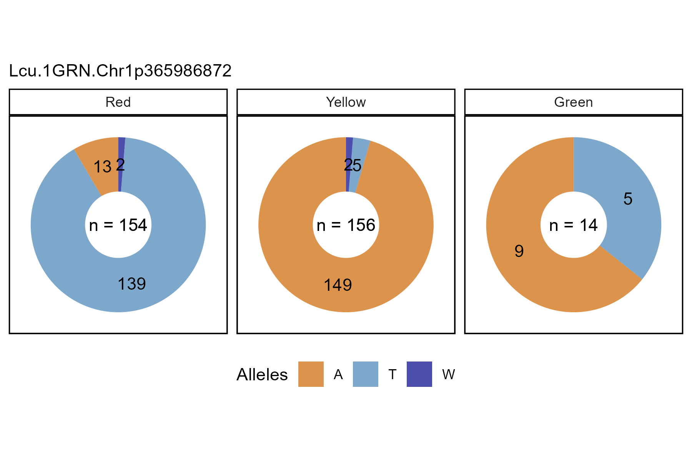

# gg_Marker_Pie()

``` r

library(gwaspr)
```

The function
[`gg_Marker_Pie()`](https://derekmichaelwright.github.io/gwaspr/reference/gg_Marker_Pie.md)
creates marker plots with your `myY` and `myG` GWAS input files.

## Load data

> Note: `header = T`

``` r

# Load genotype file (note: header = T)
myG <- read.csv("gwaspr_myG_hmp.csv", header = T)
```

``` r

# Map + marker Info
myG[1:10,1:11]
```

    ##                      V1      V2    V3     V4     V5       V6     V7       V8
    ## 1                    rs alleles chrom    pos strand assembly center protLSID
    ## 2  Lcu.1GRN.Chr1p853882     A/G     1 853882   <NA>     <NA>   <NA>     <NA>
    ## 3  Lcu.1GRN.Chr1p854117     G/A     1 854117   <NA>     <NA>   <NA>     <NA>
    ## 4  Lcu.1GRN.Chr1p854159     A/C     1 854159   <NA>     <NA>   <NA>     <NA>
    ## 5  Lcu.1GRN.Chr1p854174     C/G     1 854174   <NA>     <NA>   <NA>     <NA>
    ## 6  Lcu.1GRN.Chr1p870836     A/G     1 870836   <NA>     <NA>   <NA>     <NA>
    ## 7  Lcu.1GRN.Chr1p870898     C/T     1 870898   <NA>     <NA>   <NA>     <NA>
    ## 8  Lcu.1GRN.Chr1p870903     G/A     1 870903   <NA>     <NA>   <NA>     <NA>
    ## 9  Lcu.1GRN.Chr1p871108     A/G     1 871108   <NA>     <NA>   <NA>     <NA>
    ## 10 Lcu.1GRN.Chr1p872492     T/C     1 872492   <NA>     <NA>   <NA>     <NA>
    ##           V9   V10    V11
    ## 1  assayLSID panel QCcode
    ## 2       <NA>  <NA>   <NA>
    ## 3       <NA>  <NA>   <NA>
    ## 4       <NA>  <NA>   <NA>
    ## 5       <NA>  <NA>   <NA>
    ## 6       <NA>  <NA>   <NA>
    ## 7       <NA>  <NA>   <NA>
    ## 8       <NA>  <NA>   <NA>
    ## 9       <NA>  <NA>   <NA>
    ## 10      <NA>  <NA>   <NA>

``` r

# genotrype calls
myG[1:10,12:17]
```

    ##             V12             V13            V14            V15          V16
    ## 1  X3156.11_AGL CDC_Asterix_AGL CDC_Cherie_AGL CDC_Glamis_AGL CDC_Gold_AGL
    ## 2             G               A              G              A            G
    ## 3             G               G              G              A            G
    ## 4             C               C              C              C            C
    ## 5             G               G              G              G            G
    ## 6             G               G              N              G            G
    ## 7             T               C              N              C            T
    ## 8             G               G              N              A            G
    ## 9             A               A              A              A            A
    ## 10            T               T              T              T            T
    ##                  V17
    ## 1  CDC_Greenstar_AGL
    ## 2                  A
    ## 3                  G
    ## 4                  A
    ## 5                  C
    ## 6                  A
    ## 7                  C
    ## 8                  G
    ## 9                  A
    ## 10                 N

``` r

# Load phenotype file
myY <- read.csv("gwaspr_myY.csv")
# Convert our nominal trait from numeric to factor.
myY <- myY %>% 
  mutate(Cotyledon_Color = mv(Cotyledon_RedvsYellow, c(1, 0, NA), c("Red", "Yellow", "Green")),
         Cotyledon_Color = factor(Cotyledon_Color, levels = c("Red", "Yellow", "Green")))
```

``` r

myY[1:10,]
```

    ##                 Name DTF_Sask_2017 DTF_Nepal_2017 Cotyledon_RedvsYellow
    ## 1    CDC_Asterix_AGL          54.7          128.0                     0
    ## 2      CDC_Rosie_AGL          59.0          123.3                     1
    ## 3       X3156.11_AGL          60.7          125.3                     1
    ## 4  CDC_Greenstar_AGL          56.7          121.0                     0
    ## 5     CDC_Cherie_AGL          54.3          125.3                     1
    ## 6     CDC_Glamis_AGL          59.0          123.0                     0
    ## 7       CDC_Gold_AGL          54.0          125.3                     0
    ## 8       CDC_Imax_AGL          53.0          128.7                     1
    ## 9    CDC_Impower_AGL          57.0          123.3                     0
    ## 10      CDC_KR.1_AGL          57.0          121.7                     1
    ##    Cotyledon_Color
    ## 1           Yellow
    ## 2              Red
    ## 3              Red
    ## 4           Yellow
    ## 5              Red
    ## 6           Yellow
    ## 7           Yellow
    ## 8              Red
    ## 9           Yellow
    ## 10             Red

------------------------------------------------------------------------

## Single marker, single trait

Specifying a `trait` and `markers` along with your genotype and
phenotype data as `xG` and `xY` is needed to create marker plots.

``` r

# Plot 
mp <- gg_Marker_Pie(
  # Genotype data
  xG = myG, 
  # Phenotype data
  xY = myY,
  # Select traits to plot
  trait = "Cotyledon_Color",
  # Select markers to plot
  markers = "Lcu.1GRN.Chr1p365986872",
  # Select marker colors
  marker.colors = c("darkred", "darkgoldenrod2", "darkgreen") )
# Save
ggsave("figures/gg_Marker_Pie_01.png", 
       mp, width = 6, height = 4 )
```


------------------------------------------------------------------------

## All Options

``` r

# Prep data
myM <- c("Lcu.1GRN.Chr1p365986872")
# Plot 
mp <- gg_Marker_Pie(
  xG = myG, 
  xY = myY,
  trait = "Cotyledon_Color",
  markers = myM,
  marker.colors = c("darkred", "darkgoldenrod2", "darkgreen"),
  trait.label = "Cotyledon Color",
  trait.levels = NULL,
  remove.hets = F,
  remove.N = T,
  title = NULL,
  subtitle = paste(myM, collapse = "\n"),
  ncol = NULL,
  legend.rows = 1,
  removeHets = T,
  groupByTrait = F )
# Save
ggsave("figures/gg_Marker_Pie_02.png", 
       mp, width = 6, height = 4 )
```


------------------------------------------------------------------------

## Switch Facetting

Set `groupByTrait = T` to switch from facetting by markers to facetting
by trait.

``` r

# Plot 
mp <- gg_Marker_Pie(
  # Genotype data
  xG = myG, 
  # Phenotype data
  xY = myY,
  # Select traits to plot
  trait = "Cotyledon_Color",
  # Select markers to plot
  markers = "Lcu.1GRN.Chr1p365986872",
  # Select marker colors
  marker.colors = c("darkorange3", "steelblue", "darkblue"),
  # Make pies of each trait instead of each marker
  groupByTrait = T )
# Save
ggsave("figures/gg_Marker_Pie_03.png", 
       mp, width = 6, height = 4 )
```



------------------------------------------------------------------------
