# gwaspr R Package

`gwaspr`: an `R` package for plotting GWAS results from the `GAPIT`
package

> - **GAPIT Website**:
>   [https://www.maizegenetics.net/gapit](https://www.maizegenetics.net/gapit)
> - **GAPIT github**:
>   [https://github.com/jiabowang/GAPIT](https://github.com/jiabowang/GAPIT)

# Installation

``` r

devtools::install_github("derekmichaelwright/gwaspr")
```

``` r

library(gwaspr)
```

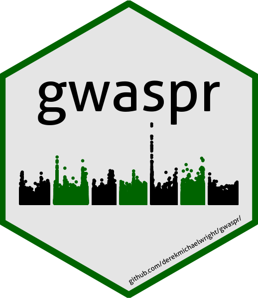

# GWAS Tutorial

> [https://derekmichaelwright.github.io/dblogr/academic/gwas_tutorial](https://derekmichaelwright.github.io/dblogr/academic/gwas_tutorial)

# Usage

For best practice, output from GAPIT should be in its own folder. In
this case, they are located in a folder called `GWAS_Results/`. For this
example we will plot GWAS results from 3 traits in a lentil diversity
panel:

- \*\*\*\*Cotyledon_Color\*\*: a *qualitative* trait describing
  cotyledon color (Red = 0, Yellow = 1).
- **DTF_Nepal_2017**: a *quantitative* trait describing days from sowing
  to flowering in a 2017 Nepal field trial.
- **DTF_Sask_2017**: a *quantitative* trait describing days from sowing
  to flowering in a 2017 Saskatchewan field trial.
- **DTF_Sask_2017_b**: same as above but run with the *b* coefficient
  from a photothermal model (see [Wright *et al*.
  2020](https://doi.org/10.1002/ppp3.10158)) used as a covariate.

Note: for more info check out this [GWAS
tutorial](https://derekmichaelwright.github.io/dblogr/academic/gwaspr_tutorial).

# Data

``` r

myG <- read.csv("myG_hmp.csv")
myY <- read.csv("myY.csv")
```

# gwaspr Functions

------------------------------------------------------------------------

## list_Traits()

List off the traits which have GWAS results files in the designated
folder.

``` r

list_Traits(folder = "GWAS_Results/")
```

``` R
## [1] "Cotyledon_Color_RvsY" "DTF_Nepal_2017"       "DTF_Sask_2017"       
## [4] "DTF_Sask_2017_b"
```

------------------------------------------------------------------------

## is_ran()

Check to see which of your `myY` traits have GWAS results files int he
designated folder.

``` r

is_Ran(myY = myY, folder = "GWAS_Results/")
```

``` R
##                 Traits GWAS
## 1 Cotyledon_Color_RvsY    X
## 2        DTF_Sask_2017    X
## 3       DTF_Nepal_2017    X
```

------------------------------------------------------------------------

## run_simmary()

Checks which GWAS models have been run for each trait within the
designated folder.

``` r

run_Summary(folder = "GWAS_Results/")
```

``` R
##                  Trait GLM MLM MLMM FarmCPU BLINK CMLM SUPER
## 1 Cotyledon_Color_RvsY   X   X    X       X     X           
## 2       DTF_Nepal_2017   X   X    X       X     X           
## 3        DTF_Sask_2017   X   X    X       X     X           
## 4      DTF_Sask_2017_b   X   X    X       X     X
```

------------------------------------------------------------------------

## Order_GWAS_Results()

Reorders the result files if they are not already arranged by P.value.

``` r

order_GWAS_Results(folder = "GWAS_Results/")
```

------------------------------------------------------------------------

## is_Ordered()

``` r

is_Ordered(folder = "GWAS_Results/")
```

``` R
##                  Trait GLM MLM MLMM FarmCPU BLINK CMLM SUPER FarmCPU_Kansas
## 1 Cotyledon_Color_RvsY   X   X    X       X     X                         X
## 2       DTF_Nepal_2017   X   X    X       X     X                         X
## 3        DTF_Sask_2017   X   X    X       X     X                         X
## 4      DTF_Sask_2017_b   X   X    X       X     X                         X
##   BLINK_Kansas
## 1            X
## 2            X
## 3             
## 4            X
```

------------------------------------------------------------------------

## table_GWAS_Results()

``` r

myResults <- table_GWAS_Results(folder = "GWAS_Results/",
                                threshold = 6.8, sug.threshold = 5)
myResults[1:5,]
```

``` R
##                       SNP Chr       Pos       P.value        MAF     effect
## 1 Lcu.1GRN.Chr1p365986872   1 365986872 1.754402e-175 0.47096774 -0.4683785
## 2 Lcu.1GRN.Chr1p365986872   1 365986872 1.164052e-154 0.47096774         NA
## 3 Lcu.1GRN.Chr1p365986872   1 365986872 3.281941e-128 0.47096774 -0.4954384
## 4 Lcu.1GRN.Chr1p361840399   1 361840399  2.178943e-84 0.04193548 -0.4603589
## 5 Lcu.1GRN.Chr1p361840399   1 361840399  6.963600e-47 0.04193548 -0.4715544
##     H.B.P.Value   Model   Type                Trait negLog10_P negLog10_HBP
## 1 5.901229e-170   BLINK Kansas Cotyledon_Color_RvsY  174.75587    169.22906
## 2 3.915488e-149    MLMM    NYC Cotyledon_Color_RvsY  153.93403    148.40721
## 3 1.103937e-122 FarmCPU Kansas Cotyledon_Color_RvsY  127.48387    121.95706
## 4  3.664623e-79   BLINK Kansas Cotyledon_Color_RvsY   83.66175     78.43597
## 5  1.171163e-41 FarmCPU Kansas Cotyledon_Color_RvsY   46.15717     40.93138
##     Threshold     Effect
## 1 Significant         NA
## 2 Significant -0.4905608
## 3 Significant         NA
## 4 Significant         NA
## 5 Significant         NA
```

------------------------------------------------------------------------

## table_GWAS_Results_Summary()

``` r

mySummary <- table_GWAS_Results_Summary(myResults, binMarkers = T, binSize = 5e+06)
mySummary[1:5,]
```

``` R
##                       SNP Chr       Pos Hits        MAF max_negLog10_P
## 1 Lcu.1GRN.Chr1p365986872   1 365986872  697 0.47096774      174.75587
## 2 Lcu.1GRN.Chr1p361840399   1 361840399  183 0.04193548       83.66175
## 3   Lcu.1GRN.Chr5p1658484   5   1658484   88 0.12345679       33.96965
## 4 Lcu.1GRN.Chr1p368962767   1 368962767  109 0.43225806       33.59588
## 5  Lcu.1GRN.Chr2p44546658   2  44546658  228 0.06790123       33.01717
##   min_negLog10_P                     Models
## 1       5.002856 BLINK;MLMM;FarmCPU;GLM;MLM
## 2       5.021118 BLINK;FarmCPU;MLMM;GLM;MLM
## 3       5.068726 BLINK;FarmCPU;GLM;MLMM;MLM
## 4       5.053575                    GLM;MLM
## 5       5.056175 FarmCPU;GLM;BLINK;MLMM;MLM
##                                         Traits max_negLog10_HBP
## 1                         Cotyledon_Color_RvsY        169.22906
## 2                         Cotyledon_Color_RvsY         78.43597
## 3 DTF_Nepal_2017;DTF_Sask_2017_b;DTF_Sask_2017         28.44284
## 4                         Cotyledon_Color_RvsY         28.67113
## 5                 DTF_Nepal_2017;DTF_Sask_2017         27.49036
##   min_negLog10_HBP         min_P        max_P       min_HBP     max_HBP
## 1        2.2949280 1.754402e-175 9.934454e-06 5.901229e-170 0.005070747
## 2        0.9359202  2.178943e-84 9.525370e-06  3.664623e-79 0.115899021
## 3        1.2617553  1.072375e-34 8.536380e-06  3.607114e-29 0.054732422
## 4        2.3403431  2.535833e-34 8.839436e-06  2.132426e-29 0.004567273
## 5        0.4196753  9.612382e-34 8.786685e-06  3.233288e-28 0.380473781
```

------------------------------------------------------------------------

## list_Top_Markers()

``` r

list_Top_Markers(folder = "GWAS_Results/", trait = "DTF_Nepal_2017", chroms = c(2,5))
```

``` R
## # A tibble: 10 × 6
##    SNP                       Chr       Pos Traits         Models        Max_LogP
##    <chr>                   <int>     <int> <chr>          <chr>            <dbl>
##  1 Lcu.1GRN.Chr5p1658484       5   1658484 DTF_Nepal_2017 BLINK; FarmC…    34.0 
##  2 Lcu.1GRN.Chr2p44546658      2  44546658 DTF_Nepal_2017 FarmCPU; GLM…    33.0 
##  3 Lcu.1GRN.Chr2p44545877      2  44545877 DTF_Nepal_2017 BLINK; FarmC…    22.6 
##  4 Lcu.1GRN.Chr2p44558948      2  44558948 DTF_Nepal_2017 GLM; MLM         22.2 
##  5 Lcu.1GRN.Chr5p1650591       5   1650591 DTF_Nepal_2017 FarmCPU; GLM…    18.7 
##  6 Lcu.1GRN.Chr5p2101990       5   2101990 DTF_Nepal_2017 FarmCPU          14.8 
##  7 Lcu.1GRN.Chr5p1651791       5   1651791 DTF_Nepal_2017 GLM; MLM         14.1 
##  8 Lcu.1GRN.Chr5p2102310       5   2102310 DTF_Nepal_2017 FarmCPU           7.42
##  9 Lcu.1GRN.Chr5p367898555     5 367898555 DTF_Nepal_2017 FarmCPU           6.40
## 10 Lcu.1GRN.Chr2p426093179     2 426093179 DTF_Nepal_2017 MLMM              5.58
```

``` r

list_Top_Markers(folder = "GWAS_Results/", trait = "DTF_Sask_2017", chroms = 6)
```

``` R
## # A tibble: 5 × 6
##   SNP                       Chr       Pos Traits        Models     Max_LogP
##   <chr>                   <int>     <int> <chr>         <chr>         <dbl>
## 1 Lcu.1GRN.Chr6p417801481     6 417801481 DTF_Sask_2017 GLM           10.4 
## 2 Lcu.1GRN.Chr6p40079300      6  40079300 DTF_Sask_2017 BLINK; GLM     9.65
## 3 Lcu.1GRN.Chr6p40079329      6  40079329 DTF_Sask_2017 GLM            9.65
## 4 Lcu.1GRN.Chr6p20799044      6  20799044 DTF_Sask_2017 FarmCPU        6.52
## 5 Lcu.1GRN.Chr6p3269280       6   3269280 DTF_Sask_2017 MLM; MLMM      6.23
```

``` r

list_Top_Markers(folder = "GWAS_Results/", trait = "DTF_Sask_2017_b", chroms = 6)
```

``` R
## # A tibble: 8 × 6
##   SNP                       Chr       Pos Traits          Models        Max_LogP
##   <chr>                   <int>     <int> <chr>           <chr>            <dbl>
## 1 Lcu.1GRN.Chr6p3269280       6   3269280 DTF_Sask_2017_b BLINK; FarmC…    33.0 
## 2 Lcu.1GRN.Chr6p1734191       6   1734191 DTF_Sask_2017_b GLM              23.6 
## 3 Lcu.1GRN.Chr6p1445607       6   1445607 DTF_Sask_2017_b GLM              23.5 
## 4 Lcu.1GRN.Chr6p3270522       6   3270522 DTF_Sask_2017_b FarmCPU          21.9 
## 5 Lcu.1GRN.Chr6p431657465     6 431657465 DTF_Sask_2017_b FarmCPU          17.8 
## 6 Lcu.1GRN.Chr6p431595092     6 431595092 DTF_Sask_2017_b FarmCPU           9.04
## 7 Lcu.1GRN.Chr6p172232372     6 172232372 DTF_Sask_2017_b FarmCPU           8.75
## 8 Lcu.1GRN.Chr6p276826232     6 276826232 DTF_Sask_2017_b BLINK             6.56
```

``` r

list_Top_Markers(folder = "GWAS_Results/", trait = "Cotyledon_Color_RvsY", chroms = 1)
```

``` R
## # A tibble: 9 × 6
##   SNP                       Chr       Pos Traits               Models   Max_LogP
##   <chr>                   <int>     <int> <chr>                <chr>       <dbl>
## 1 Lcu.1GRN.Chr1p365986872     1 365986872 Cotyledon_Color_RvsY BLINK; …    175. 
## 2 Lcu.1GRN.Chr1p361840399     1 361840399 Cotyledon_Color_RvsY BLINK; …     83.7
## 3 Lcu.1GRN.Chr1p361856257     1 361856257 Cotyledon_Color_RvsY MLMM         39.5
## 4 Lcu.1GRN.Chr1p365318023     1 365318023 Cotyledon_Color_RvsY GLM; MLM     34.8
## 5 Lcu.1GRN.Chr1p365318027     1 365318027 Cotyledon_Color_RvsY GLM; MLM     34.6
## 6 Lcu.1GRN.Chr1p361407757     1 361407757 Cotyledon_Color_RvsY FarmCPU      29.5
## 7 Lcu.1GRN.Chr1p27007485      1  27007485 Cotyledon_Color_RvsY MLMM         23.1
## 8 Lcu.1GRN.Chr1p166851286     1 166851286 Cotyledon_Color_RvsY FarmCPU      15.0
## 9 Lcu.1GRN.Chr1p361541626     1 361541626 Cotyledon_Color_RvsY BLINK        14.6
```

------------------------------------------------------------------------

## gg_Manhattan()

### Multi-Model Manhattan Plots

This is the default setting for this function: `facet = F`

``` r

for(i in list_Traits(folder = "GWAS_Results/")) {
  # Plot
  mp <- gg_Manhattan(
    # Specify a folder with GWAS results
    folder = "GWAS_Results/", 
    # Select a trait to plot
    trait = i)
  # Save
  ggsave(paste0("man/figures/fig_01_", i, ".png"), 
         mp, width = 12, height = 3.5, bg = "white")
}
```


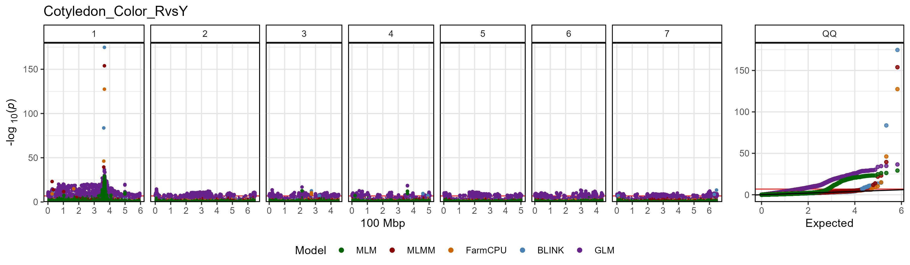

------------------------------------------------------------------------

### Facetted Manhattan Plots

facet the plots by setting `facet = T`

``` r

for(i in list_Traits(folder = "GWAS_Results/")) {
  # Plot
  mp <- gg_Manhattan(
    # Specify a folder with GWAS results
    folder = "GWAS_Results/",
    # Select a trait to plot
    trait = i, 
    # Facet out the different GWAS models
    facet = T)
  # Save
  ggsave(paste0("man/figures/fig_02_", i, ".png"), 
         mp, width = 12, height = 8, bg = "white")
}
```


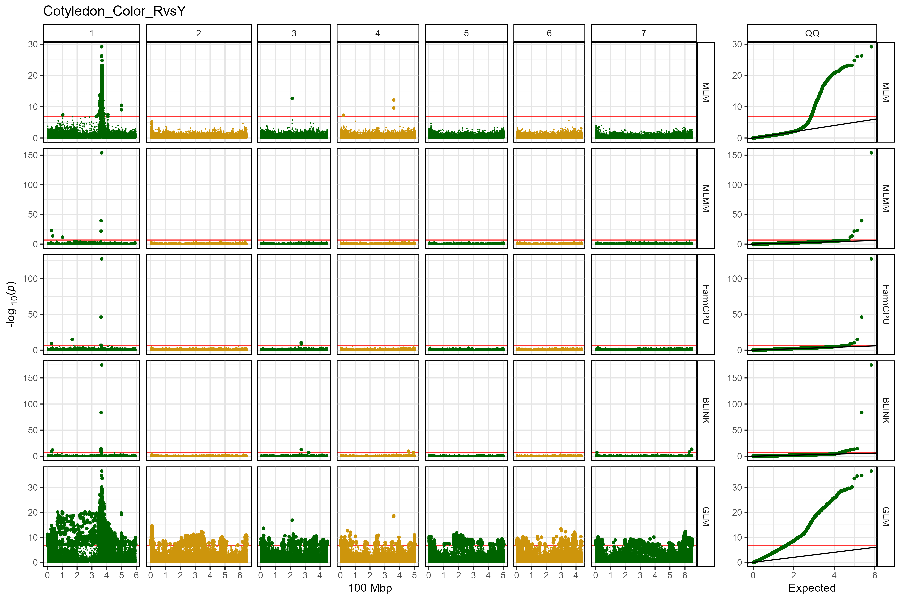

------------------------------------------------------------------------

### Custom Manhattan Plot

``` r

mp <- gg_Manhattan(
  # Specify a folder with GWAS results
  folder = "GWAS_Results/",
  # Select a trait to plot
  trait = "DTF_Nepal_2017",
  # Create a title for the plot
  title = "GWAS Results for DTF_Nepal_2017",
  # Highlight specific markers
  vlines = c("Lcu.1GRN.Chr2p44545877",
             "Lcu.1GRN.Chr5p1658484",
             "Lcu.1GRN.Chr6p3269280"),
  vline.colors = c("red","red","blue"),
  # Plot only certain GWAS models
  models = c("MLM", "MLMM", "FarmCPU", "BLINK"),
  # Set horizontal thresholds bars
  threshold = 6.7,
  sug.threshold = 5
  )
ggsave(paste0("man/figures/fig_03.png"), 
         mp, width = 12, height = 3.5, bg = "white")
```

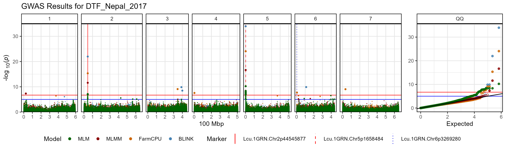

------------------------------------------------------------------------

## gg_Mahattan_Zoom()

`facet = T`

``` r

# Plot
mp <- gg_Manhattan_Zoom(
  # Specify a folder with GWAS results
  folder = "GWAS_Results/", 
  # Select a trait to plot
  trait = "Cotyledon_Color_RvsY", 
  # Plot just Chromosome 1
  chr = 1,
  pos1 = 360000000,
  pos2 = 370000000,
  # Highlight specific markers
  markers = c("Lcu.1GRN.Chr1p365986872",
              "Lcu.1GRN.Chr1p361840399"),
  # Create alt labels for the markers
  labels = c("365Mbp","361Mbp"),
  # Specify Color for each marker vline
  vline.colors = c("red", "blue"),
  # Should models be facetted
  facet = T
  )
# Save
ggsave("man/figures/fig_04_1.png", mp, width = 8, height = 8)
```

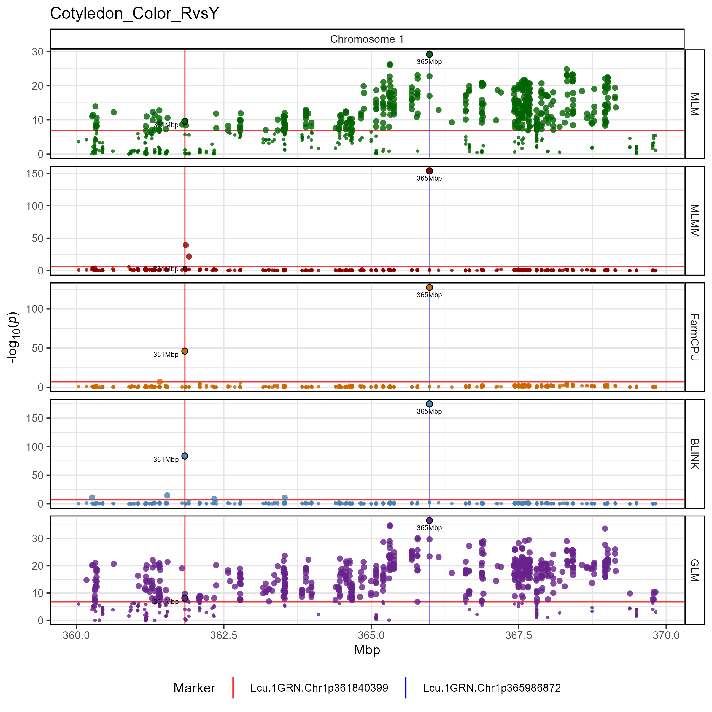

------------------------------------------------------------------------

`facet = F`

``` r

# Plot
mp <- gg_Manhattan_Zoom(
  # Specify a folder with GWAS results
  folder = "GWAS_Results/", 
  # Select a trait to plot
  trait = "Cotyledon_Color_RvsY", 
  # Plot just Chromosome 1
  chr = 1,
  pos1 = 360000000,
  pos2 = 370000000,
  # Plot only certain GWAS models
  models = c("MLMM","FarmCPU","BLINK"),
  # Highlight specific markers
  markers = c("Lcu.1GRN.Chr1p365986872",
              "Lcu.1GRN.Chr1p361840399"),
  # Create alt labels for the markers
  labels = c("365Mbp","361Mbp"),
  # Specify Color for each marker vline
  vline.colors = c("red", "blue"),
  # Should models be facetted
  facet = F,
  # set a max P value
  pmax = 40
  )
# Save
ggsave("man/figures/fig_04_2.png", mp, width = 10, height = 4)
```

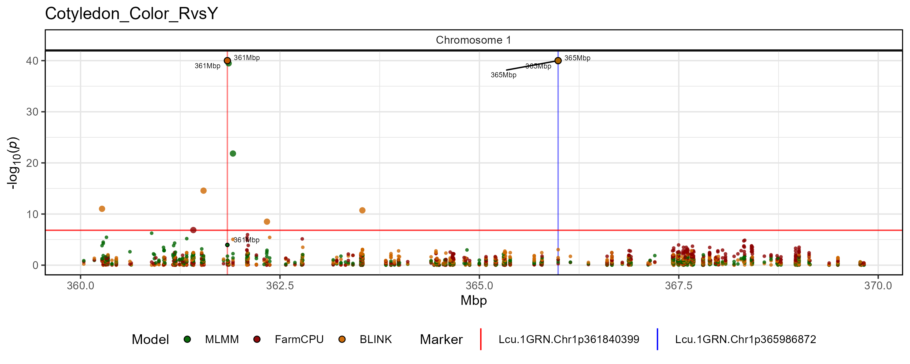

------------------------------------------------------------------------

## gg_Manhattan_Zoom_Traits()

``` r

# Plot
mp <- gg_Manhattan_Zoom_Traits(
  # Specify a folder with GWAS results
  folder = "GWAS_Results/",
  # Select traits to plot
  traits = c("DTF_Sask_2017","DTF_Sask_2017_b","DTF_Nepal_2017"),
  # Create a title for the plot
  title = "Days To Flower",
  # Plot just Chromosome 1
  chrom = 5, 
  pos1 = 1000000,
  pos2 = 2500000,
  # Set horizontal thresholds bars
  threshold = 6.7,
  sug.threshold = 5,
  # Highlight specific markers
  markers = "Lcu.1GRN.Chr5p1658484",
  # Plot only certain GWAS models
  models =  c("MLM","FarmCPU","BLINK"),
  model.colors = gwaspr_Colors
  ) 
ggsave("man/figures/fig_05.png", mp, width = 8, height = 6)
```

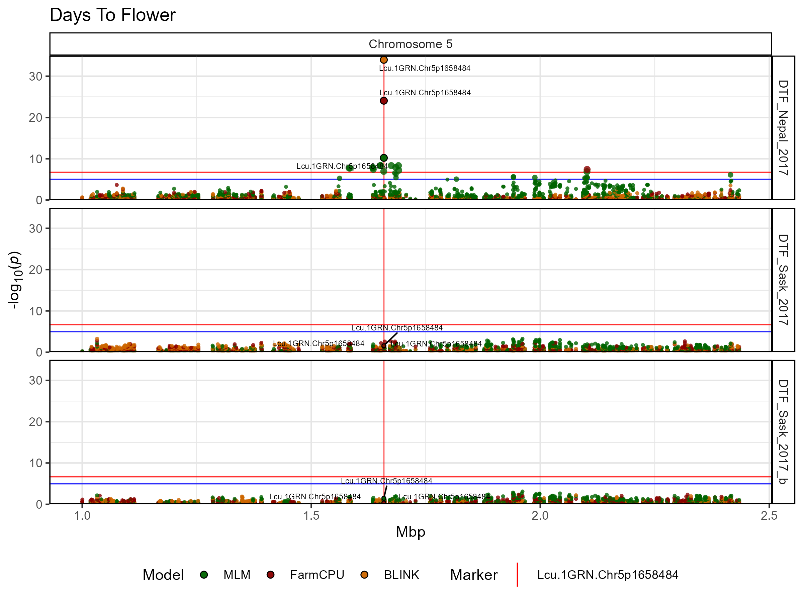

------------------------------------------------------------------------

## gg_Manhattan_xModels()

Uses a Single GWAS model and plots multiple traits

``` r

mp <- gg_Manhattan_xModels(
  # Specify a folder with GWAS results
  folder = "GWAS_Results/",
  # Select traits to plot
  traits = c("DTF_Sask_2017", "DTF_Sask_2017_b", "DTF_Nepal_2017"),
  # Specify a title
  title = "Days to Flower",
  vlines = c("Lcu.1GRN.Chr2p44545877",
              "Lcu.1GRN.Chr5p1658484",
              "Lcu.1GRN.Chr6p3269280"),
  vline.colors = c("red", "red", "blue"),
  # Choose a GWAS model
  models =  c("MLM","FarmCPU")
  )
ggsave("man/figures/fig_06.png", mp, width = 12, height = 5, bg = "white")
```


------------------------------------------------------------------------

## gg_Manhattan_xTraits()

Uses multiple GWAS models and facets each trait.

``` r

# Plot
mp <- gg_Manhattan_xTraits(
  # Specify a folder with GWAS results
  folder = "GWAS_Results/",
  # Select traits to plot
  traits = c("DTF_Sask_2017", "DTF_Sask_2017_b", "DTF_Nepal_2017"),
  # Specify a title
  title = "Days to Flower",
  # Highlight specific markers
  markers = c("Lcu.1GRN.Chr2p44545877",
              "Lcu.1GRN.Chr5p1658484",
              "Lcu.1GRN.Chr6p3269280"),
  # Create alt labels for the markers
  labels = c("44Mbp","16Mbp","32Mbp"),
  # Specify Color for each marker vline
  vline.colors = c("red","red","blue"),
  # Specify GWAS models to plot
  models =  c("MLM","MLMM","FarmCPU","BLINK")
  )
# Save
ggsave("man/figures/fig_07.png", mp, width = 12, height = 8, bg = "white")
```

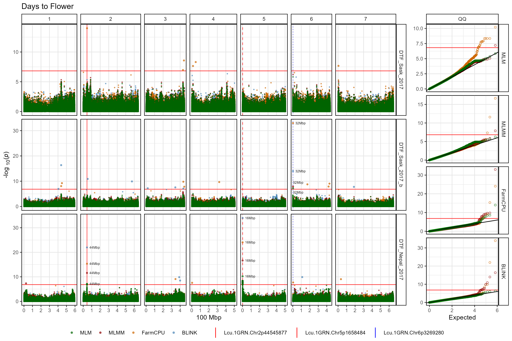

------------------------------------------------------------------------

## gg_GWAS_Summary()

``` r

# Plot
mp <- gg_GWAS_Summary(
  # Specify a folder with GWAS results
  folder = "GWAS_Results/",
  # Specify a title
  title = "Summary of Significant GWAS Results",
  # Specify GWAS models to plot
  models = c("MLMM","FarmCPU","BLINK")
  )
# Save
ggsave("man/figures/fig_08.png", mp, width = 12, height = 4)
```

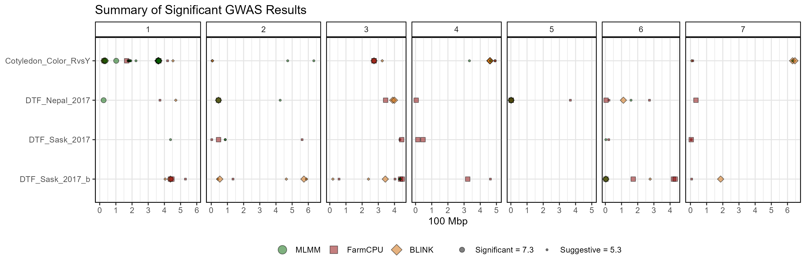

Make it an interactive plot with the following code

``` r

gg_plotly(mp, filename = "man/figures/fig_08.html")
```

<https://derekmichaelwright.github.io/gwaspr/man/figures/fig_08.html>

------------------------------------------------------------------------

## gg_GWAS_Hits()

``` r

xx <- table_GWAS_Results(folder = "GWAS_Results/", threshold = 6.8, sug.threshold = 5)
mp <- gg_GWAS_Hits(
  xx = xx,
  xG = myG,
  xCV = NULL,
  range = 5000000,
  traits = c("DTF_Sask_2017", "DTF_Sask_2017_b", "DTF_Nepal_2017"),
  models =  c("BLINK", "FarmCPU", "MLMM", "MLM")
  )
ggsave("man/figures/fig_09.png", mp, width = 12, height = 3.5)
```


------------------------------------------------------------------------

## gg_Marker\_\*

### gg_Marker_Box()

single marker, single trait

``` r

mp <- gg_Marker_Box(xG = myG, xY = myY,
                    traits = "DTF_Sask_2017",
                    markers = "Lcu.1GRN.Chr6p3269280",
                    plot.points = F
                    )
ggsave("man/figures/fig_10_1.png", mp, width = 6, height = 4)
```

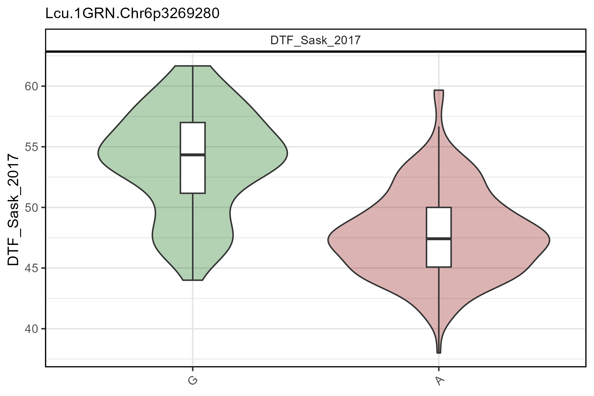

------------------------------------------------------------------------

multiple markers, multiple traits

``` r

mp <- gg_Marker_Box(xG = myG, xY = myY,
                    traits = c("DTF_Nepal_2017", "DTF_Sask_2017"),
                    markers = c("Lcu.1GRN.Chr5p1658484", "Lcu.1GRN.Chr2p44545877")
                    )
ggsave("man/figures/fig_10_2.png", mp, width = 8, height = 4)
```


------------------------------------------------------------------------

## gg_Marker_Bar()

``` r

mp <- gg_Marker_Bar(xG = myG, xY = myY,
                    traits = c("DTF_Nepal_2017", "DTF_Sask_2017"),
                    markers = c("Lcu.1GRN.Chr2p44545877", "Lcu.1GRN.Chr5p1658484")
                    )
ggsave("man/figures/fig_10_3.png", mp, width = 8, height = 4)
```

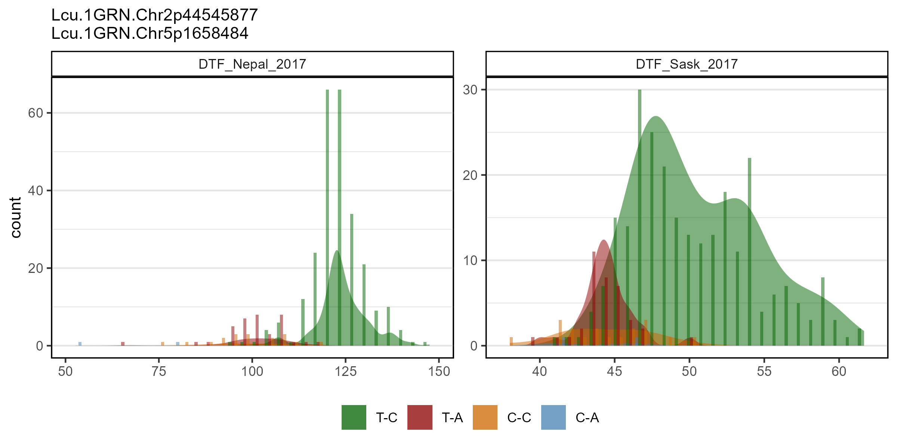

------------------------------------------------------------------------

``` r

# Plot 
mp <- gg_Marker_Bar(xG = myG, xY = myY,
                    traits = "Cotyledon_Color_RvsY",
                    markers = "Lcu.1GRN.Chr1p365986872",
                    plot.density = F
                    )
# Save
ggsave("man/figures/fig_10_4.png", mp, width = 6, height = 4)
```


------------------------------------------------------------------------

``` r

xx <- myY %>% 
  mutate(Cotyledon_Color = plyr::mapvalues(Cotyledon_Color_RvsY, 
                              c(0,1,NA), c("Yellow","Red","Green")))
# Plot 
mp <- gg_Marker_Bar(xG = myG, xY = xx,
                    traits = "Cotyledon_Color",
                    markers = "Lcu.1GRN.Chr1p365986872",
                    plot.density = F,
                    )
# Save
ggsave("man/figures/fig_10_5.png", mp, width = 6, height = 4)
```

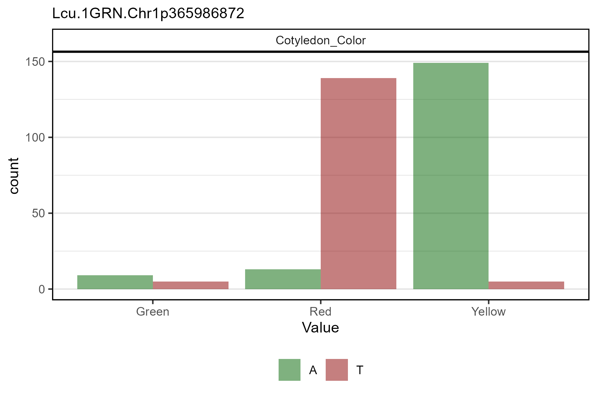

------------------------------------------------------------------------

``` r

xx <- myY %>% 
  mutate(Cotyledon_Color = plyr::mapvalues(Cotyledon_Color_RvsY, 
                              c(0,1,NA), c("Yellow","Red","Green")))
# Plot 
mp <- gg_Marker_Pie(xG = myG, xY = xx,
                    trait = "Cotyledon_Color",
                    markers = "Lcu.1GRN.Chr1p365986872"
                    )
# Save
ggsave("man/figures/fig_10_6.png", mp, width = 6, height = 4)
```


------------------------------------------------------------------------

# GAPIT

`GAPIT`: and `R` package for performing Genome Wide Association Studies
(GWAS)

<https://github.com/jiabowang/GAPIT>

# Dependancies

`tidyverse`, `ggpubr`, `ggbeeswarm`, `ggrepel`, `ggtext`, `plotly`,
`htmlwidgets`

------------------------------------------------------------------------

© Derek Michael Wright
