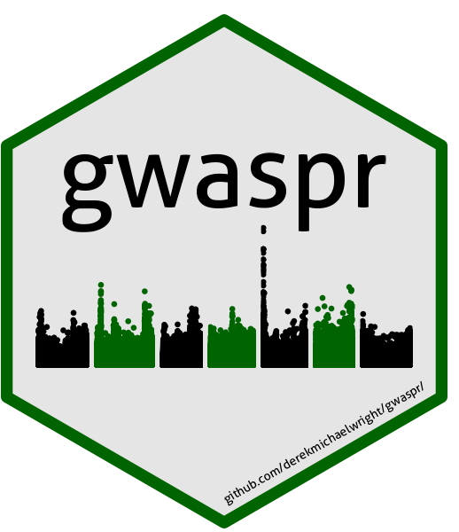
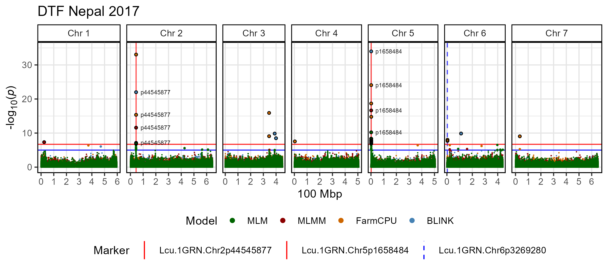
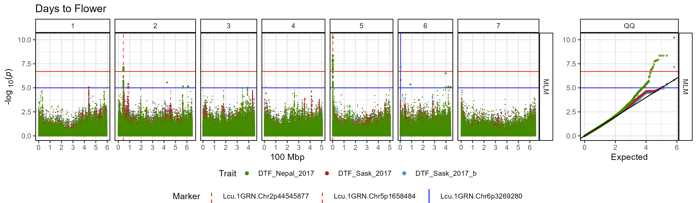
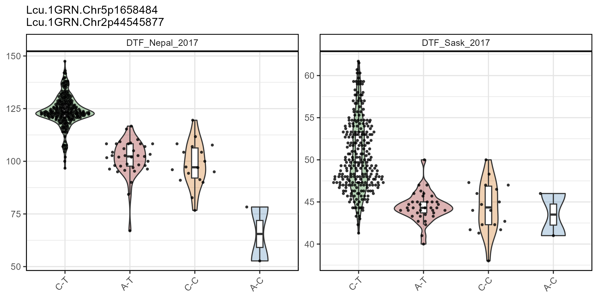
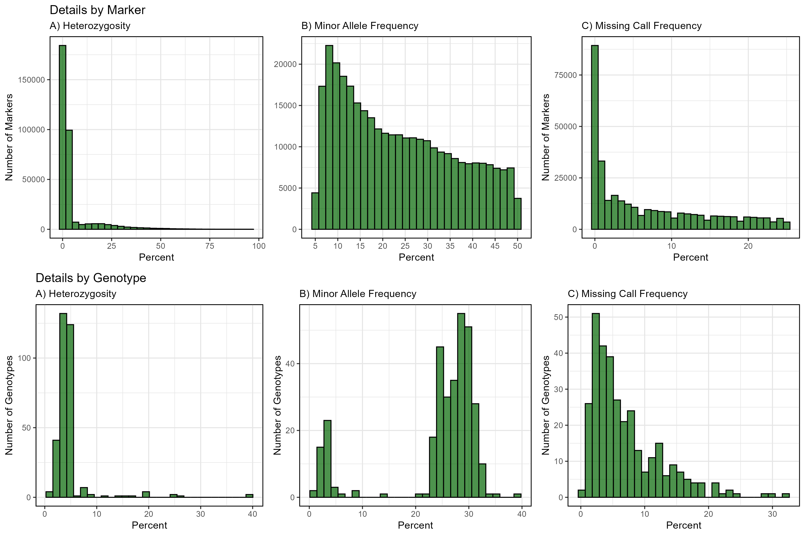

# gwaspr 

`gwaspr`: an `R` package for plotting GWAS results from the `GAPIT`
package

------------------------------------------------------------------------

# Instal gwaspr

``` r

devtools::install_github("derekmichaelwright/gwaspr")
```

``` r

library(gwaspr)
```

------------------------------------------------------------------------

# github

> - **github link**:
>   [https://github.com/derekmichaelwright/gwaspr/](https://github.com/derekmichaelwright/gwaspr/)

------------------------------------------------------------------------

# GWAS Tutorial

> - **dblogr GWAS Tutorial**:
>   [https://derekmichaelwright.github.io/dblogr/academic/gwas_tutorial/](https://derekmichaelwright.github.io/dblogr/academic/gwas_tutorial/)

------------------------------------------------------------------------

# GAPIT

`GAPIT`: and `R` package for performing Genome Wide Association Studies
(GWAS)

> - **GAPIT Website**:
>   [https://www.maizegenetics.net/gapit](https://www.maizegenetics.net/gapit)
> - **GAPIT github**:
>   [https://github.com/jiabowang/GAPIT](https://github.com/jiabowang/GAPIT)

``` r

devtools::install_github("jiabowang/GAPIT")
```

------------------------------------------------------------------------

# Dependancies

`tidyverse`, `ggpubr`, `ggbeeswarm`, `ggrepel`, `ggtext`, `plotly`,
`htmlwidgets`

------------------------------------------------------------------------

# Example Plots













------------------------------------------------------------------------


