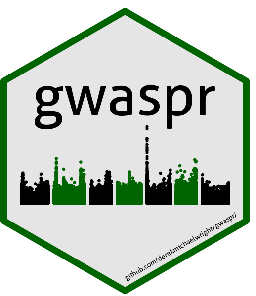
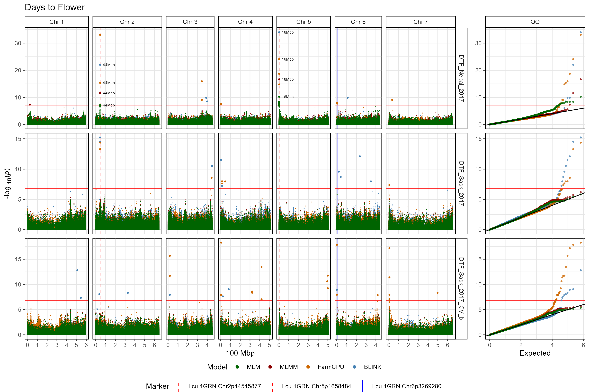
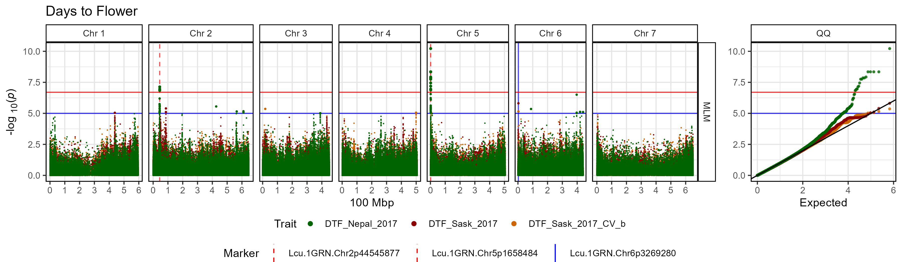
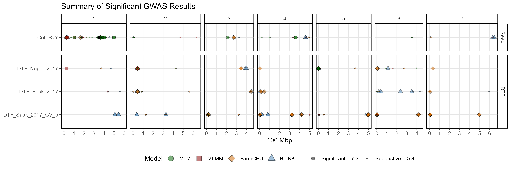
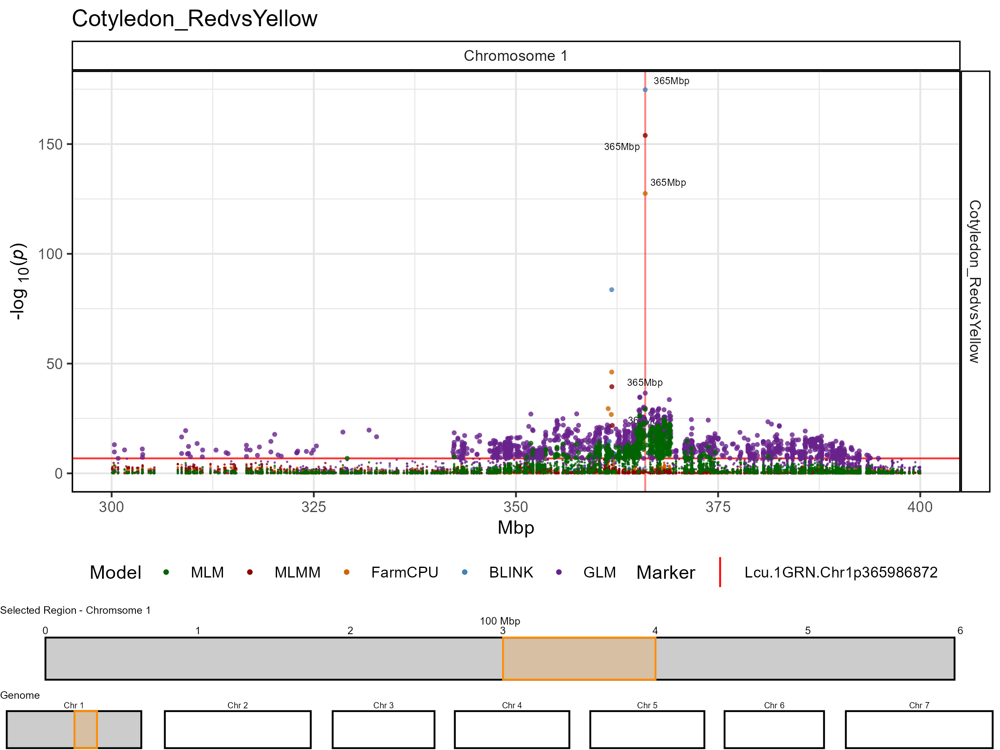
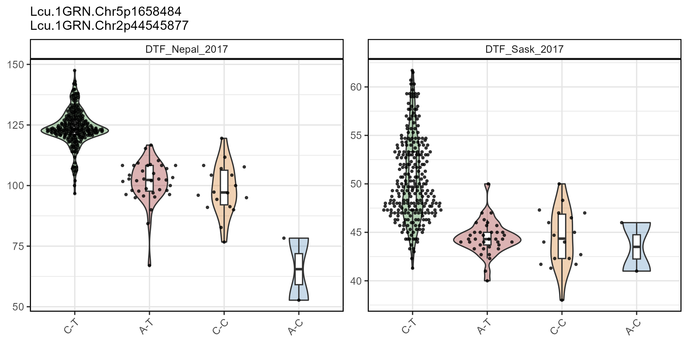
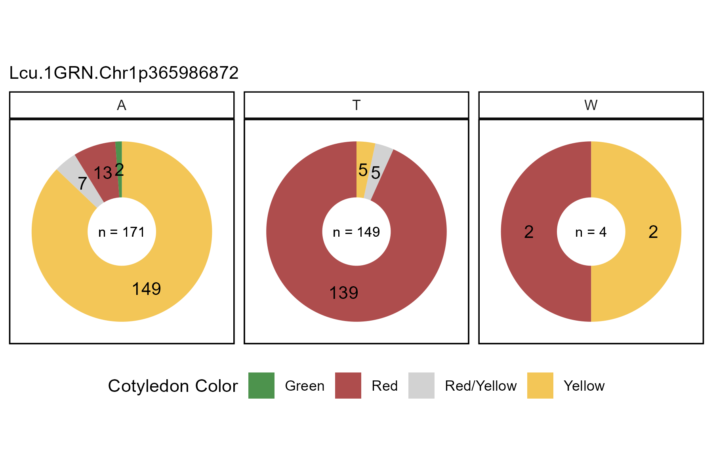
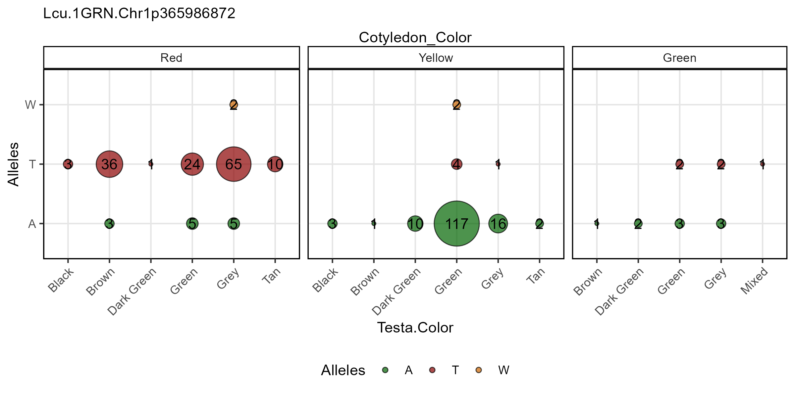
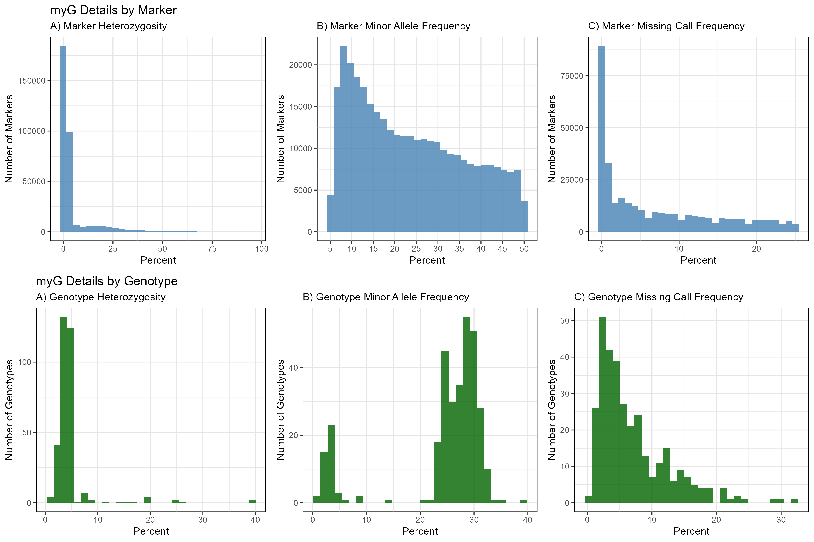
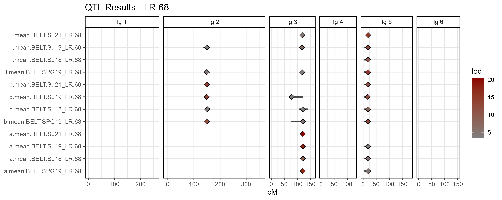

# gwaspr 

`gwaspr`: an `R` package for plotting GWAS results from the `GAPIT`
package

> Note: this pakage is currently in development. If you’re having issues
> first try reinstalling the package. If that doesn’t work, contact the
> author. <derek.wright@usask.ca>

------------------------------------------------------------------------

# Instal `gwaspr`

``` r

devtools::install_github("derekmichaelwright/gwaspr")
```

# Load `gwaspr`

``` r

library(gwaspr)
```

------------------------------------------------------------------------

# GWAS with `GAPIT`

`GAPIT`: an `R` package for performing Genome Wide Association Studies
(GWAS)

> - **GAPIT Website**:
>   [https://www.maizegenetics.net/gapit](https://www.maizegenetics.net/gapit)
> - **GAPIT github**:
>   [https://github.com/jiabowang/GAPIT](https://github.com/jiabowang/GAPIT)

``` r

devtools::install_github("jiabowang/GAPIT")
```

``` r

library(GAPIT)
```

------------------------------------------------------------------------

# `gwaspr` Github

- **github link**:
  [https://github.com/derekmichaelwright/gwaspr/](https://github.com/derekmichaelwright/gwaspr/)

------------------------------------------------------------------------

# `gwapsr` Tutorial

- **dblogr GWAS Tutorial**:
  [https://derekmichaelwright.github.io/dblogr/academic/gwas_tutorial/](https://derekmichaelwright.github.io/dblogr/academic/gwas_tutorial/)
- [Phenotype data
  (gwaspr_myY.csv)](https://derekmichaelwright.github.io/gwaspr/vignettes/gwaspr_myY.csv)
- [Covariate data
  (gwaspr_myCV.csv)](https://derekmichaelwright.github.io/gwaspr/vignettes/gwaspr_myCV.csv)
- [Genotype data
  (gwaspr_myG_hmp.zip)](https://derekmichaelwright.github.io/gwaspr/vignettes/gwaspr_myG_hmp.zip)

------------------------------------------------------------------------

# Package Dependancies

`tidyverse`, `ggpubr`, `ggbeeswarm`, `ggrepel`, `ggtext`, `plotly`,
`htmlwidgets`

------------------------------------------------------------------------

# Example plots

## gg_Manhattan()





## gg_GWAS_Summary()



## gg_Manhattan_Zoom



## gg_Marker_Box()



## gg_Marker_Pie()



## gg_Marker_Bubble()



## gg_myG_Details()



## gg_LD_Heatmap()


## gg_QTL_Summary()



------------------------------------------------------------------------


