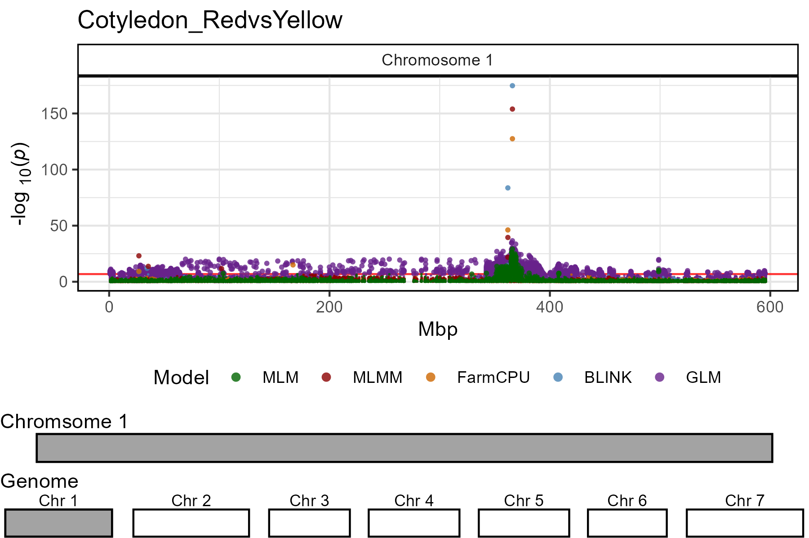
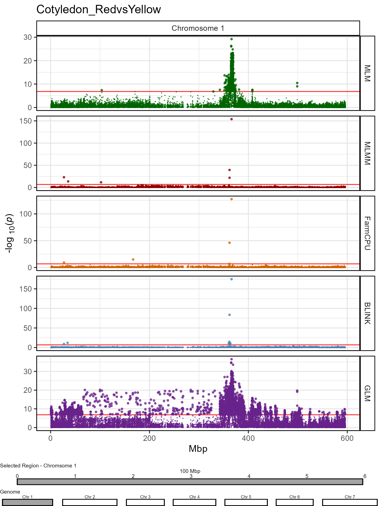
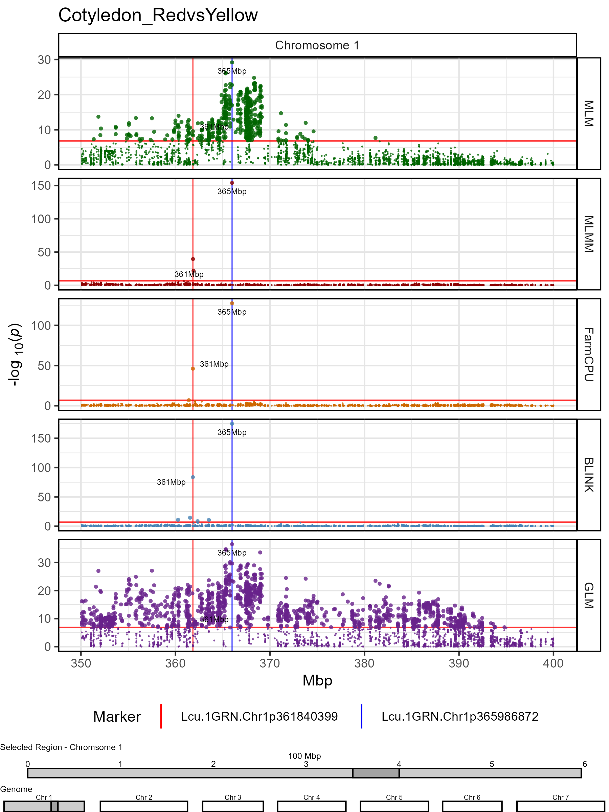
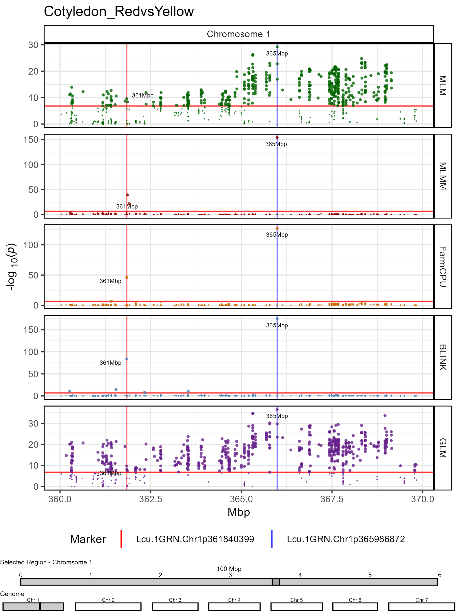
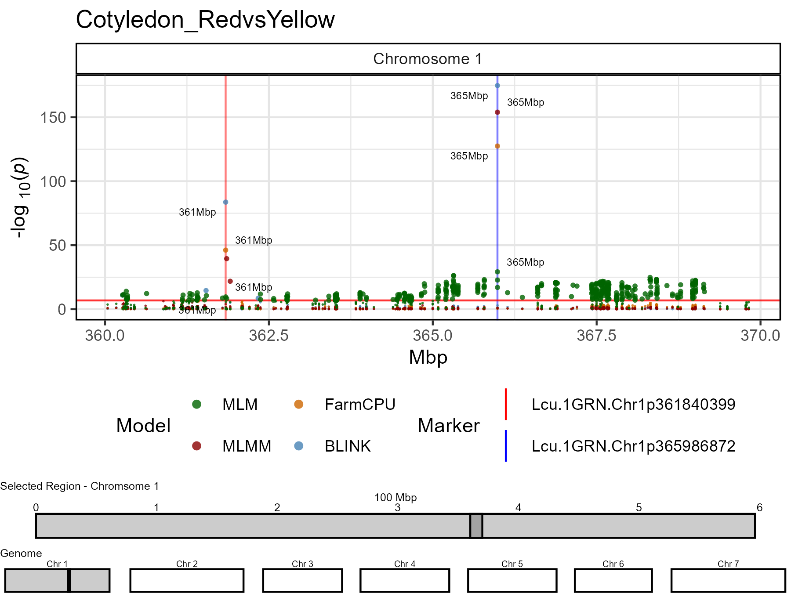

```{r setup, include = FALSE}
knitr::opts_chunk$set(message = F, warning = F)
```

```{r echo = F}
library(gwaspr)
```

Due to the large size of most genomes, small shifts in the x-axis on a standard manhattan plot can result in large distances. 

The function `gg_Manhattan_Zoom()` creates manhattan plots from GAPIT GWAS results zoomed into a specific region on a chromosome. 

Specifying a `folder`, a `trait` and a `chr` (defaults to 1 if not specified) is all that is needed to create zoomed in manhattan plots.

```{r eval = F}
# Plot
mp <- gg_Manhattan_Zoom(
  # Specify a folder with GWAS results
  folder = "GWAS_Results/", 
  # Select a trait to plot
  trait = "Cotyledon_RedvsYellow", 
  # Plot just Chromosome 1
  chr = 1 )
# Save
ggsave("figures/gg_Manhattan_Zoom_01.png", mp, width = 6, height = 4, bg = "white")
```



---

# Facet by Model

The default for `gg_Manhattan_Zoom()` is to set `facet = F` and plot all GWAS models together. However, if `facet = T`, then the different GWAS models can be separated.

```{r eval = F}
# Plot
mp <- gg_Manhattan_Zoom(
  # Specify a folder with GWAS results
  folder = "GWAS_Results/", 
  # Select a trait to plot
  trait = "Cotyledon_RedvsYellow", 
  # Plot just Chromosome 1
  chr = 1,
  # Should models be facetted
  facet = T )
# Save
ggsave("figures/gg_Manhattan_Zoom_02.png", mp, width = 6, height = 8, bg = "white")
```



---

# Customized Plots 

Any Region within a chromosome can be plotted by specifying `pos1` and `pos2`. 

```{r eval = F}
# Plot
mp <- gg_Manhattan_Zoom(
  # Specify a folder with GWAS results
  folder = "GWAS_Results/", 
  # Select a trait to plot
  trait = "Cotyledon_RedvsYellow", 
  # Plot just Chromosome 1
  chr = 1,
  pos1 = 350000000,
  pos2 = 400000000,
  # Highlight specific markers
  markers = c("Lcu.1GRN.Chr1p365986872",
              "Lcu.1GRN.Chr1p361840399"),
  # Create alt labels for the markers
  labels = c("365Mbp","361Mbp"),
  # Specify Color for each marker vline
  vline.colors = c("red", "blue"),
  # Should models be facetted
  facet = T )
# Save
ggsave("figures/gg_Manhattan_Zoom_03.png", mp, width = 6, height = 8, bg = "white")
```



---

```{r eval = F}
# Plot
mp <- gg_Manhattan_Zoom(
  # Specify a folder with GWAS results
  folder = "GWAS_Results/", 
  # Select a trait to plot
  trait = "Cotyledon_RedvsYellow", 
  # Plot just Chromosome 1
  chr = 1,
  pos1 = 360000000,
  pos2 = 370000000,
  # Highlight specific markers
  markers = c("Lcu.1GRN.Chr1p365986872",
              "Lcu.1GRN.Chr1p361840399"),
  # Create alt labels for the markers
  labels = c("365Mbp","361Mbp"),
  # Specify Color for each marker vline
  vline.colors = c("red", "blue"),
  # Should models be facetted
  facet = T )
# Save
ggsave("figures/gg_Manhattan_Zoom_04.png", mp, width = 6, height = 8, bg = "white")
```



---

If there are markers with extremely high *-log10(p)* values, `pmax` can be set to make plots more readable. 

```{r eval = F}
# Plot
mp <- gg_Manhattan_Zoom(
  # Specify a folder with GWAS results
  folder = "GWAS_Results/", 
  # Select a trait to plot
  trait = "Cotyledon_RedvsYellow", 
  # Plot just Chromosome 1
  chr = 1,
  pos1 = 360000000,
  pos2 = 370000000,
  # Plot only certain GWAS models
  models = c("MLM","MLMM","FarmCPU","BLINK"),
  # Set colors for each GWAS model
  model.colors = c("darkgreen","darkred", "darkorange3", "steelblue"),
  # Highlight specific markers
  markers = c("Lcu.1GRN.Chr1p365986872",
              "Lcu.1GRN.Chr1p361840399"),
  # Create alt labels for the markers
  labels = c("365Mbp","361Mbp"),
  # Specify Color for each marker vline
  vline.colors = c("red", "blue"),
  # Set the number of rows in the legend
  legend.rows = 2,
  # Should models be facetted
  facet = F
  # set a max P value
  #pmax = 40
  )
# Save
ggsave("figures/gg_Manhattan_Zoom_05.png", mp, width = 6, height = 4.5, bg = "white")
```



---
