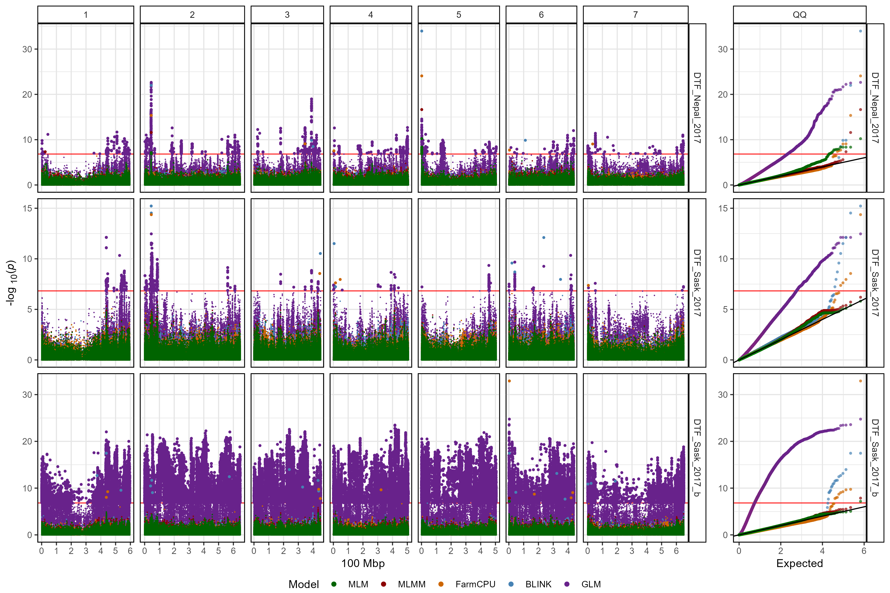
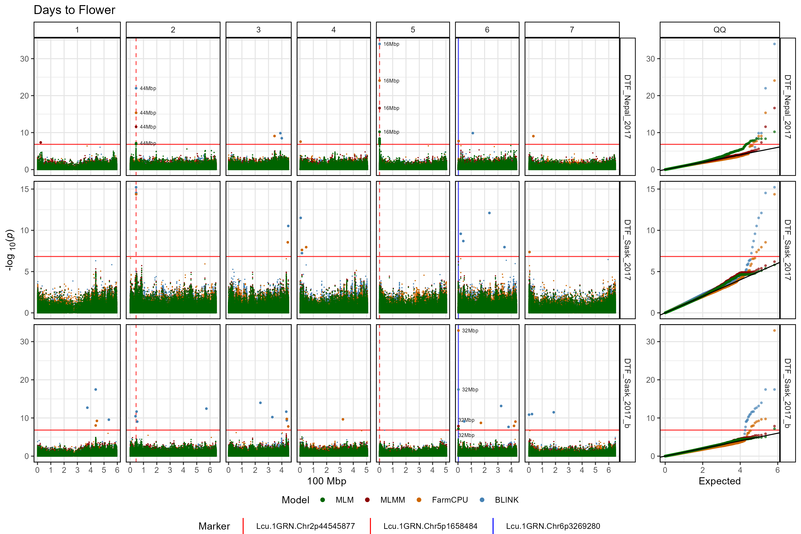

```{r setup, include = FALSE}
knitr::opts_chunk$set(message = F, warning = F)
```

```{r echo = F}
library(gwaspr)
```

Uses multiple GWAS models and facets each trait.

The function `gg_Manhattan_xTraits()` creates manhattan plots from GAPIT GWAS results for multiple traits and facets them by Trait.

Specifying a `folder` and `traits` is all that is needed to create manhattan plots for multiple traits.

```{r eval = F}
# Plot
mp <- gg_Manhattan_xTraits(
  # Specify a folder with GWAS results
  folder = "GWAS_Results/",
  # Select traits to plot
  traits = c("DTF_Nepal_2017", "DTF_Sask_2017", "DTF_Sask_2017_b") )
# Save
ggsave("figures/gg_Manhattan_xTraits_01.png", mp, width = 12, height = 8, bg = "white")
```



---

# Customized Plot

```{r eval = F}
# Plot
mp <- gg_Manhattan_xTraits(
  # Specify a folder with GWAS results
  folder = "GWAS_Results/",
  # Select traits to plot
  traits = c("DTF_Nepal_2017", "DTF_Sask_2017", "DTF_Sask_2017_b"),
  # Specify a title
  title = "Days to Flower",
  # Highlight specific markers
  markers = c("Lcu.1GRN.Chr2p44545877",
              "Lcu.1GRN.Chr5p1658484",
              "Lcu.1GRN.Chr6p3269280"),
  # Create alt labels for the markers
  labels = c("44Mbp","16Mbp","32Mbp"),
  # Specify Color for each marker vline
  vline.colors = c("red","red","blue"),
  vline.types = c(2,2,1),
  # Change the legend alignment
  legend.box="vertical",
  # Specify GWAS models to plot
  models =  c("MLM","MLMM","FarmCPU","BLINK") )
# Save
ggsave("figures/gg_Manhattan_xTraits_02.png", mp, width = 12, height = 8, bg = "white")
```



---
