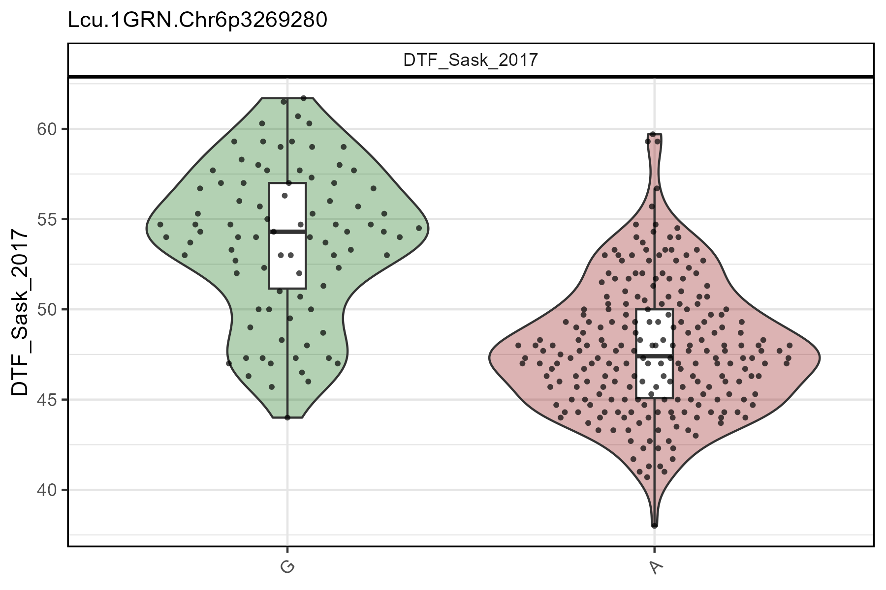
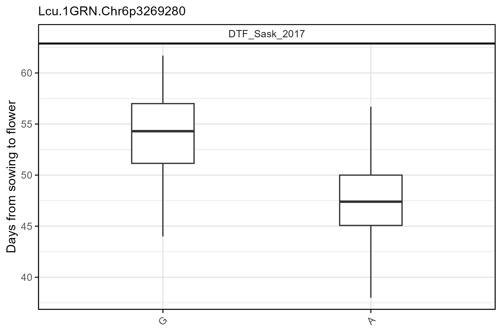
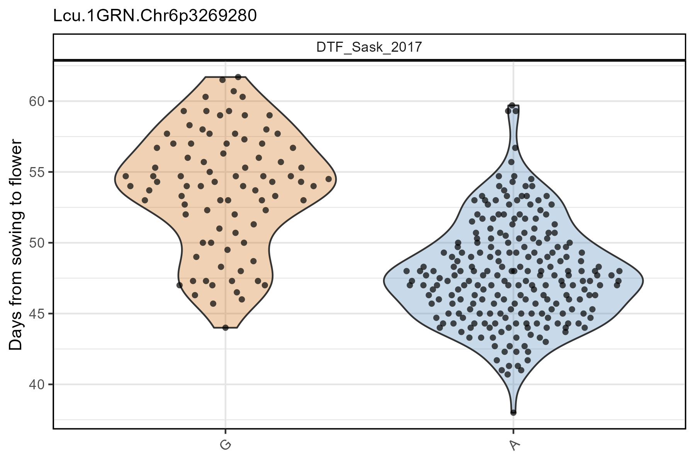
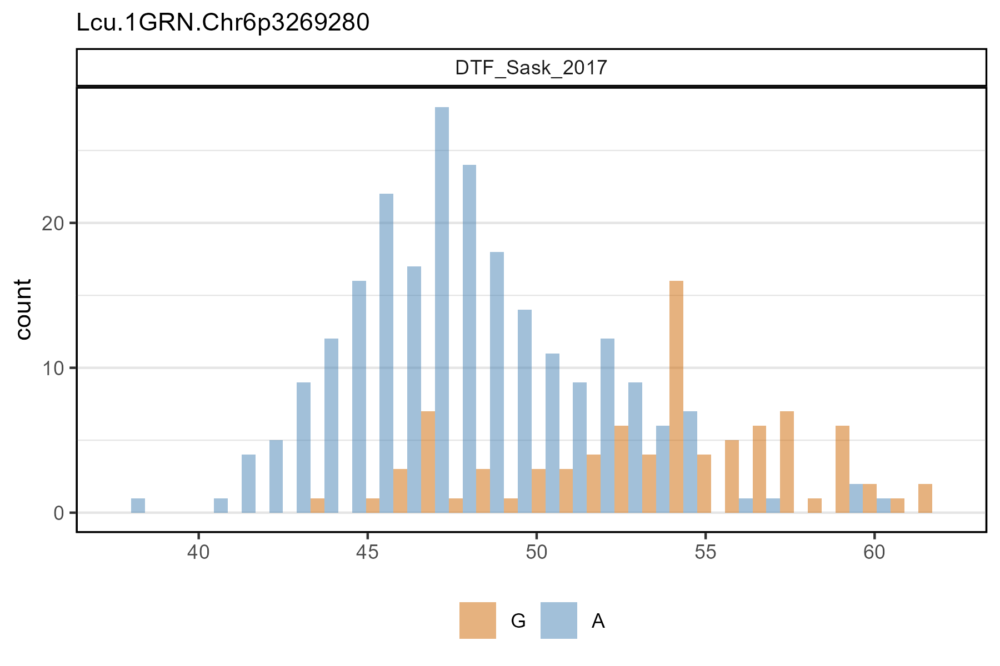
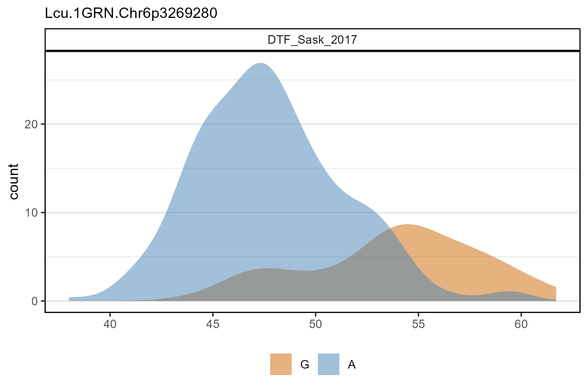
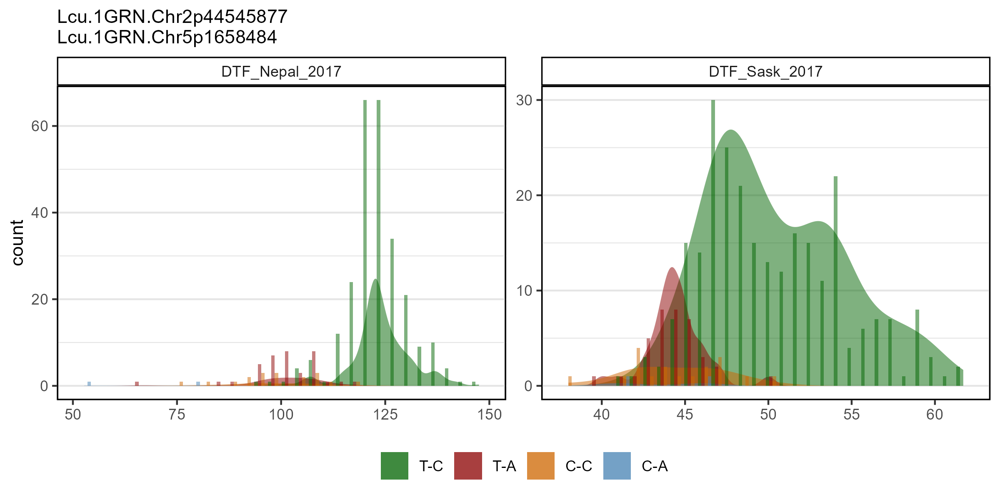
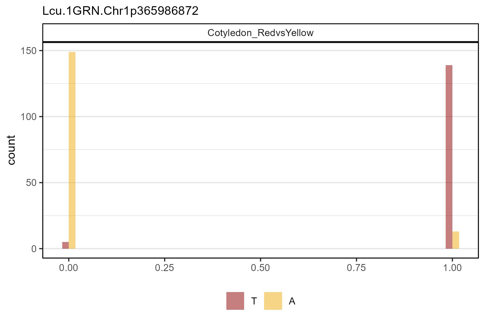
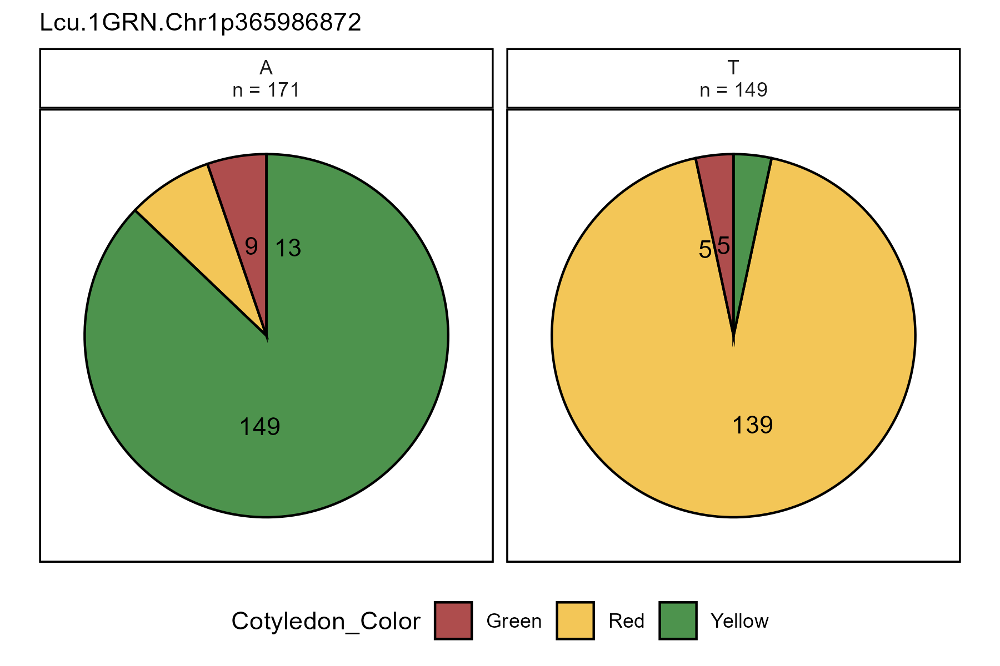

```{r setup, include = FALSE}
knitr::opts_chunk$set(eval = F, message = F, warning = F)
```

```{r}
library("gwaspr")
```

The functions `gg_Marker_Box()`, `gg_Marker_Bar()`, and `gg_Marker_Pie()` create marker plots with your `myY` and `myG` GWAS input files.

# Load data

```{r}
# Load phenotype file
myY <- read.csv("myY.csv")
# Load genotype file (note: header = T)
myG <- read.csv("myG_hmp.csv", header = T)
```

---

# gg_Marker_Box()

## Single marker, single trait

Specifying a `trait` and a `marker` along with your genotype and phenotype data as `xG` and `xY` is needed to create marker plots.

```{r}
# Plot
mp <- gg_Marker_Box(
  # Genotype data
  xG = myG, 
  # Phenotype data
  xY = myY,
  # Select traits to plot
  traits = "DTF_Sask_2017",
  # Select markers to plot
  markers = "Lcu.1GRN.Chr6p3269280" )
# Save
ggsave("figures/gg_Marker_Box_01.png", 
       mp, width = 6, height = 4)
```



---

## Customized Plots

### Boxplots 

```{r}
# Plot
mp <- gg_Marker_Box(
  # Genotype data
  xG = myG, 
  # Phenotype data
  xY = myY,
  # Select traits to plot
  traits = "DTF_Sask_2017",
  # Select markers to plot
  markers = "Lcu.1GRN.Chr6p3269280",
  # Customize
  marker.colors = gwaspr_Colors[3:4],
  plot.violin = F,
  plot.points = F,
  plot.box = T,
  box.width = 0.3,
  yLab = "Days from sowing to flower" )
# Save
ggsave("figures/gg_Marker_Box_02.png", 
       mp, width = 6, height = 4)
```



---

### Violin + points

```{r}
# Plot
mp <- gg_Marker_Box(
  # Genotype data
  xG = myG, 
  # Phenotype data
  xY = myY,
  # Select traits to plot
  traits = "DTF_Sask_2017",
  # Select markers to plot
  markers = "Lcu.1GRN.Chr6p3269280",
  # Customize
  marker.colors = gwaspr_Colors[3:4],
  plot.violin = T,
  plot.points = T,
  plot.box = F,
  point.size = 1.5,
  yLab = "Days from sowing to flower" )
# Save
ggsave("figures/gg_Marker_Box_03.png", 
       mp, width = 6, height = 4)
```



---

## Multiple markers, multiple traits

```{r}
# Plot
mp <- gg_Marker_Box(
  # Genotype data
  xG = myG,
  # Phenotype data
  xY = myY,
  # Select traits to plot
  traits = c("DTF_Nepal_2017", "DTF_Sask_2017"),
  # Select markers to plot
  markers = c("Lcu.1GRN.Chr5p1658484", "Lcu.1GRN.Chr2p44545877") )
# Save
ggsave("figures/gg_Marker_Box_04.png",
       mp, width = 8, height = 4)
```


---

# gg_Marker_Bar()

## Single marker, single trait

```{r}
# Plot
mp <- gg_Marker_Bar(
  # Genotype data
  xG = myG, 
  # Phenotype data
  xY = myY,
  # Select traits to plot
  traits = "DTF_Sask_2017",
  # Select markers to plot
  markers = "Lcu.1GRN.Chr6p3269280" )
# Save
ggsave("figures/gg_Marker_Bar_01.png", 
       mp, width = 6, height = 4)
```


---

## Customized Plots

### Histogram

```{r}
# Plot
mp <- gg_Marker_Bar(
  # Genotype data
  xG = myG, 
  # Phenotype data
  xY = myY,
  # Select traits to plot
  traits = "DTF_Sask_2017",
  # Select markers to plot
  markers = "Lcu.1GRN.Chr6p3269280",
  # Customization
  marker.colors = gwaspr_Colors[3:4],
  plot.histogram = T,
  plot.density = F )
# Save
ggsave("figures/gg_Marker_Bar_02.png", 
       mp, width = 6, height = 4)
```



---

### Density

```{r}
# Plot
mp <- gg_Marker_Bar(
  # Genotype data
  xG = myG, 
  # Phenotype data
  xY = myY,
  # Select traits to plot
  traits = "DTF_Sask_2017",
  # Select markers to plot
  markers = "Lcu.1GRN.Chr6p3269280",
  # Customization
  marker.colors = gwaspr_Colors[3:4],
  plot.histogram = F,
  plot.density = T )
# Save
ggsave("figures/gg_Marker_Bar_03.png", 
       mp, width = 6, height = 4)
```



---

## Multiple markers, multiple traits

```{r}
# Plot
mp <- gg_Marker_Bar(
  # Genotype data
  xG = myG, 
  # Phenotype data
  xY = myY,
  # Select traits to plot
  traits = c("DTF_Nepal_2017", "DTF_Sask_2017"),
  # Select markers to plot
  markers = c("Lcu.1GRN.Chr2p44545877", "Lcu.1GRN.Chr5p1658484") )
# Save
ggsave("figures/gg_Marker_Bar_04.png", 
       mp, width = 8, height = 4)
```



---

## Factor data

### Numeric format

```{r}
# Plot 
mp <- gg_Marker_Bar(
  # Genotype data
  xG = myG, 
  # Phenotype data
  xY = myY,
  # Select traits to plot
  traits = "Cotyledon_RedvsYellow",
  # Select markers to plot
  markers = "Lcu.1GRN.Chr1p365986872",
  # Customization
  marker.colors = c("darkred", "darkgoldenrod2"),
  plot.histogram = T,
  plot.density = F )
# Save
ggsave("figures/gg_Marker_Bar_05.png", mp, width = 6, height = 4)
```



---

### Factor format

```{r}
# Prep data
xx <- myY %>% 
  mutate(Cotyledon_Color = mv(Cotyledon_RedvsYellow, c(0,1,NA), c("Yellow","Red","Green")) )
# Plot 
mp <- gg_Marker_Bar(
  # Genotype data
  xG = myG, xY = xx,
  # Select traits to plot
  traits = "Cotyledon_Color",
  # Select markers to plot
  markers = "Lcu.1GRN.Chr1p365986872",
  # Customization
  marker.colors = c("darkred", "darkgoldenrod2", "darkgreen"),
  plot.histogram = T,
  plot.density = F )
# Save
ggsave("figures/gg_Marker_Bar_06.png", mp, width = 6, height = 4)
```


---

# gg_Marker_Pie()

```{r}
# Prep data
xx <- myY %>% 
  mutate(Cotyledon_Color = mv(Cotyledon_RedvsYellow, c(0,1,NA), c("Yellow","Red","Green")))
# Plot 
mp <- gg_Marker_Pie(
  # Genotype data
  xG = myG, 
  # Phenotype data
  xY = xx,
  # Select traits to plot
  trait = "Cotyledon_Color",
  # Select markers to plot
  markers = "Lcu.1GRN.Chr1p365986872",
  # Customization
  marker.colors = c("darkred", "darkgoldenrod2", "darkgreen") )
# Save
ggsave("figures/gg_Marker_Pie_01.png", 
       mp, width = 6, height = 4)
```


