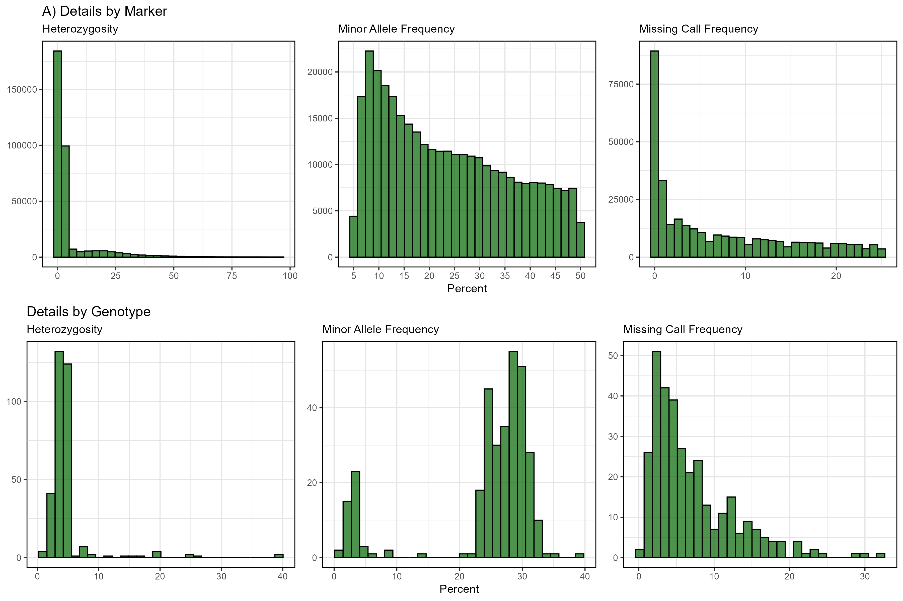

```{r setup, include = FALSE}
knitr::opts_chunk$set(message = F, warning = F)
```

```{r echo = F}
library("gwaspr")
```

```{r eval = F}
# Run function
gg_myG_Details(filename = "myG_hmp.csv", 
               myPrefix = "figures/gg_myG_Details" )
```



---
