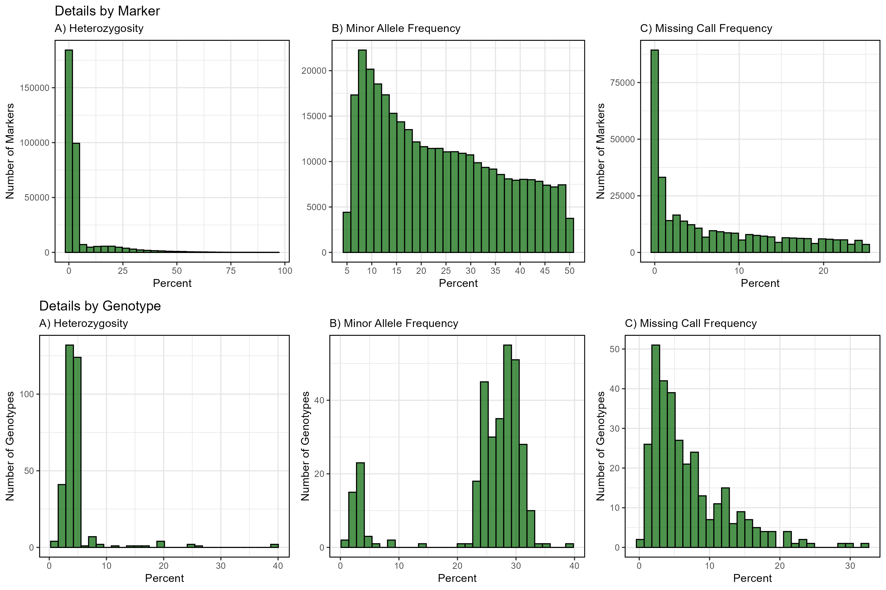

```{r setup, include = FALSE}
knitr::opts_chunk$set(message = F, warning = F)
```

```{r}
library("gwaspr")
```

```{r eval = F}
# Run function
gg_myG_Details(
  # Specify the name of your myG file
  filename = "myG_hmp.csv", 
  # Select a prefix to give the output files
  myPrefix = "figures/gg_myG_Details" )
```


