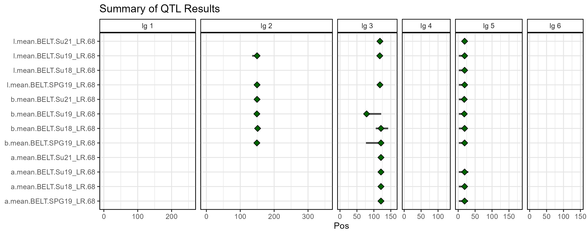
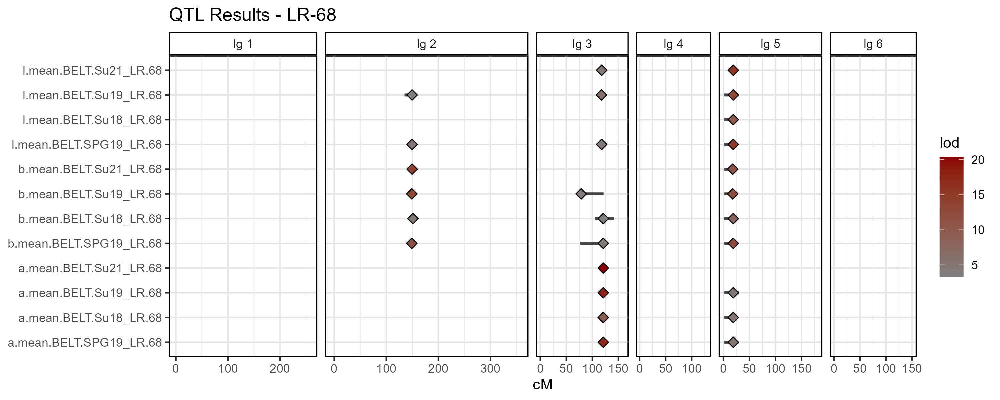
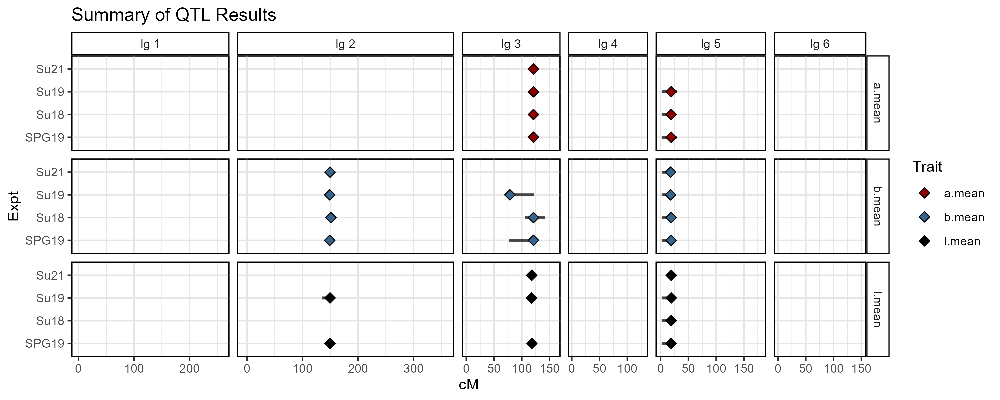
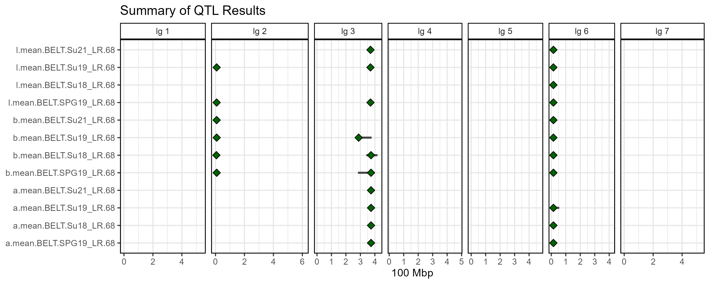
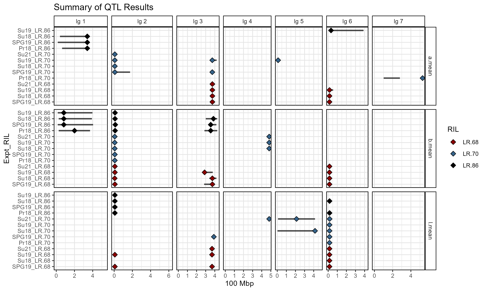

```{r setup, include = FALSE}
knitr::opts_chunk$set(message = F, warning = F)
```

```{r echo = F}
library("gwaspr")
```

The function `gg_QTL_Summary()` creates plot summarising the results from multiple QTL analyses. 

Sample Data

- [LR-68_gmap.csv](https://derekmichaelwright.github.io/gwaspr/vignettes/LR-68_gmap.csv)
- [myQTL_LR-68_lab_peaks.csv](https://derekmichaelwright.github.io/gwaspr/vignettes/myQTL_LR-68_lab_peaks.csv)
- [LR-70_gmap.csv](https://derekmichaelwright.github.io/gwaspr/vignettes/LR-70_gmap.csv)
- [myQTL_LR-70_lab_peaks.csv](https://derekmichaelwright.github.io/gwaspr/vignettes/myQTL_LR-70_lab_peaks.csv)
- [LR-86_gmap.csv](https://derekmichaelwright.github.io/gwaspr/vignettes/LR-86_gmap.csv)
- [myQTL_LR-86_lab_peaks.csv](https://derekmichaelwright.github.io/gwaspr/vignettes/myQTL_LR-86_lab_peaks.csv)

Inputting a properly formatted `myG` and `myQ` object is all that is needed to create QTL summary plots.

```{r}
# Prep data
myG <- read.csv("LR-68_gmap.csv") %>% 
  select(Marker=SNP, Chr=lg, Pos=Position)
head(myG)
```

```{r}
myQ <- read.csv("myQTL_LR-68_lab_peaks.csv") %>% 
  select(Trait=lodcolumn, Chr=chr, Pos=pos, lod, Pos_lo=ci_lo, Pos_hi=ci_hi)
head(myQ)
```

```{r eval = F}
# Plot
mp <- gg_QTL_Summary(
  # Genetic map 
  myQ = myQ, 
  # QTL results
  myG = myG )
# Save
ggsave("figures/gg_QTL_Summary_01.png", mp, width = 10, height = 4)
```



---

# Customized Plot

```{r eval = F}
# Plot
mp <- gg_QTL_Summary(
  # Genetic map
  myG = myG,
  # QTL results
  myQ = myQ, 
  # Custom title 
  title = "QTL Results - LR-68",
  # Fill points based on lod values
  lodFill = T,
  fillColor = "darkred",
  fillColor_low = "grey50",
  # Custom labels
  xLab = "cM",
  facetLab = "lg" )
# Save
ggsave("figures/gg_QTL_Summary_02.png", mp, width = 10, height = 4)
```



---

# Grouping

```{r}
# Prep data
myG <- read.csv("LR-68_gmap.csv") %>% 
  select(Marker=SNP, Chr=lg, Pos=Position)
head(myG)
myQ <- read.csv("myQTL_LR-68_lab_peaks.csv") %>% 
  select(Trait=lodcolumn, Chr=chr, Pos=pos, lod, Pos_lo=ci_lo, Pos_hi=ci_hi) %>%
  mutate(y_Group = substr(Trait, regexpr(".BELT", Trait)+6, regexpr("_", Trait)-1 ),
         facet_Group = substr(Trait, 1, regexpr(".BELT", Trait)-1),
         color_Group = facet_Group )
head(myQ)
```

```{r eval = F}
# Plot
mp <- gg_QTL_Summary_Groups(
  # Genetic map
  myG = myG,
  # QTL results
  myQ = myQ, 
  # Custom title
  title = "Summary of QTL Results",
  #Name of y column
  yGroup = "y_Group",
  # Name of faceting column
  facetGroup = "facet_Group",
  # Name of coloring column
  colorGroup = "color_Group",
  # Title for the color legend
  colorName = "Trait",
  # Color pallete
  fillColors = c("darkred","steelblue4","black", "green"),
  # Custom labels
  yLab = "Expt",
  xLab = "cM",
  facetLab = "lg" )
# Save
ggsave("figures/gg_QTL_Summary_03.png", mp, width = 10, height = 4)
```



---

# Physical Positions

QTL analyses are generally done with linkage groups and their genetic positions. However, we may want to convert these into physical positions so we can compare with other analyses. 

```{r}
# Prep data
myG <- read.csv("LR-68_gmap.csv") %>% 
  select(Marker=SNP, lg, cM=Position)
myQ <- read.csv("myQTL_LR-68_lab_peaks.csv") %>% 
  rename(Trait=lodcolumn, lg=chr, cM=pos) %>%
  select(Trait, lg, cM, lod, ci_lo, ci_hi) %>%
  left_join(myG, by = c("lg", "cM")) %>%
  left_join(myG%>%rename(M_lo=Marker), by = c("lg", "ci_lo"="cM")) %>%
  left_join(myG%>%rename(M_hi=Marker), by = c("lg", "ci_hi"="cM")) %>%
  arrange(cM) %>% 
  arrange(lg) %>%
  mutate(Chr = NA, Pos = NA, Pos_lo = NA, Pos_hi = NA)
#
for(i in 1:nrow(myQ)) {
  lg_i <- myQ$lg[i]
  myGi <- myG %>% filter(lg == lg_i) 
  # find marker positions
  if(!is.na(myQ$Marker[i])) {
    myQ$Chr[i] <- as.numeric(substr(myQ$Marker[i], regexpr("Chr", myQ$Marker[i])+3, regexpr("_", myQ$Marker[i])-1))
    myQ$Pos[i] <- as.numeric(substr(myQ$Marker[i], regexpr("_", myQ$Marker[i])+1, nchar(myQ$Marker[i])))
  }
  # find missing marker positions
  if(is.na(myQ$Marker[i])) {
    cM_i <- myQ$cM[i]
    myDi <- myGi$cM - cM_i
    pos1 <- myGi$Marker[which.min(ifelse(myDi<0,Inf,myDi))]
    pos2 <- myGi$Marker[which.max(ifelse(myDi>0,-Inf,myDi))]
    chr_i <- as.numeric(substr(pos1, regexpr("Chr", pos1)+3, regexpr("_", pos1)-1))
    pos1 <- as.numeric(substr(pos1, regexpr("_", pos1)+1, nchar(pos1)))
    pos2 <- as.numeric(substr(pos2, regexpr("_", pos2)+1, nchar(pos2)))
    myQ$Chr[i] <- chr_i
    myQ$Pos[i] <- (pos1 + pos2) / 2
  }
  # find ci_lo pos
  if(!is.na(myQ$M_lo[i])) {
    myQ$Pos_lo[i] <- as.numeric(substr(myQ$M_lo[i], regexpr("_", myQ$M_lo[i])+1, nchar(myQ$M_lo[i])))
  }
  if(!is.na(myQ$M_hi[i])) {
    myQ$Pos_hi[i] <- as.numeric(substr(myQ$M_hi[i], regexpr("_", myQ$M_hi[i])+1, nchar(myQ$M_hi[i])))
  }
}
#
myG <- myG %>%
  mutate(Chr = as.numeric(substr(Marker, regexpr("Chr", Marker)+3, regexpr("_", Marker)-1 )),
         Pos = as.numeric(substr(Marker, regexpr("_", Marker)+1, nchar(Marker))))
head(myG)
head(myQ)
```

```{r eval = F}
# Plot
mp <- gg_QTL_Summary(
  # Genetic map
  myG = myG %>% mutate(Pos = Pos / 100000000),
  # QTL results
  myQ = myQ %>% mutate(Pos = Pos / 100000000, Pos_lo = Pos_lo / 100000000, Pos_hi = Pos_hi / 100000000),
  # x-axis label
  xLab = "100 Mbp")
# Save
ggsave("figures/gg_QTL_Summary_04.png", mp, width = 10, height = 4)
```



---

# Multiple Populations & Groups

```{r}
# Create function to get physical position
convertPosition <- function(myG_Name = "LR-68_gmap.csv", myQ_Name = "myQTL_LR-68_lab_peaks.csv") {
  #
  myG <- read.csv(myG_Name) %>% 
    select(Marker=SNP, lg, cM=Position)
  #
  myQ <- read.csv(myQ_Name) %>% 
    rename(Trait=lodcolumn, lg=chr, cM=pos) %>%
    select(Trait, lg, cM, lod, ci_lo, ci_hi) %>%
    left_join(myG, by = c("lg", "cM")) %>%
    left_join(myG%>%rename(M_lo=Marker), by = c("lg", "ci_lo"="cM")) %>%
    left_join(myG%>%rename(M_hi=Marker), by = c("lg", "ci_hi"="cM")) %>%
    arrange(cM) %>% 
    arrange(lg) %>%
    mutate(Chr = NA, Pos = NA, Pos_lo = NA, Pos_hi = NA)
  #
  for(i in 1:nrow(myQ)) {
    lg_i <- myQ$lg[i]
    myGi <- myG %>% filter(lg == lg_i) 
    # find marker positions
    if(!is.na(myQ$Marker[i])) {
      myQ$Chr[i] <- as.numeric(substr(myQ$Marker[i], regexpr("Chr", myQ$Marker[i])+3, regexpr("_", myQ$Marker[i])-1))
      myQ$Pos[i] <- as.numeric(substr(myQ$Marker[i], regexpr("_", myQ$Marker[i])+1, nchar(myQ$Marker[i])))
    }
    # find missing marker positions
    if(is.na(myQ$Marker[i])) {
      cM_i <- myQ$cM[i]
      myDi <- myGi$cM - cM_i
      pos1 <- myGi$Marker[which.min(ifelse(myDi<0,Inf,myDi))]
      pos2 <- myGi$Marker[which.max(ifelse(myDi>0,-Inf,myDi))]
      chr_i <- as.numeric(substr(pos1, regexpr("Chr", pos1)+3, regexpr("_", pos1)-1))
      pos1 <- as.numeric(substr(pos1, regexpr("_", pos1)+1, nchar(pos1)))
      pos2 <- as.numeric(substr(pos2, regexpr("_", pos2)+1, nchar(pos2)))
      myQ$Chr[i] <- chr_i
      myQ$Pos[i] <- (pos1 + pos2) / 2
    }
    # find ci_lo pos
    if(!is.na(myQ$M_lo[i])) {
      myQ$Pos_lo[i] <- as.numeric(substr(myQ$M_lo[i], regexpr("_", myQ$M_lo[i])+1, nchar(myQ$M_lo[i])))
    }
    if(!is.na(myQ$M_hi[i])) {
      myQ$Pos_hi[i] <- as.numeric(substr(myQ$M_hi[i], regexpr("_", myQ$M_hi[i])+1, nchar(myQ$M_hi[i])))
    }
  }
  #
  myG <- myG %>%
    mutate(Chr = as.numeric(substr(Marker, regexpr("Chr", Marker)+3, regexpr("_", Marker)-1 )),
           Pos = as.numeric(substr(Marker, regexpr("_", Marker)+1, nchar(Marker))))
  list(myG, myQ)
}
# Prep data for Population #1 - LR-68
my68 <- convertPosition(myG_Name = "LR-68_gmap.csv", myQ_Name = "myQTL_LR-68_lab_peaks.csv") 
myG_68 <- my68[[1]]
myQ_68 <- my68[[2]]
# Prep data for Population #2 - LR-70
my70 <- convertPosition(myG_Name = "LR-70_gmap.csv", myQ_Name = "myQTL_LR-70_lab_peaks.csv") 
myG_70 <- my70[[1]]
myQ_70 <- my70[[2]]
# Prep data for Population #3 - LR-86
my86 <- convertPosition(myG_Name = "LR-86_gmap.csv", myQ_Name = "myQTL_LR-86_lab_peaks.csv") 
myG_86 <- my86[[1]]
myQ_86 <- my86[[2]]
# Combine Results for plotting
myG <- bind_rows(myG_68, myG_70, myG_86) %>% filter(!duplicated(Marker))
myQ <- bind_rows(myQ_68, myQ_70, myQ_86) %>%
  mutate(y_Group = substr(Trait, regexpr(".BELT", Trait)+6, nchar(Trait)),
         facet_Group = substr(Trait, 1, regexpr(".BELT", Trait)-1),
         color_Group = substr(Trait, regexpr("_", Trait)+1, nchar(Trait)) )
# factor yGroup
myLevels <- c("SPG19_LR.68", "Su18_LR.68", "Su19_LR.68", "Su21_LR.68", 
              "Pr18_LR.70", "SPG19_LR.70", "Su18_LR.70", "Su19_LR.70", "Su21_LR.70",  
              "Pr18_LR.86",  "SPG19_LR.86", "Su18_LR.86", "Su19_LR.86")
myQ <- myQ %>%
  mutate(y_Group = factor(y_Group, levels = myLevels))
head(myG)
head(myQ)
```

```{r eval = F}
# Plot
mp <- gg_QTL_Summary_Groups(
  # Genetic map
  myG = myG %>% mutate(Pos = Pos / 100000000),
  # QTL results
  myQ = myQ %>% mutate(Pos = Pos / 100000000, Pos_lo = Pos_lo / 100000000, Pos_hi = Pos_hi / 100000000), 
  # Custom title
  title = "Summary of QTL Results",
  #Name of y column
  yGroup = "y_Group",
  # Name of faceting column
  facetGroup = "facet_Group",
  # Name of coloring column
  colorGroup = "color_Group",
  # Title for the color legend
  colorName = "RIL",
  # Color pallete
  fillColors = c("darkred","steelblue4","black", "green"),
  # Custom labels
  xLab = "100 Mbp",
  yLab = "Expt_RIL")
# Save
ggsave("figures/gg_QTL_Summary_05.png", mp, width = 10, height = 6)
```



---
