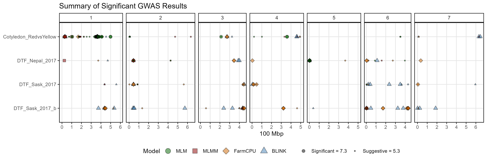

```{r setup, include = FALSE}
knitr::opts_chunk$set(message = F, warning = F)
```

```{r}
library("gwaspr")
```

```{r eval = F}
# Plot
mp <- gg_GWAS_Summary(
  # Specify a folder with GWAS results
  folder = "GWAS_Results/" )
# Save
ggsave("figures/gg_GWAS_Summary_01.png",
       mp, width = 12, height = 4 )
```



---

```{r eval = F}
# Plot
mp <- gg_GWAS_Summary(
  # Specify a folder with GWAS results
  folder = "GWAS_Results/",
  # Specify a title
  title = "Summary of Significant GWAS Results",
  # Specify GWAS models to plot
  models = c("MLM","MLMM","FarmCPU","BLINK") )
# Save
ggsave("figures/gg_GWAS_Summary_02.png", 
       mp, width = 12, height = 4 )
```


---

Make it an interactive plot with the following code

```{r eval = F}
gg_plotly(mp, filename = "figures/gg_GWAS_Summary_02.html")
```

https://derekmichaelwright.github.io/gwaspr/vignettes/figures/gg_GWAS_Summary_02.html
