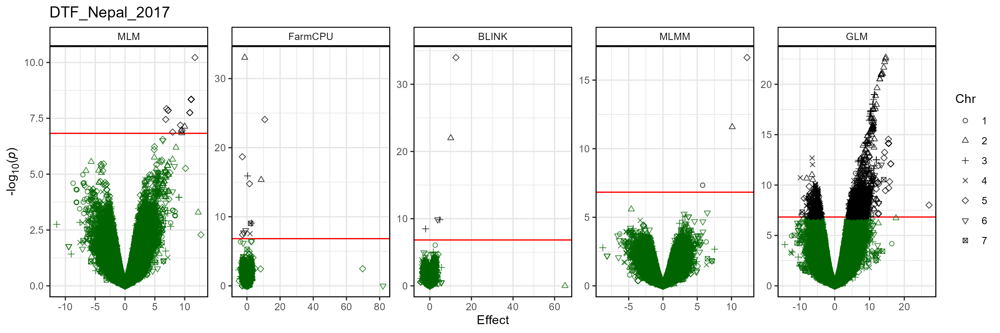

```{r setup, include = FALSE}
knitr::opts_chunk$set(message = F, warning = F)
```

```{r echo = F}
library("gwaspr")
```

The function `gg_Volcano()` creates volcano plots from GAPIT GWAS results. 

Specifying a `folder` and `trait` is all that is needed to create manhattan plots.

```{r eval = F}
# Calulate LD decay
calc_LD_Decay(
  # Load genotype data
  xG = myG,
  # Specify a folder with GWAS results
  outputFolder = "LD_Decay/",
  # Select the number of markers per chromosome to analyse
  markerNum = 200 )
```

```{r echo = F, eval = F}
# Plot
mp <- gg_LD_Decay(
  # Specify a folder with GWAS results
  folder = "GWAS_Results/", 
  # Select a trait to plot
  trait = "DTF_Nepal_2017" )
# Save
ggsave("figures/gg_LD_Decay.png", mp, width = 12, height = 4 )
#
```

