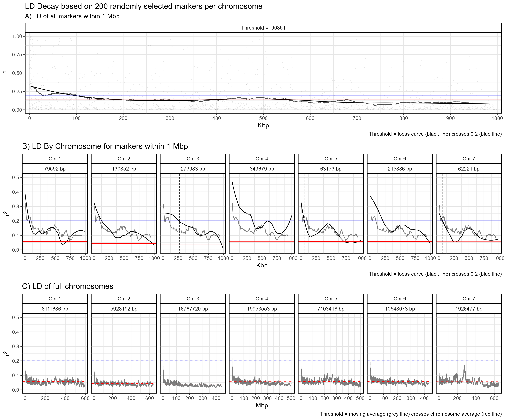
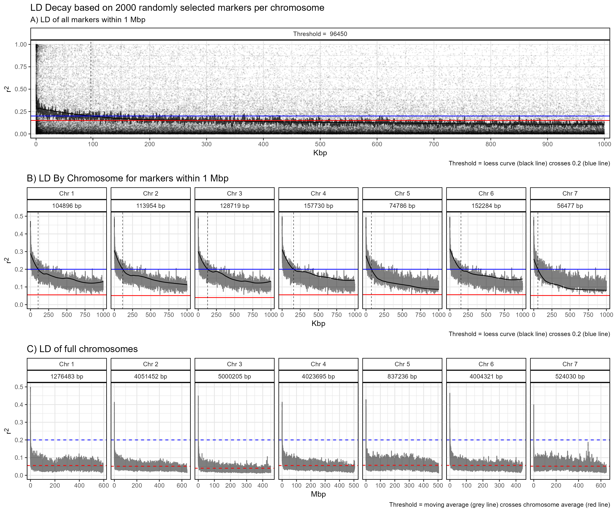

```{r setup, include = FALSE}
knitr::opts_chunk$set(message = F, warning = F)
```

```{r}
library(gwaspr)
```

The function `gg_LD_Decay()` creates Linkage Disequilibrium (LD) Decay plots from GAPIT GWAS results. 

Specifying a `myG` object, an `outputFolder`, and a `markerNum` is all that is needed to calculate and plot LD decay.

> **Note:** this is a computation heavy function and the larger you set `markerNum` the longer the computation will take. Start by setting to a lower number such as `200` which is the default.

```{r eval = F}
# Load genotype file (note: header = T)
myG <- read.csv("gwaspr_myG_hmp.csv", header = T)
```

# `markerNum` = 200

```{r eval = F}
# Calulate LD decay
calc_LD_Decay(
  # Load genotype data
  xG = myG,
  # Specify a folder with GWAS results
  outputFolder = "LD_Decay/",
  # Select the number of markers per chromosome to analyse
  markerNum = 200 )
```

```{r eval = F}
# Plot
mp <- gg_LD_Decay(
  # Load genotype data
  xG = myG,
  # Specify a folder with GWAS results
  outputFolder = "LD_Decay/",
  # Select the number of markers per chromosome to analyse
  markerNum = 200 )
# Save
ggsave("figures/gg_LD_Decay_01.png", mp, width = 12, height = 10 )
```



---

# `markerNum` = 2000

```{r eval = F}
# Calulate LD decay
calc_LD_Decay(
  # Load genotype data
  xG = myG,
  # Specify a folder with GWAS results
  outputFolder = "LD_Decay/",
  # Select the number of markers per chromosome to analyse
  markerNum = 2000 )
```

```{r eval = F}
# Plot
mp <- gg_LD_Decay(
  # Load genotype data
  xG = myG,
  # Specify a folder with GWAS results
  outputFolder = "LD_Decay/",
  # Select the number of markers per chromosome to analyse
  markerNum = 2000 )
# Save
ggsave("figures/gg_LD_Decay_02.png", mp, width = 12, height = 10 )
```


