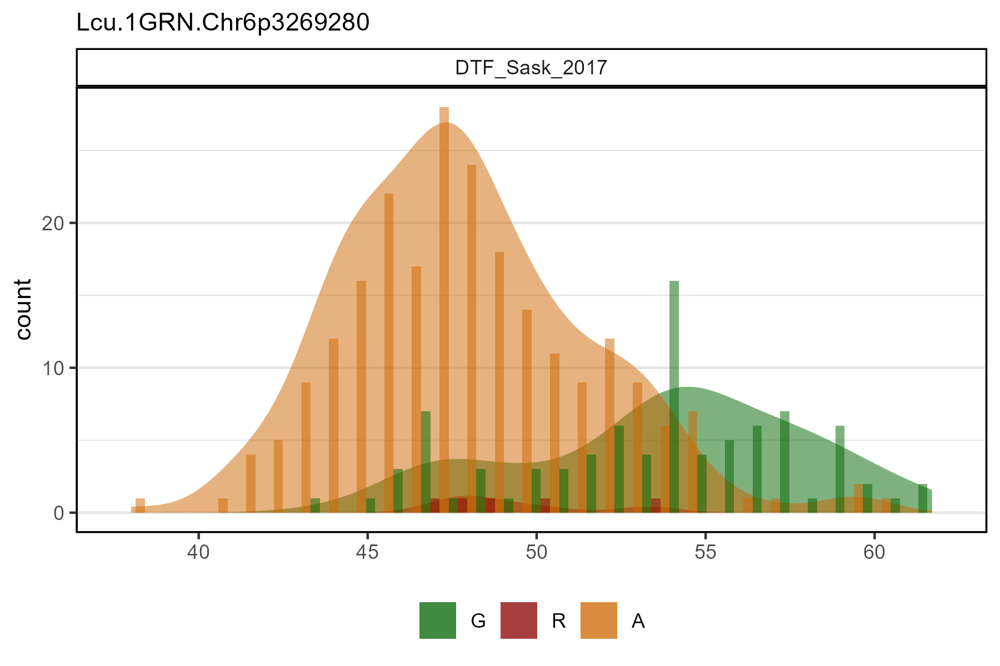
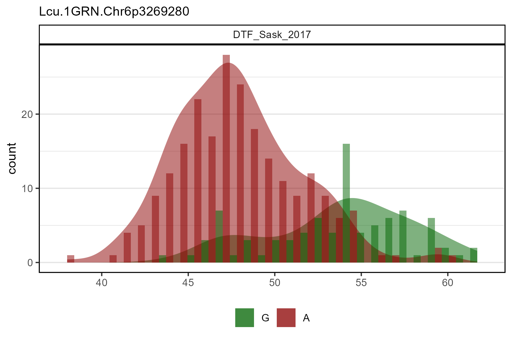
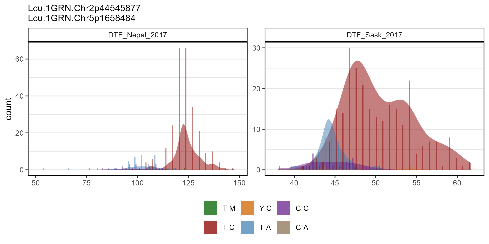
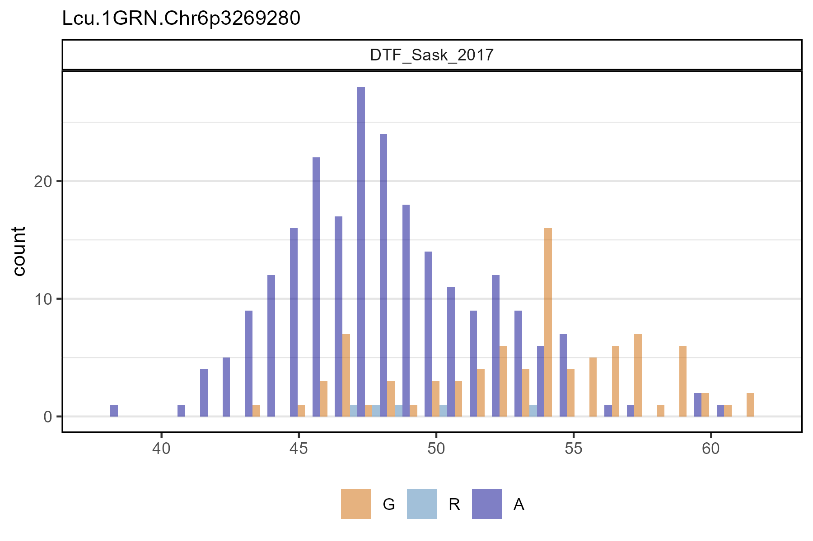
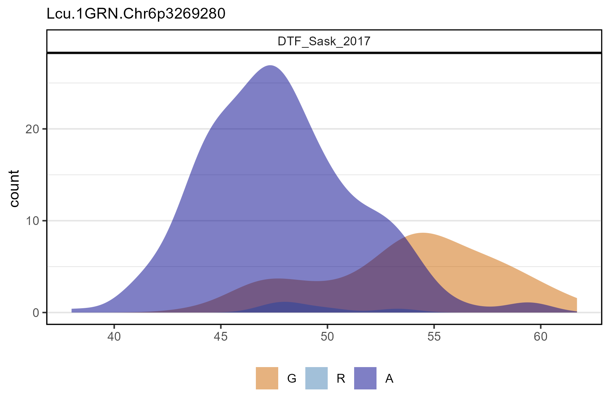
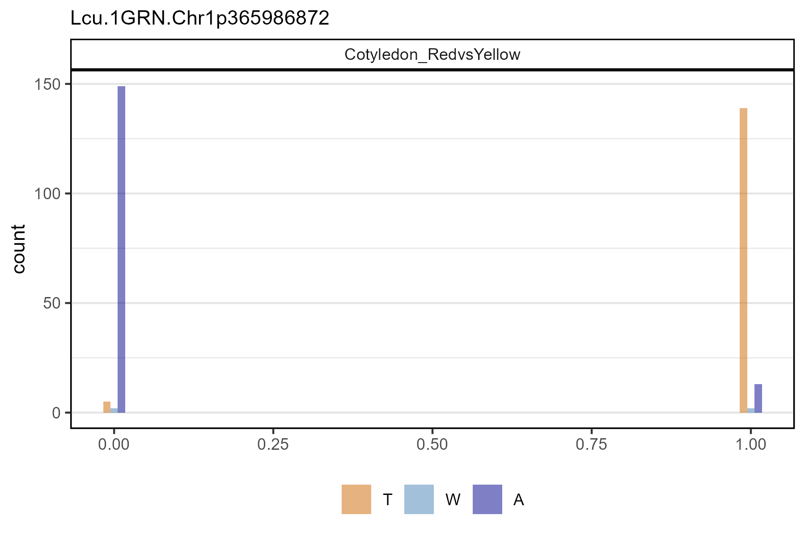
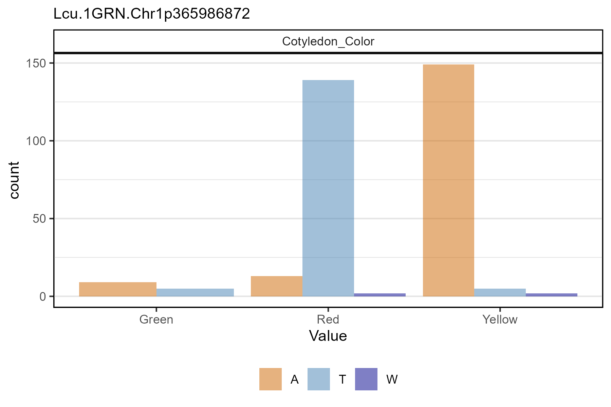

```{r setup, include = FALSE}
knitr::opts_chunk$set(message = F, warning = F)
```

```{r}
library(gwaspr)
```

The function `gg_Marker_Bar()` creates marker plots with your `myY` and `myG` GWAS input files.

# Load data

> Note: `header = T`

```{r eval = F}
# Load genotype file (note: header = T)
myG <- read.csv("gwaspr_myG_hmp.csv", header = T)
```

```{r eval = F}
# Load phenotype file
myY <- read.csv("gwaspr_myY.csv")
# Convert our nominal trait from numeric to factor.
myY <- myY %>% 
  mutate(Cotyledon_Color = mv(Cotyledon_RedvsYellow, c(1, 0, NA), c("Red", "Yellow", "Green")),
         Cotyledon_Color = factor(Cotyledon_Color, levels = c("Red", "Yellow", "Green")))
```

```{r echo = F, eval = F}
write.csv(myY, "gwaspr_myY_full.csv", row.names = F)
```

```{r echo = F}
myY <- read.csv("gwaspr_myY_full.csv")
```

```{r}
myY[1:10,]
```

---

# Single marker, single trait

Specifying `traits` and `markers` along with your genotype and phenotype data as `xG` and `xY` is needed to create marker plots.

```{r eval = F}
# Plot
mp <- gg_Marker_Bar(
  # Genotype data
  xG = myG, 
  # Phenotype data
  xY = myY,
  # Select traits to plot
  traits = "DTF_Sask_2017",
  # Select markers to plot
  markers = "Lcu.1GRN.Chr6p3269280" )
# Save
ggsave("figures/gg_Marker_Bar_01.png", 
       mp, width = 6, height = 4 )
```



---

# All Options

`gg_Marker_Bar()` contains a number of different options for customizing the marker plots.

```{r eval = F}
# Prep data
myM <- c("Lcu.1GRN.Chr6p3269280")
# Plot
mp <- gg_Marker_Bar(
  xG = myG, 
  xY = myY,
  traits = "DTF_Sask_2017",
  markers = myM,
  marker.colors = gwaspr_Colors,
  remove.hets = T,
  remove.N = T,
  plot.histogram = T,
  plot.density = T,
  plot.counts = T,
  ncol = NULL,
  line.color = F,
  title = NULL,
  subtitle = paste(myM, collapse = "\n"),
  asfactor = F)
# Save
ggsave("figures/gg_Marker_Bar_02.png", 
       mp, width = 6, height = 4 )
```



---

# Multiple markers, multiple traits

```{r eval = F}
# Plot
mp <- gg_Marker_Bar(
  # Genotype data
  xG = myG, 
  # Phenotype data
  xY = myY,
  # Select traits to plot
  traits = c("DTF_Nepal_2017", "DTF_Sask_2017"),
  # Select markers to plot
  markers = c("Lcu.1GRN.Chr2p44545877", "Lcu.1GRN.Chr5p1658484") )
# Save
ggsave("figures/gg_Marker_Bar_03.png", 
       mp, width = 8, height = 4 )
```



---

# Histogram

```{r eval = F}
# Plot
mp <- gg_Marker_Bar(
  # Genotype data
  xG = myG, 
  # Phenotype data
  xY = myY,
  # Select traits to plot
  traits = "DTF_Sask_2017",
  # Select markers to plot
  markers = "Lcu.1GRN.Chr6p3269280",
  # Select marker colors
  marker.colors = c("darkorange3", "steelblue", "darkblue"),
  # Choose what should be plotted
  plot.histogram = T,
  plot.density = F )
# Save
ggsave("figures/gg_Marker_Bar_04.png", 
       mp, width = 6, height = 4 )
```



---

# Density

```{r eval = F}
# Plot
mp <- gg_Marker_Bar(
  # Genotype data
  xG = myG, 
  # Phenotype data
  xY = myY,
  # Select traits to plot
  traits = "DTF_Sask_2017",
  # Select markers to plot
  markers = "Lcu.1GRN.Chr6p3269280",
  # Select marker colors
  marker.colors = c("darkorange3", "steelblue", "darkblue"),
  # Choose what should be plotted
  plot.histogram = F,
  plot.density = T )
# Save
ggsave("figures/gg_Marker_Bar_05.png", 
       mp, width = 6, height = 4)
```



---

# Factor data

## Numeric format

```{r eval = F}
# Plot 
mp <- gg_Marker_Bar(
  # Genotype data
  xG = myG, 
  # Phenotype data
  xY = myY,
  # Select traits to plot
  traits = "Cotyledon_RedvsYellow",
  # Select markers to plot
  markers = "Lcu.1GRN.Chr1p365986872",
  # Select marker colors
  marker.colors = c("darkorange3", "steelblue", "darkblue"),
  # Choose what should be plotted
  plot.histogram = T,
  plot.density = F )
# Save
ggsave("figures/gg_Marker_Bar_06.png", 
       mp, width = 6, height = 4 )
```



---

## Factor format

```{r eval = F}
# Plot 
mp <- gg_Marker_Bar(
  # Genotype data
  xG = myG, 
  # Phenotype data
  xY = myY,
  # Select traits to plot
  traits = "Cotyledon_Color",
  # Select markers to plot
  markers = "Lcu.1GRN.Chr1p365986872",
  # Select marker colors
  marker.colors = c("darkorange3", "steelblue", "darkblue"),
  # Choose what should be plotted
  plot.histogram = T,
  plot.density = F )
# Save
ggsave("figures/gg_Marker_Bar_07.png", 
       mp, width = 6, height = 4 )
```


