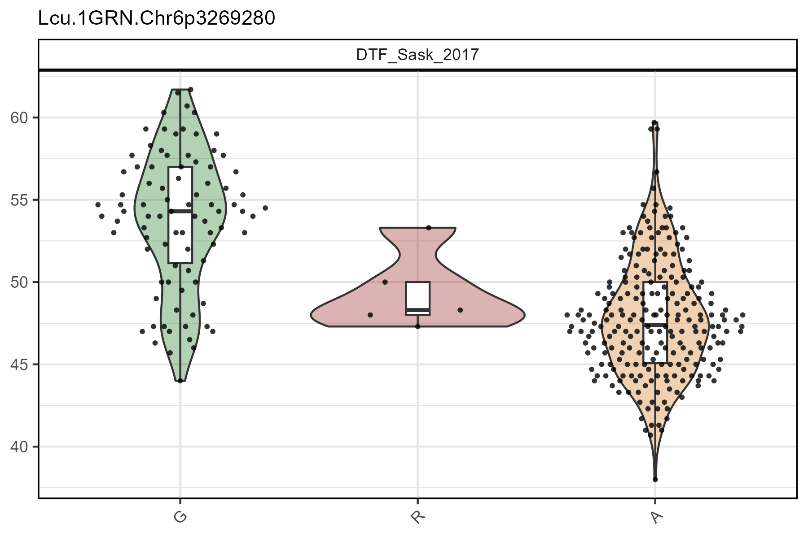
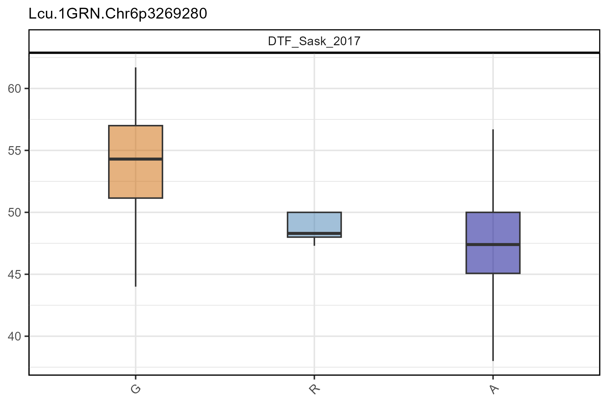
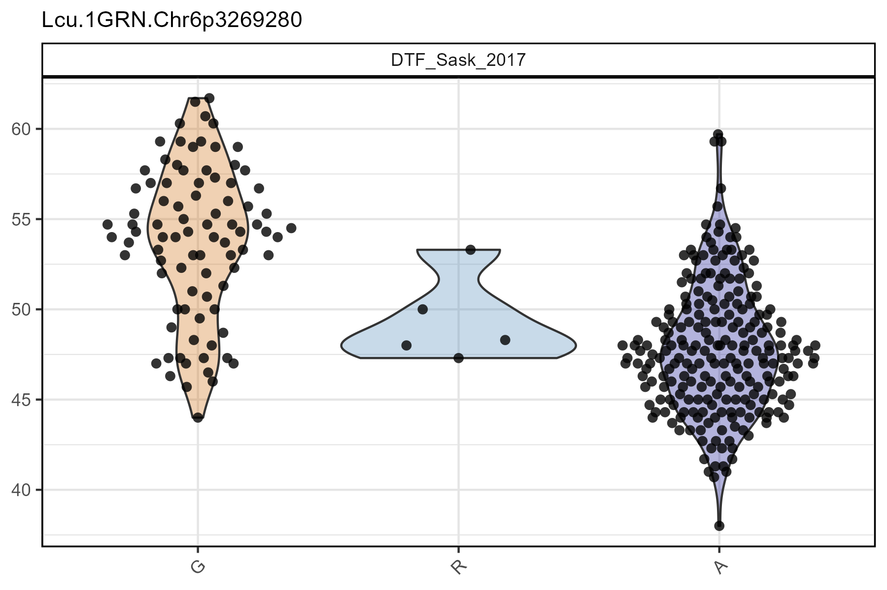
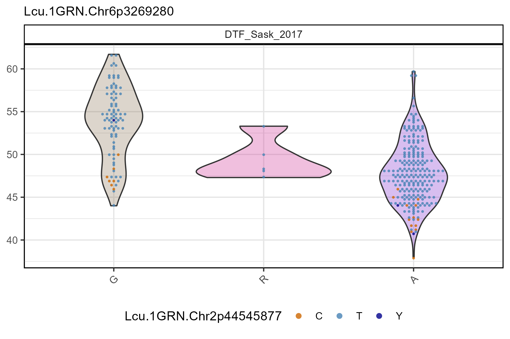
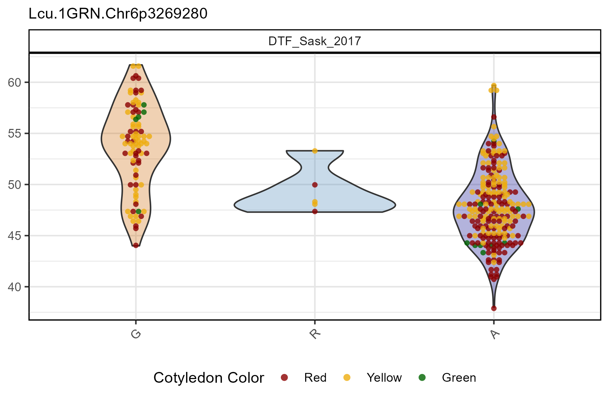
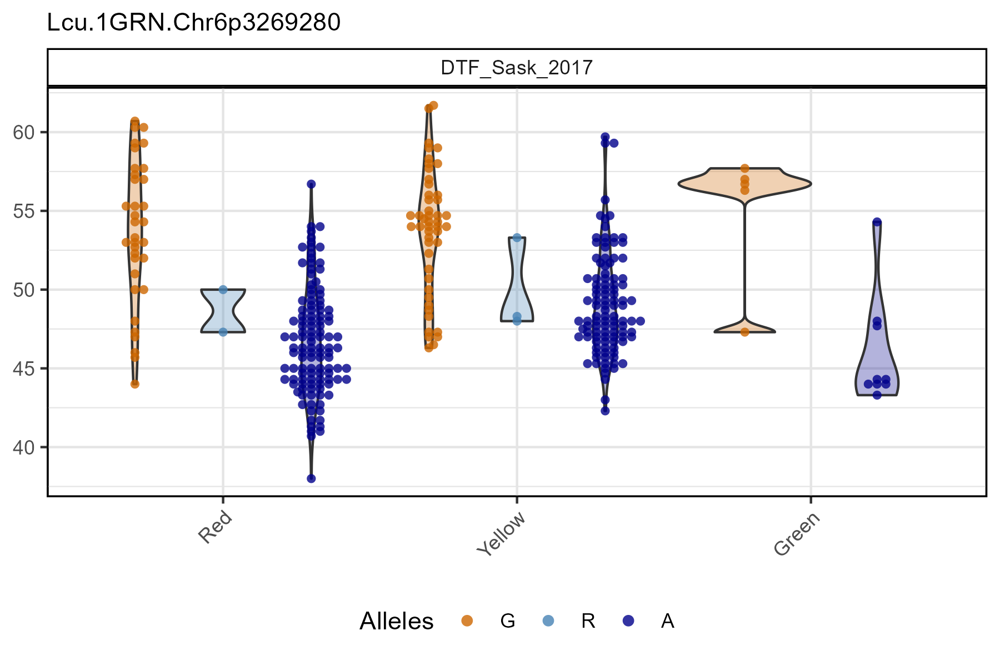

```{r setup, include = FALSE}
knitr::opts_chunk$set(message = F, warning = F)
```

```{r}
library(gwaspr)
```

The function `gg_Marker_Box()` creates marker plots with your `myY` and `myG` GWAS input files.

# Load data

> Note: `header = T`

```{r eval = F}
# Load genotype file (note: header = T)
myG <- read.csv("gwaspr_myG_hmp.csv", header = T)
```

```{r echo = F}
myG <- read.csv("gwaspr_myG_hmp_10.csv", header = T)
#write.csv(myG, "myG_hmp_10.csv", row.names = F)
```

```{r}
# Map + marker Info
myG[1:10,1:11]
# genotrype calls
myG[1:10,12:17]
```

```{r eval = F}
# Load phenotype file
myY <- read.csv("gwaspr_myY.csv")
# Convert our nominal trait from numeric to factor.
myY <- myY %>% 
  mutate(Cotyledon_Color = mv(Cotyledon_RedvsYellow, c(1, 0, NA), c("Red", "Yellow", "Green")),
         Cotyledon_Color = factor(Cotyledon_Color, levels = c("Red", "Yellow", "Green")))
```

```{r echo = F, eval = F}
write.csv(myY, "gwaspr_myY_full.csv", row.names = F)
```

```{r echo = F}
myY <- read.csv("gwaspr_myY_full.csv")
```

```{r}
myY[1:10,]
```

---

# Single marker, single trait

Specifying `traits` and `markers` along with your genotype and phenotype data as `xG` and `xY` is needed to create marker plots.

```{r eval = F}
# Plot
mp <- gg_Marker_Box(
  # Genotype data
  xG = myG, 
  # Phenotype data
  xY = myY,
  # Select traits to plot
  traits = "DTF_Sask_2017",
  # Select markers to plot
  markers = "Lcu.1GRN.Chr6p3269280" )
# Save
ggsave("figures/gg_Marker_Box_01.png", 
       mp, width = 6, height = 4 )
```


---

# All Options

```{r eval = F}
# Prep data
myM <- c("Lcu.1GRN.Chr6p3269280")
# Plot
mp <- gg_Marker_Box(
  xG = myG, 
  xY = myY,
  traits = "DTF_Sask_2017",
  markers = myM,
  marker.colors = gwaspr_Colors,
  remove.hets = F,
  remove.N = T,
  plot.violin = T,
  plot.box = T,
  plot.points = T,
  box.width = 0.1,
  point.size = 1,
  point.beeswarm = F,
  ncol = NULL,
  legend.rows = 1,
  title = NULL,
  subtitle = paste(myM, collapse = "\n"),
  cv.source = "xG",
  cv.name = NULL,
  cv.colors = NULL,
  cv.label = cv.name,
  groupByCV = F )
# Save
ggsave("figures/gg_Marker_Box_02.png", 
       mp, width = 6, height = 4 )
```



---

# Multiple markers, multiple traits

```{r eval = F}
# Plot
mp <- gg_Marker_Box(
  # Genotype data
  xG = myG,
  # Phenotype data
  xY = myY,
  # Select traits to plot
  traits = c("DTF_Nepal_2017", "DTF_Sask_2017"),
  # Select markers to plot
  markers = c("Lcu.1GRN.Chr5p1658484", "Lcu.1GRN.Chr2p44545877"),
  # Remove heterozygotic markers  
  remove.hets = T )
# Save
ggsave("figures/gg_Marker_Box_03.png",
       mp, width = 8, height = 4 )
```


---

# Boxplots 

```{r eval = F}
# Plot
mp <- gg_Marker_Box(
  # Genotype data
  xG = myG, 
  # Phenotype data
  xY = myY,
  # Select traits to plot
  traits = "DTF_Sask_2017",
  # Select markers to plot
  markers = "Lcu.1GRN.Chr6p3269280",
  # Select marker colors
  marker.colors = c("darkorange3", "steelblue", "darkblue"),
  # Choose what should be plotted
  plot.violin = F,
  plot.box = T,
  plot.points = F,
  # Change the width of the boxplots
  box.width = 0.3 )
# Save
ggsave("figures/gg_Marker_Box_04.png", 
       mp, width = 6, height = 4 )
```



---

# Violin + points

```{r eval = F}
# Plot
mp <- gg_Marker_Box(
  # Genotype data
  xG = myG, 
  # Phenotype data
  xY = myY,
  # Select traits to plot
  traits = "DTF_Sask_2017",
  # Select markers to plot
  markers = "Lcu.1GRN.Chr6p3269280",
  # Select marker colors
  marker.colors = c("darkorange3", "steelblue", "darkblue"),
  # Choose what should be plotted
  plot.violin = T,
  plot.box = F,
  plot.points = T,
  # Set the point size
  point.size = 2)
# Save
ggsave("figures/gg_Marker_Box_05.png", 
       mp, width = 6, height = 4 )
```



---

# myG Covariable

```{r eval = F}
# Plot
mp <- gg_Marker_Box(
  # Genotype data
  xG = myG, 
  # Phenotype data
  xY = myY,
  # Select traits to plot
  traits = "DTF_Sask_2017",
  # Select markers to plot
  markers = "Lcu.1GRN.Chr6p3269280",
  # Select marker colors
  marker.colors = c("burlywood4", "maroon3", "purple3"),
  # Keep heterozygous markers
  remove.hets = F,
  # Choose what should be plotted
  plot.violin = T,
  plot.box = F,
  plot.points = T,
  # Set the point size
  point.size = 0.75,
  # Plot with geom_beeswarm instead of quasirandom
  point.beeswarm = T,
  # Select Covariable trait for points
  cv.name = "Lcu.1GRN.Chr2p44545877", 
  # Select colors for the covariable
  cv.colors = c("darkorange3", "steelblue", "darkblue") )
# Save
ggsave("figures/gg_Marker_Box_06.png", 
       mp, width = 6, height = 4 )
```



---

# myY Covariable

```{r eval = F}
# Plot
mp <- gg_Marker_Box(
  # Genotype data
  xG = myG, 
  # Phenotype data
  xY = myY,
  # Select traits to plot
  traits = "DTF_Sask_2017",
  # Select markers to plot
  markers = "Lcu.1GRN.Chr6p3269280",
  # Select marker colors
  marker.colors = c("darkorange3", "steelblue", "darkblue"),
  # Choose what should be plotted
  plot.violin = T,
  plot.box = F,
  plot.points = T,
  # Set the point size
  point.size = 1.5,
  # Plot with geom_beeswarm instead of quasirandom
  point.beeswarm = T,
  # Select covariable source
  cv.source = "xY",
  # Select Covariable trait for points
  cv.name = "Cotyledon_Color", 
  # Select colors for the covariable
  cv.colors = c("darkred", "darkgoldenrod2", "darkgreen"),
  # Set a custom label for the covariable legend
  cv.label = "Cotyledon Color" )
# Save
ggsave("figures/gg_Marker_Box_07.png", 
       mp, width = 6, height = 4 )
```



---

# Grouped by myY Covariable

```{r eval = F}
# Plot
mp <- gg_Marker_Box(
  # Genotype data
  xG = myG, 
  # Phenotype data
  xY = myY,
  # Select traits to plot
  traits = "DTF_Sask_2017",
  # Select markers to plot
  markers = "Lcu.1GRN.Chr6p3269280",
  # Select marker colors
  marker.colors = c("darkorange3", "steelblue", "darkblue"),
  # Choose what should be plotted
  plot.violin = T,
  plot.box = F,
  plot.points = T,
  # Set the point size
  point.size = 1.5,
  # Plot with geom_beeswarm instead of quasirandom
  point.beeswarm = T,
  # Select covariable source
  cv.source = "xY",
  # Select Covariable trait for points
  cv.name = "Cotyledon_Color", 
  # Select colors for the covariable
  cv.colors = c("darkred", "darkgoldenrod2", "darkgreen"),
  # Set a custom label for the covariable legend
  cv.label = "Cotyledon Color",
  # Plot CV on x-axis instead of marker
  groupByCV = T)
# Save
ggsave("figures/gg_Marker_Box_08.png", 
       mp, width = 6, height = 4 )
```



---
