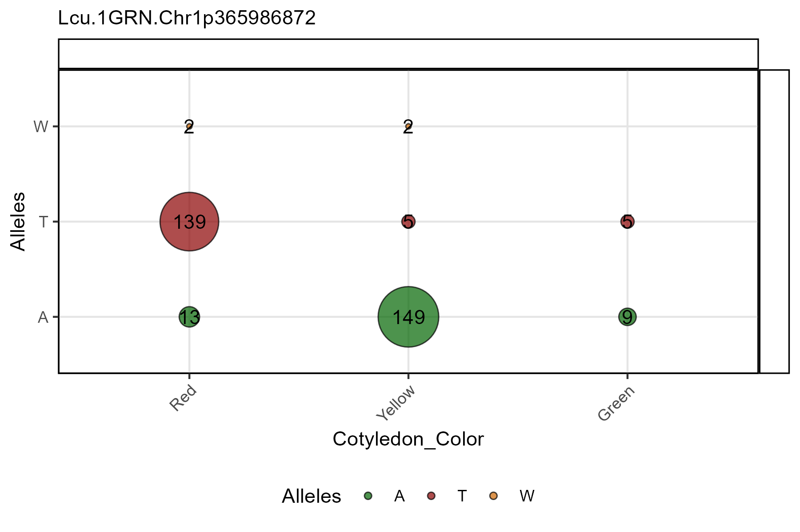
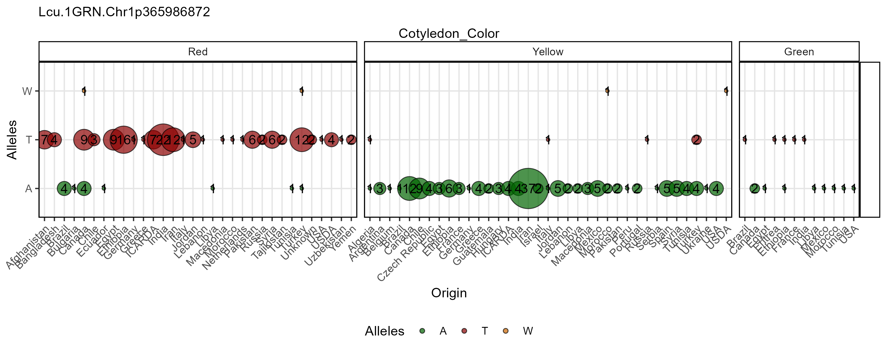

```{r setup, include = FALSE}
knitr::opts_chunk$set(message = F, warning = F)
```

```{r}
library(gwaspr)
```

The function `gg_Marker_Bubble()` creates marker plots with your `myY` and `myG` GWAS input files.

# Load data

> Note: `header = T`

```{r eval = F}
# Load genotype file (note: header = T)
myG <- read.csv("gwaspr_myG_hmp.csv", header = T)
```

```{r echo = F}
myG <- read.csv("gwaspr_myG_hmp_10.csv", header = T)
#write.csv(myG, "myG_hmp_10.csv", row.names = F)
```

```{r}
# Map + marker Info
myG[1:10,1:11]
# genotrype calls
myG[1:10,12:17]
```

```{r eval = F}
# Load phenotype file
myY <- read.csv("gwaspr_myY.csv")
# Convert our nominal trait from numeric to factor.
myY <- myY %>% 
  mutate(Cotyledon_Color = mv(Cotyledon_RedvsYellow, c(1, 0, NA), c("Red", "Yellow", "Green")),
         Cotyledon_Color = factor(Cotyledon_Color, levels = c("Red", "Yellow", "Green")))
```

```{r echo = F, eval = F}
write.csv(myY, "gwaspr_myY_full.csv", row.names = F)
```

```{r echo = F}
myY <- read.csv("gwaspr_myY_full.csv")
```

```{r}
myY[1:10,]
```

```{r}
myO <- read.csv("gwaspr_myO.csv")
```

```{r}
myY <- myY %>% left_join(myO, by = "Name")
```

---

# Single marker, single trait

Specifying a `trait.x` and `markers` along with your genotype and phenotype data as `xG` and `xY` is needed to create marker plots.

```{r eval = F}
# Plot
mp <- gg_Marker_Bubble(
  # Genotype data
  xG = myG, 
  # Phenotype data
  xY = myY,
  # Select traits to plot
  trait.x = "Cotyledon_Color",
  # Select markers to plot
  markers = "Lcu.1GRN.Chr1p365986872" )
# Save
ggsave("figures/gg_Marker_Bubble_01.png", 
       mp, width = 6, height = 4 )
```


---

# All Options

Note: one of `trait.x`, `trait.y`, `facet.rows`, `facet.cols` must be set to `= "Alleles"`. 

```{r eval = F}
# Prep data
myM <- c("Lcu.1GRN.Chr1p365986872")
# Plot
mp <- gg_Marker_Bubble(
  xG = myG, 
  xY = myY,
  trait.x = "Cotyledon_Color",
  markers = myM,
  trait.y = "Alleles",
  facet.rows = NULL,
  facet.cols = NULL,
  marker.colors = gwaspr_Colors,
  remove.hets = F,
  remove.N = T,
  legend.pos = "bottom",
  legend.rows = 1,
  title = NULL,
  subtitle = paste(myM, collapse = "\n") )
# Save
ggsave("figures/gg_Marker_Bubble_02.png", 
       mp, width = 6, height = 4 )
```



---

# Facet Grouping

## Column Facetting

```{r eval = F}
# Plot
mp <- gg_Marker_Bubble(
  # Genotype data
  xG = myG, 
  # Phenotype data
  xY = myY,
  # Select traits to plot
  trait.x = "Origin",
  # Select markers to plot
  markers = "Lcu.1GRN.Chr1p365986872",
  # Select a trait for col facetting
  facet.cols = "Cotyledon_Color" )
# Save
ggsave("figures/gg_Marker_Bubble_03.png", 
       mp, width = 10, height = 4 )
```



---

## Row Facetting

```{r eval = F}
# Plot
mp <- gg_Marker_Bubble(
  # Genotype data
  xG = myG, 
  # Phenotype data
  xY = myY,
  # Select traits to plot
  trait.x = "Origin",
  # Select markers to plot
  markers = "Lcu.1GRN.Chr1p365986872",
  # Select a trait for col facetting
  facet.cols = "Cotyledon_Color",
  # Select a trait for row facetting
  facet.rows = "Region" )
# Save
ggsave("figures/gg_Marker_Bubble_04.png", 
       mp, width = 10, height = 8 )
```


---
