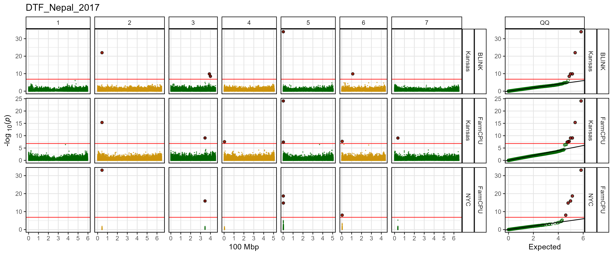

```{r setup, include = FALSE}
knitr::opts_chunk$set(message = F, warning = F)
```

```{r}
library("gwaspr")
```

`GAPIT` 

# checkNYCvsKansas()

The function `checkNYCvsKansas()` will output a table indicating the number of markers with different p values between NYC and Kansas files.

Specifying a `folder` of GWAS results is all that is needed for this function.

```{r eval = F}
checkNYCvsKansas(
  # Specify a folder with GWAS results
  folder = "GWAS_Results/", 
  # Delete any Kansas files with no difference between the NYC files if set to T
  deleteKansas = F )
```

```{r echo = F, eval = F}
write.csv(checkNYCvsKansas(folder = "GWAS_Results/"), 
          "checkNYCvsKansas.csv", row.names = F )
```

```{r echo = F, eval = T}
read.csv("checkNYCvsKansas.csv")
```

---

# gg_NYCvsKansas()

The function `gg_NYCvsKansas()` creates manhattan plots from GAPIT GWAS results. 

Specifying a `folder` and `trait` is all that is needed to create manhattan plots.

```{r eval = F}
mp <- gg_NYCvsKansas(
  # Specify a folder with GWAS results
  folder = "GWAS_Results/",
  # Specify a trait to plot
  trait = "DTF_Nepal_2017"
)
# Save
ggsave("figures/gg_NYCvsKansas.png", mp, width = 12, height = 5)
```


