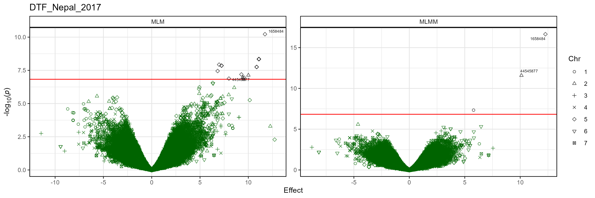

```{r setup, include = FALSE}
knitr::opts_chunk$set(message = F, warning = F)
```

```{r echo = F}
library("gwaspr")
```

The function `gg_Volcano()` creates volcano plots from GAPIT GWAS results. 

Specifying a `folder` and `trait` is all that is needed to create manhattan plots.

```{r eval = F}
# Plot
mp <- gg_Volcano(
  # Specify a folder with GWAS results
  folder = "GWAS_Results/", 
  # Select a trait to plot
  trait = "DTF_Nepal_2017" )
# Save
ggsave("figures/gg_Volcano_01.png", mp, width = 12, height = 4)
```


---

# Customized Plot

```{r eval = F}
# Plot
mp <- gg_Volcano(
  # Specify a folder with GWAS results
  folder = "GWAS_Results/", 
  # Select a trait to plot
  trait = "DTF_Nepal_2017",
  # Plot only certain GWAS models
  models = c("MLM","MLMM","FarmCPU","BLINK"),
  # Highlight specific markers
  markers = c("Lcu.1GRN.Chr2p44545877", 
              "Lcu.1GRN.Chr5p1658484"), 
  # Create alt labels for the markers
  labels = c("44545877","1658484") 
  )
# Save
ggsave("figures/gg_Volcano_02.png", mp, width = 12, height = 4)
```


